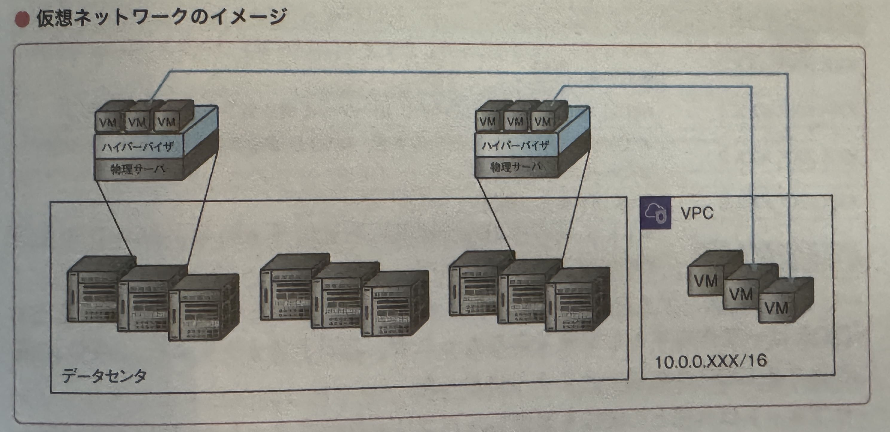
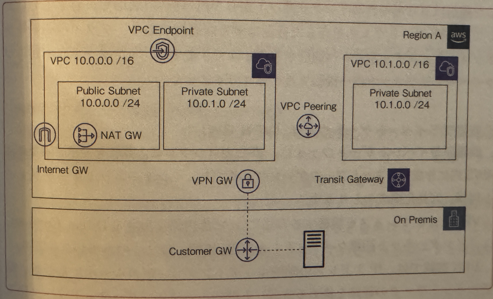
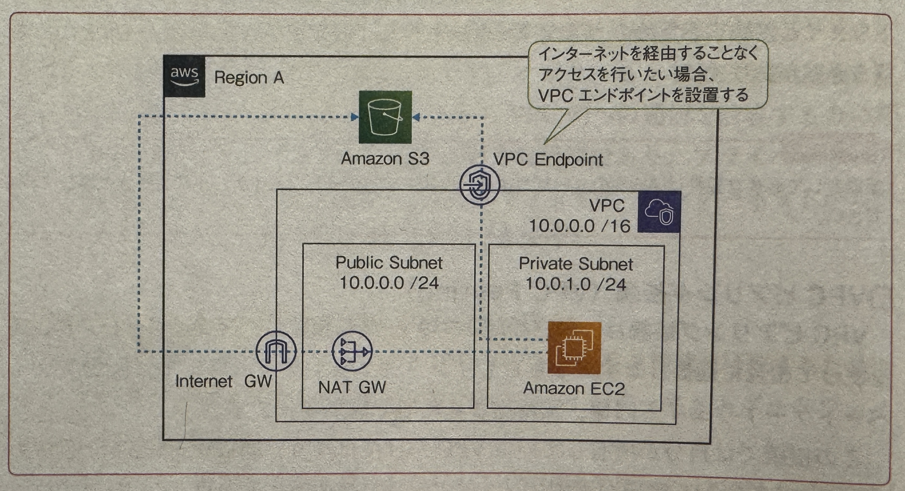
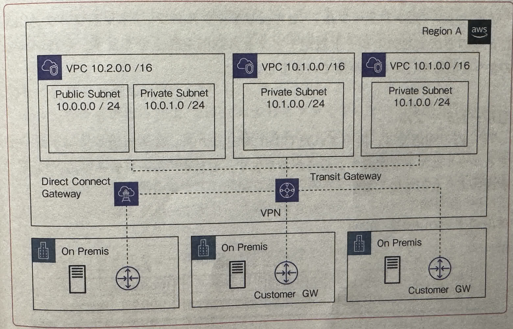

## OVERVIEW

[AWSハンズオン資料](https://aws.amazon.com/jp/events/aws-event-resource/hands-on/)の学習記録．

自作PCエミュレータ！！ ->

## アカウント作成

### ルートユーザとIAMユーザ

- ルートユーザ

  - メールアドレスとパスワードでログイン
  - 全AWSサービスとリソースに対して，完全なタスク権限.
  - 日常的タスクには使わない．

- IAM(Identity and Access Management)ユーザ

  - アカウントID + IAM ユーザ名 + パスワードでログイン
  - 紐づけられているIAMポリシー権限で認められた操作のみ実行可能．
  - 利用者ごとにIAMユーザを作成．利用者はIAMユーザでログインし，作業を進めていく．

## アベイラリティゾーン(AZ)とリージョン

1 つの AWS リージョン内でそれぞれ切り離され, 冗長的な電力源, ネットワーク, そして接続機能を備えている 1 つ以上のデータセンターのこと.  
イメージは，大学とキャンパス. リージョンが大学でAZがキャンパスだと考えると, 大学のキャンパスには複数の建物があるので, リージョンとAZの関係に似ていてわかりやすい.

## ネットワーク関連のサービス

VPCは仮想ネットワークを構築できるサービス．

VPCおよびサブネットは，ネットワークを論理的に細分化したセグメントに相当する．  
VPCで作成したネットワークはあくまでも仮想化されたものであり，様々なロケーションに分散しているAWSの物理リソース上に構築される．

### CIDR(Classless Inter Domain Routing)

別名をクラスレスアドレッシングと呼び，現在主流で使用されているIPアドレスの割り当て方式．  
初期のTCP/IPのIPアドレス(IPv4)は，IPアドレスの枯渇問題を抱えていた．この問題を解決するために，**クラスフルアドレッシング** という仕組みが導入された．
このクラスとは，クラスA，クラスB，クラスCの3つのクラスが存在し, それぞれネットワークとホストの割り当ての割合が異なる．

しかし，クラスフルアドレッシングには「ユーザにとってちょうどいいアドレスクラスが存在しない」という問題が存在したため，
この問題を解決するために，割り振られたネットワークをさらに小さい単位に分割する『**サブネット**』という概念が誕生した．

従来のクラスフルアドレッシングのクラス(クラスA，クラスB，クラスC)をより小さいサブネットに分割することをサブネット化と表現することもあるが，
現在では，クラスの定義に関わらず単にネットワークをより小さな複数のネットワークに分割することもサブネット化すると表現する．

つまり，サブネット化を行うために，IPアドレスをサブネットマスクの情報を付随して自由にネットワークの範囲を指定する仕組みのことを『CIDR(クラスレスアドレッシング)』と呼ぶ．

このように，クラスフルアドレッシングのクラスCであれば，ネットワークアドレス24bit, ホストアドレス8bitで固定されている．そのため，256-2=254台のホストが接続可能である．  
一方CIDRは，クラスフルアドレッシングのようにネットワーク部とホスト部を8bit区切ることにこだわらずに，**任意のbitでネットワーク部とホスト部の境界が決められる点**である．

CIDR表記は，IPアドレスの後ろにスラッシュと数字を付けて表記(ex. `192.168.0.0/24`)する．  
この場合のCIDR表記は`192.168.0.0/255.255.255.0`と同義である．
サブネットマスク`/255.255.255.0`，`/24`は，『上位何ビットがネットワークアドレスである』という意味である．

一般的にCIDR表記はプレフィックスと呼び，CIDR表記を「プレフィックス表記」とも呼ぶ．

- 経路情報の集約
  経路(ルート)が多くなると，ルータ内のルーティングテーブルが大きくなり，宛先ネットワークを見つけるための時間が長くなったり，ルーティングテーブルに保存するためのメモリ量が大量に必要なる．  
  そのため，上図のようにルーティングテーブルを圧縮し，エントリ数を減らすことが可能．

### VPCとサブネットの特徴と構築方法

VPCは，AWSのリージョン単位で作成でき，CIDR表記にそってネットワークを構築することが可能．  
構築したVPCでは，セグメントに相当する複数のサブネットを定義して，用途に応じて柔軟にネットワークを構成することができる．

- VPC内のアドレスはCIDRが「/16」または「/28」の間で使用できる．

使用できないアドレスは以下の通り，  
XXX.XXX.XXX.0 : ネットワークアドレス  
XXX.XXX.XXX.1 : VPCルータ  
XXX.XXX.XXX.2 : DNSサーバ  
XXX.XXX.XXX.3 : AWSが予備的に確保  
XXX.XXX.XXX.255 : ブロードキャストアドレス

### VPCの外部通信

VPCでは，複数のVPC間で通信することはもちろん，Direct Connect(オンプレミスとの接続サービス)やVPN(Virtual Private Network)を通じて，オンプレミス環境にあるサーバとも通信できる．
VPC内のリソースが外部通信する際は，次のようなネットワークゲートウェイリソースを設置する．

- インターネットゲートウェイ
  インターネットゲートウェイは，文字通り，VPCとインターネットの通信用途で設置されるもので，実際に通信を行うためにはそれに加えて，通信元のリソースがパブリックIPアドレスを持っている必要がある．  
  AWSで付与できるパブリックアドレスは動的に割り当てられるものと固定的に割り振られるものがあり，後者を「**Elastic IP Address**」と呼ぶ．

  冗長構成(あえて複数の構成をとり，片方に障害が発生しても対応)をとり，インターネットゲートウェイは自動スケーリングされる．

- NATゲートウェイ(NAT Gateway)
  NAT(Network Address Translation: ネットワークアドレス変換)は，プライベートサブネットないでインターネットへの通信を行いたい場合にパブリックサブネットへ設置する中継用ゲートウェイである．  
  NATゲートウェイを介した通信は，単方向通信であり，プライベートサブネットからインターネットへ通信することはできますが，**インターネットからプライベートサブネットへの通信はできない．**

- 仮想プライベートゲートウェイ(VPN GW)
  仮想プライベートゲートウェイはVPCとオンプレミス環境を接続するためにAWS内に作成するネットワークゲートウェイである．  
  インターネットゲートウェイと同様，冗長化構成をとる．

- カスタマーゲートウェイ(Customer Gateway)
  カスタマーゲートウェイはAWSとのVPN接続においてオンプレミス側に配置するゲートウェイである．  
  前述の動的/静的の接続方式は，オンプレミス環境のネットワーク構成に依存する．オンプレミス環境で動的ルーティングを利用する場合は，BGP(Border Gateway Protocol)を利用する．

  オンプレミス環境で静的ルーティングを利用する場合は，**通信が行えるネットワーク物理機器と，接続を許可する固定のパブリックIPアドレス**が必要となる．
  仮想プライゲートウェイと接続するためのカスタマーゲートウェイ設定は，AWSコンソール上からも行う必要がある．

- VPCピアリング接続(VPC Peering)
  VPCピアリング接続は，独立した2つのVPCを接続し，プライベートアドレスを使って相互に通信する．  
  同じリージョンの別のアカウントのVPCとも接続が可能である．

- VPCエンドポイント(VPC Endpoint)
  VPCエンドポイントは，VPCの中からマネージメントサービスにアクセスするためのサービスである．  
  AWSのマネージメントサービスには，EC2やRDSのようにVPCまたはサブネット内に構築されるリソースと，S3やDynamoDB，SQSのようにリージョン単位で提供されるリソースがある．

  リージョンサービスはVPCの外にあるAWSネットワーク内に構築されるため，アクセスするにはVPCから外部へ出る形になる．  
  S3やDynamoDBなどはデフォルトで，インターネット経由のアクセスが可能なので，インターネットゲートウェイやNATゲートウェイの設定が実行されていれば通信できるが,
  VPCエンドポイントを設置することで，インターネットを経由することなくアクセスすることができる．

  

  VPCエンドポイントには，「ゲートウェイ型」と「インターフェース型」の二種類がある．??説明読んでもよくわからんから，あとでやる??

- トランジットゲートウェイ(Transit Gateway)
  トランジットゲートウェイはVPCで設定するものとは，別のルーティングテーブルを持っており，独立した2つのVPCを接続する「VPCピアリング接続」にて，各VPC間の通信を制御する．  
  多数のVPCでピアリング接続が複数発生する場合は，通常，各VPC間の接続ごとに設定する必要があるが，トランジットゲートウェイを使用することで，一元的な設定により効率的な管理が可能になる．

  

### VPCのアクセス制御

VPCでは，「ルートテーブル」「セキュリティグループ」「ネットワークACL」の3つの方法で通信のルート設定・アクセス制御を設定することが可能．

- ルートテーブル
  VPC内の通信では，指定されたCIDR表記のアドレスで通信をルーティングするルールセットを定義する必要がある．  
  これを「ルートテーブル」といい，以下の図のような形で表す．

  

  VPCを作成すると，同時にメインルートテーブルが自動的に作成される．  
  ユーザは通常，設定変更による影響を小さくするため，メインルートテーブルを編集するのではなく，カスタムルートテーブルに関連付けられる必要がある．

  VPC内の各サブネットは何かしらのルートテーブルに関連付けられる必要がある．
  そのため，特定のルートテーブルが明示的に関連付けられていない場合，サブネットはメインルートテーブルに暗黙的に関連付けられる．

- セキュリティグループ
  セキュリティグループは，Linuxにおけるファイアウォール機能を**IPTables**とほぼ同じ役割を持つ．  
  アクセス許可するソースやプロトコル，ポートのルール定義を作成し，EC2やRDSなどのAWSリソースに関連づけることで，ファイアウォールとして機能する．  
  受信と送信の両方をリソースレベルで制御する他，リソースをグループ化し，共通のセキュリティグループを関連づけることができる．

  一般的なファイアウォール同様，通信の状態を記録して動作し，発生した通信に対する応答通信は自動的に許可される．

  

- ネットワークACLの作成
  ネットワークACLは，サブネットに関連付けられ，受信と送信の両方をサブネットレベルで制御することが可能．  
  そのため，関連付けられた全てのリソースに対して，同じネットワークACLが適用される．

  

### VPCの利用料金

VPCの利用料金は，以下の通り．
| 項目 | 内容 |
| -------------- | --------------- |
| VPC・サブネットの構築・稼働 | 無料 |
| VPCからのデータ通信でインバウンド接続 | 無料 |
| VPCからのデータ通信でアウトバウンド接続 | データ転送量に応じた従量課金 |
| VPCピアリング接続 | データ転送量に応じた従量課金 |
| インターネットゲートウェイ | 無料 |
| NATゲートウェイ | NATゲートウェイの利用時間の料金 |
| 仮想プライベートゲートウェイ | AWS VPN, AWS Direct Connectの利用料金に準ずる |
| VPCエンドポイント | Private Link 利用時間の料金, データ転送量に応じた従量課金 |
| トランジットゲートウェイ | アタッチメントごとの料金, データ転送量に応じた従量課金 |

### Elastic Load Balancing(ELB)

Elastic Load Balancing(ELB)は，AWSが提供する完全マネージドな仮想ロードバランシングサービス．  
以下の３つのサービスの総称．

- アプリケーションロードバランサー (Application Load Balancer: ALB）
- クラッシックロードバランサー (Classic Load Balancer: CLB)
- ネットワークロードバランサー (Network Load Balancer: NLB)

各機能の違いや特徴を押さえ，目的にあったものを選択できるようにする．  
AWSが提供する仮想ロードバランシングサービスであるELBは，EC2やRDSのようにVPC内に仮想的に配置される．  
定義上は1つのリソースのように扱われるが，内部的には冗長化構成されている．  
ELBは，複数のアベイラビリティゾーンをまたいだ構築が可能．

- Application Load Balancer (ALB)
  ALBは，リバースプロキシ型のロードバランシングサービスである．  
  負荷分散はOSI7層モデルの第7層(アプリケーション層)レベルでルーティングが可能．  
  「リスナー」と呼ばれるコンポーネントを作成し，使用するプロトコルとポートを設定して，ルーティングルールを設定する．

  

  例えば，`https://example.com/pathA`や`https://example.com/pathB`といったURLのパス単位で，ターゲットグループ(アベイラビリティゾーンをまたいでインスタンスやコンテナをまとめた仮想的なグループ)を振り分け指定し，

  その他，ALBではAWS CognitoやOIDC IDプロバイダと連携する**ユーザ認証**をサポートしている．
  認証が成功したリクエストは，ALBによりアクセストークンやIDトークン，ユーザトークン，ユーザクレイム(ユーザ情報)がHTTPヘッダに付与されて，リクエストとして転送される．

- Network Load Balancer(NLB)
  NLBは，主にOSI7層モデルでの第四層(トランスポート層)での負荷分散用途で使用されるL4ロードバランサーである．  
  IPアドレスとポートを元に振り分けるため，より低負荷で負荷分散が可能な特性を持つ．

- Classic Load Balancer(CLB)
  CLBは，ALBやNLBに比べて機能が限定されている．  
  ただし，ALBやNLBの機能が不要であれば，CLBを使用することもできる．
  ALBとNLBを併せたレガシーなバランサーである認識でよい．

## 備考

- OSI (Open Systems Interconnection)
  Open Systems Interconnectionモデルは，ネットワーク通信機能を7つの層に分割する概念的なフレームワークである．  
  ネットワーク経由でのデータ転送は, 様々なハードウェアおよびソフトウェアテクノロジーが地理的および政治的境界を超えて連携して機能するため，複雑である．

Windows License key: 6RQ9V-6GCG4-8WV2H-966GF-DQ4DW
