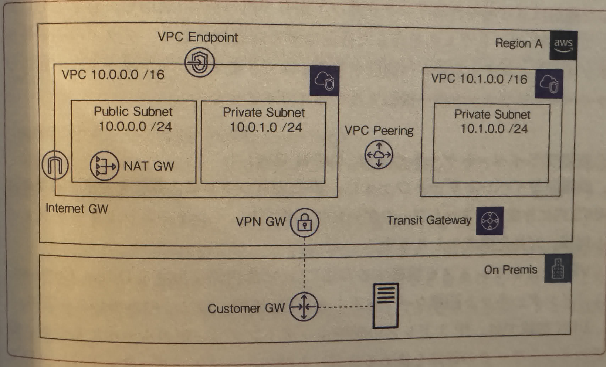
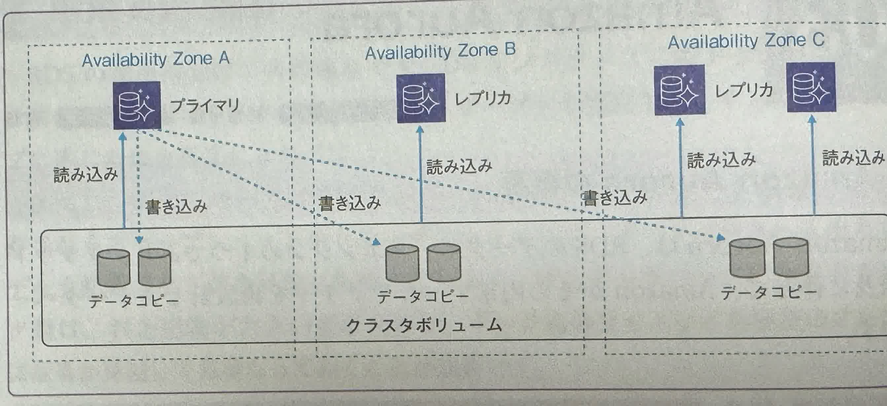

<!--toc:start-->

- [OVERVIEW](#overview)
- [アカウント作成](#アカウント作成)
  - [ルートユーザとIAMユーザ](#ルートユーザとiamユーザ)
- [アベイラリティゾーン(AZ)とリージョン](#アベイラリティゾーンazとリージョン)
- [ネットワーク関連のサービス](#ネットワーク関連のサービス)
  - [CIDR(Classless Inter Domain Routing)](#cidrclassless-inter-domain-routing)
  - [VPCとサブネットの特徴と構築方法](#vpcとサブネットの特徴と構築方法)
  - [VPCの外部通信](#vpcの外部通信)
  - [VPCのアクセス制御](#vpcのアクセス制御)
  - [VPCの利用料金](#vpcの利用料金)
  - [Elastic Load Balancing(ELB)](#elastic-load-balancingelb)
- [Amazon EC2](#amazon-ec2)
  - [EC2のインスタンスタイプ](#ec2のインスタンスタイプ)
  - [インスタンスに指定するOSイメージ(AMI)](#インスタンスに指定するosイメージami)
  - [インスタンスの購入のオプション](#インスタンスの購入のオプション)
  - [インスタンスの起動と接続](#インスタンスの起動と接続)
  - [インスタンス起動時のオプション](#インスタンス起動時のオプション)
  - [ハードウェア専有オプション](#ハードウェア専有オプション)
  - [プレースメントグループ](#プレースメントグループ)
  - [EC2インスタンスからAWSリソースへのアクセス](#ec2インスタンスからawsリソースへのアクセス)
    - [IAMユーザ認証情報を設定](#iamユーザ認証情報を設定)
    - [IAMロールをEC2インスタンスプロファイルに設定](#iamロールをec2インスタンスプロファイルに設定)
- [Auto Scaling](#auto-scaling)
  - [EC2 Auto Scalingの概要と構成要素](#ec2-auto-scalingの概要と構成要素)
  - [スケーリングされたインスタンスのライフサイクル](#スケーリングされたインスタンスのライフサイクル)
- [ストレージ関連のサービス](#ストレージ関連のサービス)
  - [ストレージサービスの種類](#ストレージサービスの種類)
    - [ブロックストレージ](#ブロックストレージ)
    - [ファイルストレージ](#ファイルストレージ)
    - [オブジェクトストレージ](#オブジェクトストレージ)
  - [Amazon S3](#amazon-s3)
    - [S3の特徴](#s3の特徴)
    - [S3の構成](#s3の構成)
    - [S3の主要機能](#s3の主要機能)
  - [Amazon EBS](#amazon-ebs)
- [備考](#備考)
<!--toc:end-->

## OVERVIEW

[AWSハンズオン資料](https://aws.amazon.com/jp/events/aws-event-resource/hands-on/)の学習記録．

自作PCエミュレータ！！ ->

## アカウント作成

### ルートユーザとIAMユーザ

- ルートユーザ

  - メールアドレスとパスワードでログイン
  - 全AWSサービスとリソースに対して，完全なタスク権限.
  - 日常的タスクには使わない．

- IAM(Identity and Access Management)ユーザ

  - アカウントID + IAM ユーザ名 + パスワードでログイン
  - 紐づけられているIAMポリシー権限で認められた操作のみ実行可能．
  - 利用者ごとにIAMユーザを作成．利用者はIAMユーザでログインし，作業を進めていく．

## アベイラリティゾーン(AZ)とリージョン

1 つの AWS リージョン内でそれぞれ切り離され, 冗長的な電力源, ネットワーク, そして接続機能を備えている 1 つ以上のデータセンターのこと.  
イメージは，大学とキャンパス. リージョンが大学でAZがキャンパスだと考えると, 大学のキャンパスには複数の建物があるので, リージョンとAZの関係に似ていてわかりやすい.

## ネットワーク関連のサービス

VPCは仮想ネットワークを構築できるサービス．

VPCおよびサブネットは，ネットワークを論理的に細分化したセグメントに相当する．  
VPCで作成したネットワークはあくまでも仮想化されたものであり，様々なロケーションに分散しているAWSの物理リソース上に構築される．


### CIDR(Classless Inter Domain Routing)

別名をクラスレスアドレッシングと呼び，現在主流で使用されているIPアドレスの割り当て方式．  
初期のTCP/IPのIPアドレス(IPv4)は，IPアドレスの枯渇問題を抱えていた．この問題を解決するために，**クラスフルアドレッシング** という仕組みが導入された．
このクラスとは，クラスA，クラスB，クラスCの3つのクラスが存在し, それぞれネットワークとホストの割り当ての割合が異なる．

しかし，クラスフルアドレッシングには「ユーザにとってちょうどいいアドレスクラスが存在しない」という問題が存在したため，
この問題を解決するために，割り振られたネットワークをさらに小さい単位に分割する『**サブネット**』という概念が誕生した．

従来のクラスフルアドレッシングのクラス(クラスA，クラスB，クラスC)をより小さいサブネットに分割することをサブネット化と表現することもあるが，
現在では，クラスの定義に関わらず単にネットワークをより小さな複数のネットワークに分割することもサブネット化すると表現する．

つまり，サブネット化を行うために，IPアドレスをサブネットマスクの情報を付随して自由にネットワークの範囲を指定する仕組みのことを『CIDR(クラスレスアドレッシング)』と呼ぶ．


このように，クラスフルアドレッシングのクラスCであれば，ネットワークアドレス24bit, ホストアドレス8bitで固定されている．そのため，256-2=254台のホストが接続可能である．  
一方CIDRは，クラスフルアドレッシングのようにネットワーク部とホスト部を8bit区切ることにこだわらずに，**任意のbitでネットワーク部とホスト部の境界が決められる点**である．

CIDR表記は，IPアドレスの後ろにスラッシュと数字を付けて表記(ex. `192.168.0.0/24`)する．  
この場合のCIDR表記は`192.168.0.0/255.255.255.0`と同義である．
サブネットマスク`/255.255.255.0`，`/24`は，『上位何ビットがネットワークアドレスである』という意味である．

一般的にCIDR表記はプレフィックスと呼び，CIDR表記を「プレフィックス表記」とも呼ぶ．


- 経路情報の集約
  経路(ルート)が多くなると，ルータ内のルーティングテーブルが大きくなり，宛先ネットワークを見つけるための時間が長くなったり，ルーティングテーブルに保存するためのメモリ量が大量に必要なる．  
  そのため，上図のようにルーティングテーブルを圧縮し，エントリ数を減らすことが可能．

### VPCとサブネットの特徴と構築方法

VPCは，AWSのリージョン単位で作成でき，CIDR表記にそってネットワークを構築することが可能．  
構築したVPCでは，セグメントに相当する複数のサブネットを定義して，用途に応じて柔軟にネットワークを構成することができる．

- VPC内のアドレスはCIDRが「/16」または「/28」の間で使用できる．

使用できないアドレスは以下の通り，  
XXX.XXX.XXX.0 : ネットワークアドレス  
XXX.XXX.XXX.1 : VPCルータ  
XXX.XXX.XXX.2 : DNSサーバ  
XXX.XXX.XXX.3 : AWSが予備的に確保  
XXX.XXX.XXX.255 : ブロードキャストアドレス

### VPCの外部通信

VPCでは，複数のVPC間で通信することはもちろん，Direct Connect(オンプレミスとの接続サービス)やVPN(Virtual Private Network)を通じて，オンプレミス環境にあるサーバとも通信できる．
VPC内のリソースが外部通信する際は，次のようなネットワークゲートウェイリソースを設置する．



- インターネットゲートウェイ
  インターネットゲートウェイは，文字通り，VPCとインターネットの通信用途で設置されるもので，実際に通信を行うためにはそれに加えて，通信元のリソースがパブリックIPアドレスを持っている必要がある．  
  AWSで付与できるパブリックアドレスは動的に割り当てられるものと固定的に割り振られるものがあり，後者を「**Elastic IP Address**」と呼ぶ．

  冗長構成(あえて複数の構成をとり，片方に障害が発生しても対応)をとり，インターネットゲートウェイは自動スケーリングされる．

- NATゲートウェイ(NAT Gateway)
  NAT(Network Address Translation: ネットワークアドレス変換)は，プライベートサブネットないでインターネットへの通信を行いたい場合にパブリックサブネットへ設置する中継用ゲートウェイである．  
  NATゲートウェイを介した通信は，単方向通信であり，プライベートサブネットからインターネットへ通信することはできますが，**インターネットからプライベートサブネットへの通信はできない．**

- 仮想プライベートゲートウェイ(VPN GW)
  仮想プライベートゲートウェイはVPCとオンプレミス環境を接続するためにAWS内に作成するネットワークゲートウェイである．  
  インターネットゲートウェイと同様，冗長化構成をとる．

- カスタマーゲートウェイ(Customer Gateway)
  カスタマーゲートウェイはAWSとのVPN接続においてオンプレミス側に配置するゲートウェイである．  
  前述の動的/静的の接続方式は，オンプレミス環境のネットワーク構成に依存する．オンプレミス環境で動的ルーティングを利用する場合は，BGP(Border Gateway Protocol)を利用する．

  オンプレミス環境で静的ルーティングを利用する場合は，**通信が行えるネットワーク物理機器と，接続を許可する固定のパブリックIPアドレス**が必要となる．
  仮想プライゲートウェイと接続するためのカスタマーゲートウェイ設定は，AWSコンソール上からも行う必要がある．

- VPCピアリング接続(VPC Peering)
  VPCピアリング接続は，独立した2つのVPCを接続し，プライベートアドレスを使って相互に通信する．  
  同じリージョンの別のアカウントのVPCとも接続が可能である．

- VPCエンドポイント(VPC Endpoint)
  VPCエンドポイントは，VPCの中からマネージメントサービスにアクセスするためのサービスである．  
  AWSのマネージメントサービスには，EC2やRDSのようにVPCまたはサブネット内に構築されるリソースと，S3やDynamoDB，SQSのようにリージョン単位で提供されるリソースがある．

  リージョンサービスはVPCの外にあるAWSネットワーク内に構築されるため，アクセスするにはVPCから外部へ出る形になる．  
  S3やDynamoDBなどはデフォルトで，インターネット経由のアクセスが可能なので，インターネットゲートウェイやNATゲートウェイの設定が実行されていれば通信できるが,
  VPCエンドポイントを設置することで，インターネットを経由することなくアクセスすることができる．

  

  VPCエンドポイントとは，インターネット上で提供される特定のURLまたはIPアドレスをさす．  
  「ゲートウェイ型」と「インターフェース型」の二種類がある．

  > [!CAUTION]  
  > 説明読んでもよくわからんから，あとでやる

- トランジットゲートウェイ(Transit Gateway)  
  トランジットゲートウェイはVPCで設定するものとは，別のルーティングテーブルを持っており，独立した2つのVPCを接続する「VPCピアリング接続」にて，各VPC間の通信を制御する．  
  多数のVPCでピアリング接続が複数発生する場合は，通常，各VPC間の接続ごとに設定する必要があるが，トランジットゲートウェイを使用することで，一元的な設定により効率的な管理が可能になる．

  

### VPCのアクセス制御

VPCでは，「ルートテーブル」「セキュリティグループ」「ネットワークACL」の3つの方法で通信のルート設定・アクセス制御を設定することが可能．

- ルートテーブル
  VPC内の通信では，指定されたCIDR表記のアドレスで通信をルーティングするルールセットを定義する必要がある．  
  これを「ルートテーブル」といい，以下の図のような形で表す．

  

  VPCを作成すると，同時にメインルートテーブルが自動的に作成される．  
  ユーザは通常，設定変更による影響を小さくするため，メインルートテーブルを編集するのではなく，カスタムルートテーブルに関連付けられる必要がある．

  VPC内の各サブネットは何かしらのルートテーブルに関連付けられる必要がある．
  そのため，特定のルートテーブルが明示的に関連付けられていない場合，サブネットはメインルートテーブルに暗黙的に関連付けられる．

- セキュリティグループ
  セキュリティグループは，Linuxにおけるファイアウォール機能を**IPTables**とほぼ同じ役割を持つ．  
  アクセス許可するソースやプロトコル，ポートのルール定義を作成し，EC2やRDSなどのAWSリソースに関連づけることで，ファイアウォールとして機能する．  
  受信と送信の両方をリソースレベルで制御する他，リソースをグループ化し，共通のセキュリティグループを関連づけることができる．

  一般的なファイアウォール同様，通信の状態を記録して動作し，発生した通信に対する応答通信は自動的に許可される．

  

- ネットワークACLの作成
  ネットワークACLは，サブネットに関連付けられ，受信と送信の両方をサブネットレベルで制御することが可能．  
  そのため，関連付けられた全てのリソースに対して，同じネットワークACLが適用される．

  

### VPCの利用料金

VPCの利用料金は，以下の通り．
| 項目 | 内容 |
| -------------- | --------------- |
| VPC・サブネットの構築・稼働 | 無料 |
| VPCからのデータ通信でインバウンド接続 | 無料 |
| VPCからのデータ通信でアウトバウンド接続 | データ転送量に応じた従量課金 |
| VPCピアリング接続 | データ転送量に応じた従量課金 |
| インターネットゲートウェイ | 無料 |
| NATゲートウェイ | NATゲートウェイの利用時間の料金 |
| 仮想プライベートゲートウェイ | AWS VPN, AWS Direct Connectの利用料金に準ずる |
| VPCエンドポイント | Private Link 利用時間の料金, データ転送量に応じた従量課金 |
| トランジットゲートウェイ | アタッチメントごとの料金, データ転送量に応じた従量課金 |

### Elastic Load Balancing(ELB)

Elastic Load Balancing(ELB)は，AWSが提供する完全マネージドな仮想ロードバランシングサービス．  
以下の３つのサービスの総称．

- アプリケーションロードバランサー (Application Load Balancer: ALB）
- クラッシックロードバランサー (Classic Load Balancer: CLB)
- ネットワークロードバランサー (Network Load Balancer: NLB)

各機能の違いや特徴を押さえ，目的にあったものを選択できるようにする．  
AWSが提供する仮想ロードバランシングサービスであるELBは，EC2やRDSのようにVPC内に仮想的に配置される．  
定義上は1つのリソースのように扱われるが，内部的には冗長化構成されている．  
ELBは，複数のアベイラビリティゾーンをまたいだ構築が可能．

- Application Load Balancer (ALB)
  ALBは，リバースプロキシ型のロードバランシングサービスである．  
  負荷分散はOSI7層モデルの第7層(アプリケーション層)レベルでルーティングが可能．  
  「リスナー」と呼ばれるコンポーネントを作成し，使用するプロトコルとポートを設定して，ルーティングルールを設定する．

  

  例えば，`https://example.com/pathA`や`https://example.com/pathB`といったURLのパス単位で，ターゲットグループ(アベイラビリティゾーンをまたいでインスタンスやコンテナをまとめた仮想的なグループ)を振り分け指定し，

  その他，ALBではAWS CognitoやOIDC IDプロバイダと連携する**ユーザ認証**をサポートしている．
  認証が成功したリクエストは，ALBによりアクセストークンやIDトークン，ユーザトークン，ユーザクレイム(ユーザ情報)がHTTPヘッダに付与されて，リクエストとして転送される．

- Network Load Balancer(NLB)
  NLBは，主にOSI7層モデルでの第四層(トランスポート層)での負荷分散用途で使用されるL4ロードバランサーである．  
  IPアドレスとポートを元に振り分けるため，より低負荷で負荷分散が可能な特性を持つ．

- Classic Load Balancer(CLB)
  CLBは，ALBやNLBに比べて機能が限定されている．  
  ただし，ALBやNLBの機能が不要であれば，CLBを使用することもできる．
  ALBとNLBを併せたレガシーなバランサーである認識でよい．

## Amazon EC2

Amazon EC2 (Elastic Compute Cloud)は，仮想的なサーバ環境を提供するサービスである．  
Webサービスやバッチ処理といったアプリケーションの中核的な処理を事項するほか，コンテナの実行オープンソースソフトウェアの実行，開発時のテスト実行など幅広い用途で使用される．

- EC2は様々なソフトウェアの10個基盤として利用される．
- ワークロード(用途や処理の内容)に応じて，多様な種類のインスタンスタイプが用意されている．
- オンデマンドやリザーブドなど，不空sの支払いオプションが用意されている．
- EC2インスタンスがデータベース・ストレージサービスなどのリソースにアクセスにするためには，適切な権限ポリシーを付与したロールを設定する必要がある．

### EC2のインスタンスタイプ

EC2というサービスは，VPCおよびサブネットに仮想を提供するサービス.  
インスタンスのCPUやメモリ，ストレージといったリソースのキャパシティを定義したものを「インスタンスタイプ」と呼ぶ．

インスタンスタイプは複数カテゴリがあり，用途を特徴づけるように，名前が設計されている．  
**M5a.24xlarge** の場合,

- インスタンスタイプ(M)
  CPUが必要なのか？メモリが必要なのか？などの用途に併せて選択する．

- 世代+オプション(5a)
  世代は，数字が高い方が高性能．

- インスタンスサイズ(24xlarge)
  CPU，メモリ，ネットワークのキャパシティといった「インスタンスの性能」を決定する．

### インスタンスに指定するOSイメージ(AMI)

EC2上で仮想サーバとして動作するゲストOSをAMI(Amazon Machine Image)と呼ぶ．  
AWSはAmazon LinuxやWindows Server, オープンソースの各種Linux ディストリビューションが利用可能．

### インスタンスの購入のオプション

EC2を利用するには，当然EC2インスタンスを購入する必要がある．  
購入方法には，従量課金制の「オンデマンドインスタンス」や，事前に予約することでディスカウントが受けられる「リザーブドインスタンス」などいくつかの種類が用意されている．  
こうした購入方法を「購入オプション」と呼ぶ．

> [参考：AWS購入オプションについて](https://zenn.dev/khatakey/articles/ec2-pricing-options)

### インスタンスの起動と接続

AWSユーザーは，これまで説明してきたインスタンスタイプと実行するAMI，購入オプションを指定して，仮想サーバを構築する．  
インスタンスの起動は，マネージメントコンソールやAWS CLI，SDKを利用して行う．

下記の流れで[ウィザード形式](#備考)で行われる.

インスタンスの起動フロー.

0. ネットワークの設定
1. AMIの選択
2. インスタンスタイプを選択
3. ストレージ設定
4. タグの設定
5. セキュリティグループの設定
6. キーペア設定

### インスタンス起動時のオプション

インスタンスを起動する際には，様々なソフトウェアインストールしたり，繰り返し行う共通的な設定作業・項目を実行したい場合がある．  
EC2では，以下のようにインスタンス起動時にカスタム処理を実行する機能が用意されている．

- ユーザーデータ
  EC2インスタンス起動時にスクリプトを実行する機能．

- 起動テンプレート
  前節で解説したインスタンス起動フローの一連の設定をテンプレート化し，実行する機能．

### ハードウェア専有オプション

自身が使用するAWSアカウントで，インスタンスが配置されるハードウェアを専有するオプション．  
例えば，

- 商用利用ソフトウェアでは，仮想サーバ上でライセンス体系が適用できないものがある.
- ハードウェアなどの物理環境リソースを共有していることで，セキュリティ要件に抵触することもある．
  こういった要件に応えるために，ハードウェア専有オプションが提供されている．

### プレースメントグループ

プレースメントグループは，EC2のインスタンスの実行時にAWSのアベイラビリティゾーンの物理的な配置戦略を選択できる機能．

- Cluster
  単一のアベイラビリティゾーンの物理的に近い位置でインスタンスを配置することが可能．

- Cluster
  EC2インスタンスは別々のハードウェアに分散して配置される．

- Spread
  インスタンスは同一のハードウェアを共有しない論理的にパーティションに分割して配置される．

### EC2インスタンスからAWSリソースへのアクセス

EC2インスタンスからS3やDynamoDBなどの他のAWSサービスへのアクセスする場合(APIを実行する場合), IAMを使った権限の付与が必要になる．

#### IAMユーザ認証情報を設定

- EC2のホームディレクトリ配下の.awsデイレクトりにCredentialフィアルを配置する．
- EC2の環境変数としてAWS_ACCESS_KEY_ID, AWS_SECRET_ACCESS_KEYを設定する．

#### IAMロールをEC2インスタンスプロファイルに設定

EC2インスタンス起動フローの「インスタンスの詳細設定」で，IAMロールをEC2に割り当てる方法である．  
なお，EC2は一般にアプリケーションを実行する用途で使われるkとおが多いので，アプリケーションからAWSリソースへのアクセスは，通常はSDKを通じて行う．

1. 環境変数
2. ホームディレクトリ
3. EC2インスタンスプロファイル(EC2で実行される場合)

## Auto Scaling

Auto Scaling は，サーバの負荷の上昇や故障を検知して，自動的にEC2インスタンス数を増減させるクラウドサービスである．
Auto Scaling には，EC2を対象とする「EC2 Auto Scaling」と，ECSやLambda，DynamoDBなどの様々なAWSサービスを対象とする「Application Auto Scaling」があるが
以下では，EC2 Auto Scalingについて説明する．

### EC2 Auto Scalingの概要と構成要素

EC2 Auto Scalingを利用すると，VPC上に配置したEC2インスタンスの需要に応じて自動的にインスタンスを増減でき，コストを最適化できる．  
また，同時に異常なインスタンスを発見すると，切り離して新しいものに交換するため，可用性を高めることができる．

- Auto Scaling Group
  Auto Scalingの設定の単位．次のようなスケーリングに関わる全般設定を定義したグループ．

  - 起動するインスタンスを配置するVPCおよびサブネット．
  - インスタンス配置数の最小値，最大値，希望値．
  - Scaling Plan (複数設定可能)
  - ヘルスチェックの方法

- Launch Configuration
  Auto Scaling Groupに関連付けられたインスタンスの起動ルールを定めた設定．前節で解説した「インスタンスの起動フロー」の設定内容とほぼ同じ．

- Scaling Plan
  インスタンスをスケールするルールを設定する．  
  Scaling Plan は，複数種類があり，Auto Scaling Groupへ複数設定することが可能．

  - 最小台数の維持
  - 手動スケーリング
  - 動的スケーリング
  - 予測スケーリング
    ２週間分のメトリクスデータを元に，自動的にスケールアウトする．

### スケーリングされたインスタンスのライフサイクル


| インスタンスの状態 | 説明                                                                                                                                     | インスタンス使用の請求 |
| ------------------ | ---------------------------------------------------------------------------------------------------------------------------------------- | ---------------------- |
| pending            | インスタンスは running 状態への移行準備中です。インスタンスは、起動時または stopped 状態になってから起動すると、pending 状態になります。 | 非請求対象             |
| running            | インスタンスは実行中で、使用できる状態です。                                                                                             | 請求済み付             |
| stopping           | インスタンスは停止の準備中です。                                                                                                         | 非請求対象             |
| stopped            | インスタンスはシャットダウンされているため、使用できません。インスタンスはいつでも起動できます。                                         | 課金されない           |
| shutting-down      | インスタンスは削除準備中です。                                                                                                           | 課金されない           |
| terminated         | インスタンスは完全に削除されているため、起動することはできません。                                                                       | 課金されない           |

## ストレージ関連のサービス

### ストレージサービスの種類

ストレージシステムには，大別して以下の3つの種類がある．

- ブロックストレージ
- ファイルストレージ
- オブジェクトストレージ


#### ブロックストレージ

最も一般的なストレージ形態で，PCに取り付けるようなハードディスクやSSDはこれに該当．データをブロックとして扱う．
ブロックストレージに格納されるデータは，固定の大きさのブロックに分割されて保存される．  
各ブロックには，一意のIDが付与され，データにアクセスする際には，そのIDを指定してアクセスする．  
このブロックは，**連続する必要ない．**

OSにストレージの存在を認識させるには，マウントが必要．

#### ファイルストレージ

データをファイルとして，階層構造となったフォルダに保存するストレージ形態．  
データにアクセスする際には，データが保存されている場所を指定する．

ファイルストレージは，ネットワーク経由でアクセスすることができる．  
高速のデータアクセスを必要とするケースには不向き．

#### オブジェクトストレージ

クラウドなどで用いられるストレージ形態.  
画像データや音声データなど一つ一つのデータをオブジェクトという単位で管理するストレージ形態．  
ブロックストレージでは，各データに固有のURI(Uniform Resource Identifier)とメタデータ(データ自体の特定を表すデータ)が付与される．  
ユーザはオブジェクトに付与されたURIを指定して，HTTP通信からデータにアクセスする．

データ複製やストレージ容量の増設などが用意．

??結局，我々がよく使うPCはどれが使われてるの -> ブロックストレージの上にファイルシステムが構築され，そのファイルシステムがブロックを管理してデータをファイルとして扱う??
??ブロックストレージなのはわかった．しかし，ファイルストレージである，sambaとかが使えるのはどうして -> ファイルストレージを別にマウントしているだけ??

### Amazon S3

`Amazon S3 (Simple Storage Service)`および`Amazon S3 Glacier`は，オブジェクトストレージを提供するサービス.

#### S3の特徴

S3は，オブジェクトストレージの特徴である「ストレージの増設の容易さ」を活かし，ユーザに容量無制限のストレージを提供する．

- 容量無制限の従量課金制
- 高耐久，高可用性
  S3は，リージョンないの複数AZで複製された上で格納される．
- 安価
  S3は，AWSのストレージサービスのなかで最も安価．

S3 Glacierは，最も安価なアーカイブストレージサービス．取り出すたびに解凍する必要がある．解凍の処理に時間と利用料金がかかる.

#### S3の構成

S3は，次の図に示す要素で構成される．


- バケット
  バケットとは，オブジェクトの格納場所のこと．  
  バケット名がそのままURLに含まれるため，バケット名は一意である必要がある．
- キー
  キーとは，オブジェクトに割り当てる名前（ファイル名）．⚪︎⚪︎.jpgみたいな  
  キーはバケット内で一意である必要がある．
- メタデータ
  メタデータは，アップロードしたオブジェクトの属性を記載したデータ．

#### S3の主要機能

S3は，様々な機能を提供している．

- 静的Webサイトホスティング
  静的Webサイトホスティングの設定を有効化することで，静的なHTMLを返すといったサービスを展開できる.

- アクセス制御
  S3では，オブジェクトへのアクセスを制御するために，ACL(Access Control List)とバケットポリシー，パブリックアクセスブロック設定を提供する．

  - ACL: バケットやオブジェクトに対するアクセス権限を設定するための機能．
  - バケットポリシー
    アカウントやIPアドレスに対するアクセス制御を設定するための機能．  
    「誰が・どのオブジェクトに対して・何を実行できるのか」をより詳細に制御可能．

    ```json
    {
      "Version": "2012-10-17",
      "Statement": [
        {
          "Sid": "PublicRead",
          "Effect": "Allow",
          "Principal": {
            "AWS": "arn:aws:iam::xxxxxxxxxxxx:root"
          },
          "Action": ["s3:GetObject", "s3:GetobjectVersion"],
          "Resource": [
            "arn:aws:s3:::example-bucket/*",
            "arn:aws:s3:::example-bucket"
          ],
          "Condition": {
            "NotIpAddress": {
              "aws:SourceIp": "YY.YY.YY.YY/24"
            }
          }
        }
      ]
    }
    ```

  - パブリックアクセスブロック: パブリックアクセスの可否をバケットやアカウント単位で制御．

- ライフスタイル
  指定日数の経過後，バケット内のオブジェクトを削除したり，ストレージクラスを変更したりする機能．  
  例えば，1ヶ月は頻繁に利用されるものの，その後は全く利用されないオブジェクトは，S3からS3 Glacierに移行することで，コストを削減できる．

- 署名付きURL
- バージョニング
  S3では，オブジェクトを更新・削除すると元に戻すことができない．  
  S3バケット内での, 更新・削除のイベントは1つのバージョンとして管理される．バージョンを指定することで復旧することが可能．  
  当然，前のバージョンのデータも保持するため，容量は増える．

- 暗号化
- クロスリージョンレプリケーション
  S3は，デフォルトで，3つのAZに複製される．  
  AZ全体での障害に備えて，別リージョンにも複製することができる．

### Amazon EBS

Amazon EBS (Elastic Block Store)は，EC2向けにブロックストレージを提供するサービス．  
EBSで作成されたブロックストレージは，EBSボリュームと呼ばれる．  
EBSボリュームは，EC2インスタンスに関連付け(アタッチ)し，OSにてマウントすることで利用できる．

#### EBSの主要機能

EBSは，ブロックストレージを提供するだけでなく，いくつかの機能を有している．

- EBSボリュームの提供
  EBSでは，前述の通りEC2向けにEBSボリュームを提供する．  
  ユーザーはボリュームサイズとAZを指定し，EBSボリュームの作成を行う．  
  EBSボリュームは同じAZにあるEC2のみアタッチ可能．

  EBSボリュームは，SSDやHDDが選択でき，当然SSDの方が高速で高価．  
  EBSのバックアップは，S3にスナップショットとして保存することができる．
  これにより，S3に保存したスナップショットから，他のAvailability zoneからEBSボリュームを作成することができる．

  

### Amazon EFS

Amazon EFS (Elastic File System)は，AWS上でファイルストレージを提供するサービスである．  
EFSが提供するストレージは，EC2やECSなどの各種サービスがら利用可能．

EFSは，**VPC**内に作成される．EC2インスタンスやコンテナは各AZに作成されるマウントターゲットのIPアドレスを使って，EFSに接続する．


## データベース関連のサービス

??僕らが目指すのは??

### CAP定理

CAP定理は，分散システムにおいて，Consistency(整合性)，Availability(可用性)，Partition tolerance(分断耐性)の3つの特性を満たすことはできないという理論である．

- 一貫性(Consistency)
  どのノードに接続しても，全てのクライアントが同時に同じデータを参照できることを意味する．

- 可用性(Availability)
  システムを構成するノードに障害が発生していたとしても，常に書き込みと読み込みが可能．

- ネットワーク分断耐性(Partition tolerance)
  システムを構成するノード間の通信が一時的に分断されても，機能が継続される．

原則として，二つの特性を重視すると，第三の特性は犠牲になる．
そのため，**CA型，CP型，AP型**の三つに分類される．

- CA型のデータベース  
  CA型のデータベースは，データの一貫性と可用性を提供する構成である．

  1. DBMS(Database Management System)の機能を使い，プライマリ/セカンダリ構成(データベースをプライマリとセカンダリの2台で構成する)でデータを同期する．
  2. X/Open に対応した分散型トランザクションマネージャなどを利用して，同時にデータベースへ更新をかけるよう，２フェーズコミット(処理が複数のサーバーで事項されているような状況下で処理の整合性が保たれるように2段階に分けて処理を行うこと)を実施する．

  

  この構成では，ネットワークが分断された場合，一貫性/可用性ともに満たされなくなる．  
  つまり，同時にネットワーク分断耐性を満たすことができない．

- CP型データベース  
  CP型は，可用性(Availability)が低下する代わりに，一貫性とネットワーク分断性を高める構成である．  
  データを複数のアベイラリティゾーンに分散して保存することで，これは一般的にシャドーイングと呼ばれる．

  

  シャドーイングでは，一つのノードが機能しなくても，そのノードに配置されたデータが利用できなくなるだけで，データベース全体が利用できなくなることはない．

- AP型データベース  
  AP型は，一貫性を犠牲にして，可用性とネットワーク分断性を高める構成である．  
  AP型のデータベースは，データの一貫性を保証しない．
  
  この構成では，ネットワークが分断された場合，可用性/ネットワーク分断性は満たされるが，一貫性が低下する．

??CP型は，どうしてネットワーク分断に強いんだ？??

### Amazon RDS (CA型)

Amazon RDS (Relational Database Service)は，リレーショナルデータベースを提供するサービス．

#### RDSマネージドサービスのスコープと内容

- 拡張性  
  スケールアップ・スケールダウンが容易に実行可能．  
  EC2同様, RDSを実行する際は，インスタンスタイプを指定して起動する．

- 高可用性  
  待機中のシステムがダウンした際に，待機系のシステムに自動で切り替える**「自動フェイルオーバー」**をサポート．  
  「Multi-AZ配置」というオプションを選択することで，別のAZにスタンバイデータベースを配置する冗長化構成が構築．

- DBバックアップ  
  RDSには，「自動バックアップ機能」があり，バックアップ対象として，次の2つのデータをS3へ保存する．

  - 1日1回のバックアップウィンドウで指定した時間にDBバックアップショット
  - 5分間隔のトランザクションログ

- DB, OSパッチ適用  
  メンテナンスウィンドウで指定した時間に，DBパッチを自動で適用する．
- OSインストール/サーバーメンテナンス/ハードウェア資産管理/電源・ネットワーク・空調

#### リードレプリカ

パフォーマンスの向上のために，プライマリとなるデータベースを非同期で複製する機能．

- リクエストをオフロードできる．
  読み込みアクセスが多い場合，最大5台までリードレプリカを構築して，リクエストをオフロード(負荷を分散)することができる．
- リードレプリカをスタンドアローンDBインスタンスへ昇格できる．
  任意のタイミングで，スタンドアローンDBインスタンスへ昇格できるオプションが用意されている．

- クロスリージョンレプリカを作成できる．
  リードレプリカには，Microsoft SQL Serverや一部のリージョンでは使用できないという制約がある．


### Amazon Aurora

Auroraは，RDBの特性である一貫性をもち，RDSが持つリードレプリカといったハイパフォーマンスのための特徴を持つ．



#### Auroraの特徴

- より高速なデータ同期・フェイルオーバー(待機への切り替え)  
  プライマリインスタンス，リードレプリカともに，3つのAZにレプリケートされた同じクラスタボリュームのデータコピーを参照するので，レプリカの非同期更新時間が小さくなっている．
  プライマリインスタンスに障害が発生したとしても，RDSより高速にリードレプリカへフェイルオーバーすることができる．

- 自動ストレージ拡張  
  データは10GBずつ「**protection groups**」と呼ばれる論理的グループに保存され，64TBまで自動で拡張される．

- 様々なエンドポイント  
  RDSと同様，プライマリインスタンスを指し示す「クラスターエンドポイント」とリードレプリカを指し示す「読み取りエンドポイント」がある．また，ユーザがワークロードに応じて任意にレプリカを設定する「カスタムエンドポイント」を定義できる．

- リードレプリカのオートスケーリング  
  Auroraのリードレプリカは，メトリクスに対応している．

- DBバックアップ機能の充填  
  RDSと同様，自動バックアップが常に有効．  
  S3へ継続的にスナップショットが保存される．増分バックアップで行われる．  
  データをある時点に戻すBackTrack機能がある．

- クロスリージョンデータベースの性能向上・低価格化
  RDSと同様，クロスリージョンでのデータベースレプリケーションが，オプションとしてサポートされる．  
  クロスリージョンは，一つのプライマリAWSリージョンと最大5つのセカンダリAWSリージョンで構成される．

- パラレルクエリ
  ストレージノードに搭載されたCPUを活用し，多数のストレージノードに対して，並列にクエリを実行し，高速にスキャンすることができる．

#### Auroraの特徴

Aurora Serverlessは，サーバーレスアーキテクチャを採用したAuroraのサービス．


Aurora Serverlessは, リクエストの負荷に応じて，インスタンスタイプの変更や更新・停止を自動で行う．  
キャパシティユニットと呼ばれるデータベースの使用量を指定する．  
キャパシティはプールされていて，指定値を満たすようにリクエストをルーティングするルーターフリートがクライアント接続を追加する．

### Amazon DynamoDB(AP型)

Amazon DynamoDBは，可用性(Avaialbility)とネットワーク分断耐性(Partition tolerance)を重視したサービス．  
重視したAP型データベースの代表例で，クラウド環境ならではの水平スケーラビリティに優れた特徴を持つ．

水平スケーラビリティとは，サーバなどのリソースの数を増やして，システム全体のパフォーマンスを高める手法を高める手法のこと．

#### AP型データベースのアーキテクチャ

AP型のNoSQLデータベースは，一貫性(Consistency) が下がる代わりに，可用性(Avaialbility) とネットワーク分断耐性(Partition tolerance) を高める構成である．


単一障害点がないことが大きな特徴．  
どこのノードからでもデータ更新が可能であり，(全てのアベリラリティゾーンにあるデータを参照・更新する)  
ただし，ノードの故障や通信のエラーにより，複数のノードでの整合性の取れない(一貫性がない)ケースが発生する．  
その解決策として，**ReadRepair機能**や **Quorum**を使って，結果整合性をとる手法(簡単に言えば，不整合が出た場合に，なるべく多くが一致したデータを多数決で採用する．)で対応．

AP型データベースを理解する上で，押さえておくべきなのは，各ノードに配置される「データ」「ノード」の概念である．  
DynamoDBでは，**Consistent Hashing**というアルゴリズムにより，各ノードと配置されるデータを決定している．  
例えば，先の図では都道府県と市/区は1対Nの関係である．  
都道府県を区別するキーを親キー，市や区を区別するキーを子キーとする．  
DynamoDBで親キーを**パーテションキー**，子キーを**ソートキー**と呼ぶ．


> [参考: Consistent Hashing](https://christina04.hatenablog.com/entry/consistent-hashing)
> 時計回りで近いノードにデータを格納する．

- Pros

  - 親キーで配置されるノードが決まる．
  - ノード内でデータ順序を決定する子キーを任意に設定できる．
  - 子キーを作成しない場合は，親キーのみでデータを一意に特定できるようにする必要がある．
  - キーにはインデックスを設定できる．

- Cons(RDBと比較して)

  - テーブル間の結合ができない．
  - 外部キーがない
  - 条件指定は基本的に，プライマリキーのみ
  - 副問合せができない
  - GROUP BYができない
  - OR, NOT などの論理演算子が利用できない．

このように，AP型のNoSQLデータベースを，RDBの代替として考えるには，機能制約が，相応にある．  
そのため，NoSQLデータベースを導入する場合でも，前述の面に記載されている様々な要件を求めらるケースもある．

#### DynamoDBの概要と特徴

DynamoDBは，AWSが提供するAP型のNoSQLデータベースのマネージドサービスである．  
項目・属性の定義が必要ないスキーマレスのテーブル構成を取る．

スキーマレスにより，1対Nのデータ構造でもそのまま保存可能．


- DynamoDBの結果整合性オプション

  |          | 結果整合性オプション     | 動作                                                           |
  | -------- | ------------------------ | -------------------------------------------------------------- |
  | 読み込み | 結果整合性のある読み込み | 2/3の読み込みが一致した場合，正常応用                          |
  | 読み込み | 強い読み込み整合性       | 全てのReadRepair完了している状態で結果を応答                   |
  | 読み込み | トランザクション読み込み | 直列化可能分離レベル(SERIALIZABLE)でデータを読み取るオプション |
  | 書き込み | 結果整合性のある書き込み | 2/3以上の書き込みが成功した場合，正常応答                      |
  | 書き込み | トランザクション書き込み | 全ての書き込みが成功した場合，正常応答                         |

  DynamoDBでは，テーブル単位で書き込みのパフォーマンスをスループットとして，定義する．  
  読み取りのスループットを「読み書きキャパシティユニット」とよび，書き込みスループットを「書き込みキャッシュユニット」(Write Capacity Units)と呼ぶ．

- キャパシティユニットの定義

  |      | 結果整合性オプション                                                                                                               |
  | ---- | ---------------------------------------------------------------------------------------------------------------------------------- |
  | RCUs | 1秒あたりの読み込み項目数 x 項目のサイズ(4kbまでを１ブロックとして計算) 結果整合性ある読み込みの場合はスループット2倍になる        |
  | WCUs | 1秒あたりの読み込み項目数 x 項目のサイズ(1kbまでを１ブロックとして計算) トランザクション書き込みの場合はスループットが半分になる． |

### Dynamo ElastiCache

Amazon ElasitcCacheは，AWSが提供するセットアップ，運用，拡張が容易なマネージメントサービス．  
主な用途として, RDBに保存してあるマスターデータをキャッシュして処理を高速化や，複数のアプリケーションサーバでセッションデータを共有などに使用される．
MemcachedとRedisの2つのエンジンを提供している．

#### ElasitCache

ElastiCacheは，インメモリ型(ディスクではなく，メモリにロードされる)のキーバリューストアである．  
キーバリューストアとは，キーと値のセットでデータを保存し，キーを指定することでデータを取り出すデータ管理システム．  
MemcachedとRedisの2つのエンジンを提供している．

主に，

- シンプルなキーバリュー型のデータをキャッシュし，低レイテンシで参照する
- マルチスレッドでアクセス可能な共通データをキャッシュする
- リクエスト量に応じてスケールアウト・スケールインする

という用途で利用される．

下図は，データが保存されているノードにElasticCacheがアクセスする仕組み.


各データはキーのコンシステントハッシュと呼ばれるアルゴリズムに基づいて，各ノードに分散して保存されている．

クラスタは設定エンドポイントと各キャッシュノードのエンドポイントをもち，クラスタにはAWSが提供している
Auto Discoveryに対応したクライアント(**ElastiCache Cluster Client**)を使ってアクセスする．  
クライアントは設定エンドポイントから指定されたキーの値に基づいて，格納されているノードのエンドポイントを取得してアクセスして，データを返す．

アプリケーションは，指定されたキーを持つデータをキャッシュから探し，存在すればそのデータを利用する．  
存在しなければ，キャッシュ対象のデータソースからデータを取得し，キャッシュに保存して，データを利用する．

次回以降，同じキーが指定される．キャッシュからデータを取り出せるようになる．  
ただし，Memcachedは，マルチスレッドで動作するため，キャッシュデータの更新系処理が発生すると，スレッドごとに異なるデータを読み込んでしまう可能性がある．

#### ElastiCache for Redis

## 備考

- OSI (Open Systems Interconnection)
  Open Systems Interconnectionモデルは，ネットワーク通信機能を7つの層に分割する概念的なフレームワークである．  
  ネットワーク経由でのデータ転送は, 様々なハードウェアおよびソフトウェアテクノロジーが地理的および政治的境界を超えて連携して機能するため，複雑である．

- AWSの利用料金の怖さ
  想定した金額よりも高額な請求が発生したらどうしよう．という怖さがある．  
  そこら辺の対処方法を知っておくべき

- ウィザード形式
  魔術師という意味の英単語．利用者に一つずつ質問や設定項目を提示して，選択入力を促し，対話的に処理を進める操作方式のことをいう．

- ハイパーバイザー
  サーバー仮想化などで利用される，コンピュータを仮想化するための制御プログラムである．

  **ハイパーバイザーの種類**

  1. Type 1 (ベアメタルハイパーバイザー)

  - 物理的ハードウェアで直接実行される．
  - OSよりも先に起動し，直接ハードウェアを制御する．

  AWSのサーバーで実際に物理的リソースを分割して仮想化する技術は，Type1に該当する．

  2. Type 2 (ホスト型ハイパーバイザー)

  - ホストOS上で実行される．
  - ホストOSがハードウェアを制御し，その上でハイパーバイザーが動作する．

  つまり，Linuxの中でWindowsを起動するような場合は，Type2に該当する．

- KVM
  KVM(Kernel-based Virtual Machine: カーネルベースの仮想マシン)は，Linuxに組み込まれたオープンソースの仮想化テクノロジーである．  
  KVMは，Type2ハイパーバイザーに分類される．
  KVMを使用すると，Linuxをハイパーバイザーとして機能させることができる．

  KVMは，Linuxカーネルのモジュールとしてロードされて，カーネルモードで動作する．
  KVMが提供する仮想化機能を利用することで，仮想化マシンが独自の仮想CPU，メモリ，ストレージ，ネットワークインターフェースをもち，実際のハードウェア上で動作しているように見える．

- テラフォームはどこまでラッパーできてるのか？

- DBMS (Database Management System)
  DBMS(Database Management System)は，データベースを管理するためのソフトウェアである．  
  DBMSは，データの追加，削除，更新，検索などの操作を行うための機能を提供する．  
  SQLと呼ばれる言語を使って，DBMSに対してデータベース操作を行う．

- X/Open
  X/Open分散型トランザクション処理(DTP)モデルには，分散トランザクションの処理方法を制御するいくつかの互いに関連するコンポーネンが含まれる．

- NoSQL
  リレーショナルデータベース(RDB)ではないデータベースの総称．  
  RDBの主なメリットとして，データの一貫性を担保し，検索性が高い点が挙げれられる．  
  NoSQLは，交通整理を行わないため，その結果として**大量のデータを高速に処理することができる**.  
  画像や音声データといった非構造化データ(決まった構造を持たないデータ)やXMLやJSONなどのような半構造型データを扱える点も，NoSQLの特徴である．

  複雑なクエリに対応しにくい．
