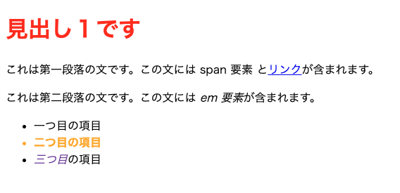
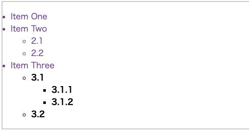
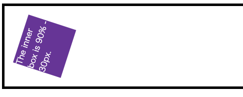

<link href="https://raw.githubusercontent.com/simonlc/Markdown-CSS/master/markdown.css" rel="stylesheet"></link>

# ALL OVERVIEW

以下は，HTMLとCSSの学習記録.

<!--toc:start-->

- [ALL OVERVIEW](#all-overview)
- [HTML 入門](#html-入門)
  - [OVERVIEW](#overview)
  - [HTMLとは](#htmlとは)
  - [タグの基礎知識](#タグの基礎知識)
  - [HTMLの属性](#htmlの属性)
  - [HTMLのバージョンとDOCTYPE宣言](#htmlのバージョンとdoctype宣言)
  - [HTML基本構成](#html基本構成)
  - [body](#body)
  - [HTML構成要素](#html構成要素)
    - [基本的な要素](#基本的な要素)
    - [空要素](#空要素)
    - [属性](#属性)
      - [論理属性](#論理属性)
    - [HTMLにCSSとJavaScriptを追加する．](#htmlにcssとjavascriptを追加する)
  - [HTMLの基礎](#htmlの基礎)
    - [見出しと段落](#見出しと段落)
    - [リスト](#リスト)
    - [強調と重要性](#強調と重要性)
  - [ハイパーリンク](#ハイパーリンク)
    - [文章フラグメント](#文章フラグメント)
    - [リンクに関する良い習慣](#リンクに関する良い習慣)
      - [ダウンロードへのリンクをdownload属性を使う](#ダウンロードへのリンクをdownload属性を使う)
      - [メールのリンク](#メールのリンク)
  - [他のテキスト整形](#他のテキスト整形)
    - [引用](#引用)
      - [ブロック引用](#ブロック引用)
      - [インライン引用](#インライン引用)
    - [略語](#略語)
    - [詳細な連絡先のマークアップ](#詳細な連絡先のマークアップ)
    - [コンピュータのコードを表現する．](#コンピュータのコードを表現する)
    - [日付と時刻をマークアップ](#日付と時刻をマークアップ)
  - [文章とウェブサイトの構造](#文章とウェブサイトの構造)
    - [文章の基本構造](#文章の基本構造)
    - [HTMLレイアウト要素の詳細](#htmlレイアウト要素の詳細)
    - [非意味的要素](#非意味的要素)
    - [改行と水平線](#改行と水平線)
  - [マルチメディアの埋め込み](#マルチメディアの埋め込み)
    - [画像の埋め込み](#画像の埋め込み)
      - [レスポンシブ画像](#レスポンシブ画像)
    - [動画の埋め込み](#動画の埋め込み)
      - [`<video>`要素](#video要素)
      - [`<iframe>`要素](#iframe要素)
    - [その他埋め込み技術](#その他埋め込み技術)
      - [`<embed>`要素と`<object>`要素](#embed要素とobject要素)
      - [ベクターグラフィック](#ベクターグラフィック)
      - [HTMLテーブル](#htmlテーブル)
- [CSS 入門](#css-入門)
  - [CSSとは何か？](#cssとは何か)
  - [CSSの基礎](#cssの基礎)
    - [特定の要素をスタイリングする](#特定の要素をスタイリングする)
    - [文章の場所に基づいてスタイリングする](#文章の場所に基づいてスタイリングする)
    - [状態に基づいてスタイリングする](#状態に基づいてスタイリングする)
  - [CSSの構造](#cssの構造)
    - [セレクター](#セレクター)
    - [詳細度](#詳細度)
    - [プロパティと値](#プロパティと値)
    - [関数](#関数)
    - [アットルール](#アットルール)
    - [一括指定](#一括指定)
  - [CSSによるスタイリングおよびレンダリングまでの一連の流れ](#cssによるスタイリングおよびレンダリングまでの一連の流れ)
    - [DOM について](#dom-について)
    <!--toc:end-->

# HTML 入門

HTML学習記録.

## OVERVIEW

[HTML入門](https://developer.mozilla.org/ja/docs/Learn/HTML/Introduction_to_HTML)の備忘録

MarkdownでHtmlタグかけるので，その際は，そのまま記述する．

## HTMLとは

HTML（HyperText Markup Language）は, Webページを作成するための言語. HTMLは, Webページの構造を記述するための言語であり, Webページの見た目を記述するための言語ではない．Webページの見た目を記述するための言語はCSS（Cascading Style Sheets）である．

このHyperTextとは, ハイパーリンクを持つテキストのことであり, ハイパーリンクとは, クリックすると別のWebページに移動することができるリンクのことである．  
そしてMarkupとは，タグなどを使って文書の構造を記述することである．

## タグの基礎知識

HTMLでは, タグを使って文書の構造を記述する．タグは, `<` と `>` で囲まれた部分であり, 以下のような形をしている．

```html
<html>
  <head>
    <meta charset="UTF-8" />
    <title>ここにページタイトルが入ります.</title>
  </head>
  <body>
    ここにページの内容が入ります．
  </body>
</html>
```

html, head, bodyタグは，通常インデント利用する．

## HTMLの属性

属性とは，タグに付ける追加情報のことである．属性は, タグの中に書く．属性は, `属性名="属性値"` という形をしている．  
また，複数の属性をつける場合は，スペースで区切る．

```html
<html lang="ja"></html>
```

- global属性

  - herf属性は, リンク先のURLを指定する．

    ```html
    <a href="https://www.mozilla.org/ja/">Mozilla</a>
    ```

    実装： <a href="https://www.mozilla.org/ja/">Mozilla</a>

  - title属性は, ツールチップの内容を指定する．  
     ホバーすると，ツールチップが表示される．

    ```html
    <a href="https://www.mozilla.org/ja/" title="Mozillaのホームページ"
      >Mozilla</a
    >
    ```

    実装： <a href="https://www.mozilla.org/ja/" title="Mozillaのホームページ">Mozilla</a>

  - class属性: 要素にクラス(分類名)を付ける．

  - title属性: 要素にタイトルを付ける．

  - lang属性: 言語を指定する．

## HTMLのバージョンとDOCTYPE宣言

最新のバージョンはHTML5.1.
HTML5からDOCTYPE宣言は，不要になった．  
しかしながら，つけないと互換モードで表示される可能性があるので，つけることが推奨されている．  
`<!DOCTYPE html>`

## HTML基本構成

基本構成を[index.html](./index.html)に示す．

以下，index.htmlの内容．

```html
<!doctype html>
<html lang="en-US">
  <head>
    <meta charset="utf-8" />
    <title>My test page</title>
  </head>
  <body>
    <p>This is my page</p>
  </body>
</html>
```

以下，レンダリング結果．  


1. `<!DOCTYPE html>`: 文書型定義
2. `<html></html>`: HTML文書のルート要素
3. `<head></head>`: メタ情報を含む要素  
   ページ閲覧者がに見せるべきではない情報を載せるコンテナの役割を持つ．  
   これには，検索結果に現れるキーワードやページの説明，内容をスタイル設定するためのCSS, 文字セットの宣言などが含まれる．

4. `<meta charset="UTF-8">`: 文字エンコーディングを指定  
   `<meta>`は，ページのメタ情報を含む要素であり，charset属性は，ページの文字エンコーディングを指定する．

5. `<title></title>`: ページのタイトルを指定
   これは，ブラウザのタブに表示されるタイトルであり，検索結果に表示されるタイトルでもある．

6. `<body></body>`: ページのコンテンツを含む要素
   要素．テキスト，画像，動画，ゲームなど，ページに表示するコンテンツを含む．

## body

- コンテンツ・モデル  
   コンテンツモデルとは，要素がどのような要素を子要素として持つことができるかを示すものである．

- 要素のカテゴリー  
   要素を分類するためのカテゴリーがある．  
   属性は，要素に関する追加情報を提供するため，区別する.

  HTML5では，以下の7つのカテゴリーがある．

  - Metadata content  
     ページの情報を指定する要素などが分類される．基本的には画面に表示されない部分．

  - Flow content  
     body要素の中から基本的にどこでも配置することができる要素．  
     ほとんどの要素がこのカテゴリーに属する．

  - Sectioning content  
     章，節，見出し

## HTML構成要素

### 基本的な要素

```html
<p>My cat is very grumpy</p>
```

- 開始タグ: `<p>`
  要素名(この場合は段落を表すp), 囲んでる開き山括弧と閉じ山括弧で構成される．  
  この場合，段落が始まる位置．

- 内容: My cat is very grumpy
  要素の内容．この場合，段落の内容．

- 終了タグ: `</p>`
  要素名の前にスラッシュをつけたもの．  
  この場合，段落が終わる位置．

### 空要素

要素によっては，単一のタグで構成される場合がある．そのような要素を空要素と呼ぶ．

例えば，以下の

```html

```

> [!TIP]  
> **メモ**: HTML では, 例えば `` のように, 空要素のタグの末尾に `/` を追加する必要はない．しかし,これは有効な構文であり, HTML を有効な XML にしたい場合に使うことがある.

### 属性

要素は次のように属性(Attribute)を持つことができる．

```html
<p class="editor-note">My cat is very grumpy</p>
```

属性は，実際のコンテンツの中で表示させたくない，要素に関する追加情報を保有する．  
この例は，`class`属性は要素をスタイル情報の対象とするために使用される識別子である．

属性をつけることで，リンクを載せることができる．  
以下の`<a>`がそのanchor要素である．

```html
<p>
  A link to my
  <a
    herf="https://www.mozilla.org/"
    title="The Mozilla homepage"
    target="_blank"
    >favorite website</a
  >.
</p>
```

#### 論理属性

沢山のHTMLソースをみていくうちに，属性値のない属性を見かけることがある．

```html
<input type="text" disabled />
```

これは，input要素にユーザが入力できないようにするためのdisabled属性がある ．

### HTMLにCSSとJavaScriptを追加する．

`<link>`要素は，外部のCSSファイルをHTMLページにリンクするために使用される．各場所は，`<head>`要素内に配置される．

```html
<link rel="stylesheet" href="my-css-file.css" />
```

`<script>`要素もヘッド部に入れるべきである．`defer`属性を指定してやると，ページのHTMLの解析が完了した後にJavaScriptを読み込む.

## HTMLの基礎

### 見出しと段落

段落は，`<p>`要素で作成する．  
見出しは，`<h1>`から`<h6>`までの要素で作成する．  
h1が最も大きく，h6が最も小さい．

例とて，物語を考える．`<h1>`は物語の題名を表し，`<h2>`は章の題名を表し，`<h3>`は節の題名を表す．

**注意**

- できれば，1ページに1つの`<h1>`を使用するのが望ましい．
- `<h2>`より先に`<h3>`要素を使用するのはよくない．
- 理想は，`<h3>`までのレベルにする．

**考慮すべき点**

- 検索エンジンは，見出しのコンテンツをページの検索ランクに影響する重要なキーワードとして扱うから，見出しがないとSEO(検索エンジンの最適化)の点でよくない．
- CSSでコンテンツをスタイリングしたり，JavaScriptでコンテンツを操作する際に，見出し要素を使用することが多い．

### リスト

以下のように，`<ul>`で囲み`<li>`(list item)で囲むことで，**順序なしリスト**を作ることができる．

```html
<ul>
  <li>milk</li>
  <li>eggs</li>
  <li>bread</li>
  <li>hummus</li>
</ul>
```

以下のように，`<ol>`で囲み`<li>`(list item)で囲むことで，**順序ありリスト**を作ることができる．

```html
<ol>
  <li>Drive to the end of the road</li>
  <li>Turn right</li>
  <li>Go straight across the first two roundabouts</li>
  <li>Turn left at the third roundabout</li>
  <li>The school is on your right, 300 meters up the road</li>
</ol>
```

### 強調と重要性

強調を表す`<em>`要素と，重要性を表す`<strong>`要素がある．

## ハイパーリンク

webをwebたらしめる機能．  
ブロックレベル要素を含む，ほぼ全てのコンテンツをリンクにすることができる．

以下は，見出しがリンクになるパターン．

```html
<a herf="https://developer.mozilla.org/ja/">
  <h1>MDN Web Docs</h1>
</a>
<p>2005年から，CSS,HTML，JavaScriptなどのウェブ技術を文章化している．</p>
```

タイトル属性による補足情報の追加もできる．

```html
<p>
  <a
    href="https://www.mozilla.org/ja/"
    title="Mozilla の使命と協力方法について調べる最適な場所"
  >
    Mozilla ホームページ</a
  >へのリンクを作成しています。
</p>
```

### 文章フラグメント

文章フラグメントとは，ページ内の特定の場所に直接リンクするためのものである．

```html
<!-- 文章のフラグメントを指定する． -->
<h2 id="Mailing_address">Mailing address</h2>
<!-- 文章のフラグメントにアクセスする． -->
<p>
  Want to write us a letter? Use our
  <a href="contacts.html#Mailing_address">mailing address</a>.
</p>
```

### リンクに関する良い習慣

#### ダウンロードへのリンクをdownload属性を使う

ダウンロード属性を使用して，規定の保存ファイル名を指定できる．

```html
<a
  href="https://download.mozilla.org/?product=firefox-latest-ssl&os=win64&lang=en-US"
  download="firefox-latest-64bit-installer.exe"
>
  Download Latest Firefox for Windows (64-bit) (English, US)
</a>
```

#### メールのリンク

以下は，宛先を指定した空のメールを作成する．

```html
<a href="mailto:nowhere@mozilla.org">メールをどこにも送信しません</a>
```

- `mailtto:nowhere@mozilla.org`
- `mailtto:nowhere@mozilla.org?cc=nobody@mozilla.org`

## 他のテキスト整形

ブラウザが認識するためのルール的なものが多い．

### 引用

HTMLには，引用をマークアップするための機能もある．  
どちらの要素を使用するかは，ブロックとインラインのどちらの引用をマークアップするかによって異なる．  
先ほどのリンクは，内部リンクで今からは外部リンク??

#### ブロック引用

以下は，ブロック引用を利用する手順．

```html
<p>こちらが引用です。</p>
<blockquote
  cite="https://developer.mozilla.org/ja/docs/Web/HTML/Element/blockquote"
>
  <p>
    The <strong>HTML <code>&lt;blockquote&gt;</code> Element</strong> (or
    <em>HTML Block Quotation Element</em>) indicates that the enclosed text is
    an extended quotation.
  </p>
</blockquote>
```

**引用する際のルール**
ブロックレベルの内容の一部が他の場所から引用されている場合，`<blockquote>`要素で囲み，`cite`属性の中に引用元を指すURLを記載する必要がある．

#### インライン引用

インライン引用の際は，`<q>`要素を使用する．

```html
<p>
  The quote element — <code>&lt;q&gt;</code> — is
  <q cite="https://developer.mozilla.org/ja/docs/Web/HTML/Element/q">
    intended for short quotations that don't require paragraph breaks.
  </q>
</p>
```

### 略語

略語を定義する際には，`<abbr>`要素を使用する．

```html
<p>
  We use <abbr>HTML</abbr>, Hypertext Markup Language, to structure our web
  documents.
</p>

<p>
  I think <abbr title="Reverend">Rev.</abbr> Green did it in the kitchen with
  the chainsaw.
</p>
```

### 詳細な連絡先のマークアップ

```html
<address>
  <p>
    Chris Mills<br />
    Manchester<br />
    The Grim North<br />
    UK
  </p>

  <ul>
    <li>Tel: 01234 567 890</li>
    <li>Email: me@grim-north.co.uk</li>
  </ul>
</address>
```

### コンピュータのコードを表現する．

htmlを使用して，コンピュータのコードをマークアップするために利用可能な要素がいくつかある．

- `<code>`: コンピュータのコードの一般的な部分をマークアップ.
- `<pre>`: 空白を保持する場合（一般的にはコードブロック）  
  テキストの中でインデントや余分な空白を使用すると、ブラウザーはそれを無視するので, レンダリングされたページにはそれが表示されない．しかし, テキストを `<pre></pre>` タグで囲むと, エディターで見たのと同じように空白が表示されるようになる.
- `<var>`: 特に変数名をマークアップするためのもの.
- `<kbd>`: コンピューターに入力されたキーボード（およびその他の種類の）入力をマークアップするためのもの．
- `<samp>`: コンピュータプログラムの出力をマークアップ.

```html
<pre><code>const para = document.querySelector('p');

para.onclick = function() {
  alert('Owww, stop poking me!');
}</code></pre>

<p>
  You shouldn't use presentational elements like <code>&lt;font&gt;</code> and
  <code>&lt;center&gt;</code>.
</p>

<p>
  In the above JavaScript example, <var>para</var> represents a paragraph
  element.
</p>

<p>Select all the text with <kbd>Ctrl</kbd>/<kbd>Cmd</kbd> + <kbd>A</kbd>.</p>

<pre>$ <kbd>ping mozilla.org</kbd>
<samp>PING mozilla.org (63.245.215.20): 56 data bytes
64 bytes from 63.245.215.20: icmp_seq=0 ttl=40 time=158.233 ms</samp></pre>
```

Qiitaとかは，これ使ってるのかな??

### 日付と時刻をマークアップ

日付をブラウザなどが認識するための要素．  
日付の書き方は様々なので，以下の要素でマークアップすることができる．

```html
<!-- Standard simple date -->
<time datetime="2016-01-20">20 January 2016</time>
<!-- Just year and month -->
<time datetime="2016-01">January 2016</time>
<!-- Just month and day -->
<time datetime="01-20">20 January</time>
<!-- Just time, hours and minutes -->
<time datetime="19:30">19:30</time>
<!-- You can do seconds and milliseconds too! -->
<time datetime="19:30:01.856">19:30:01.856</time>
<!-- Date and time -->
<time datetime="2016-01-20T19:30">7.30pm, 20 January 2016</time>
<!-- Date and time with timezone offset -->
<time datetime="2016-01-20T19:30+01:00">
  7.30pm, 20 January 2016 is 8.30pm in France
</time>
<!-- Calling out a specific week number -->
<time datetime="2016-W04">The fourth week of 2016</time>
```

## 文章とウェブサイトの構造

### 文章の基本構造

こんな形でWebページを作ろうねという共通の認識がある．

- ヘッダー:  
  通常は大きな見出しやロゴがついた部分． 通常，ウェブページ間を移動しても，ウェブサイトに関する主な共通情報が留まっている場所．
- ナビゲーションバー:  
  サイトの主要部分のリンク．通常メニューボタン，リンク，またはタブで表さられる．  
  ヘッダーと同様に，このコンテンツは通常，あるWebページから別のWebページへの一貫性を保っている．
- メインコンテンツ:  
  中央の大きな領域で，指定されたWebページの固有の内容をほとんど含む．
- サイドバー:  
  いくつかの周辺情報，リンク，引用，広告．
- フッター:
  通常，注意事項，著作権表示，連絡先情報が含まれるページの最下部．


### HTMLレイアウト要素の詳細

上に示した[webサイト](#文章の基本構造)の[コード](./Mozilla-Sample.html)をみてみる．

あらかじめ，HTMLには基本構造を明記するための要素が用意されている．

- `<main>`は，このページに固有のコンテンツようである．`<main>`はページごとに1回だけ使用する．  
  `<body>`の中に直接入れる．
- `<article>`は，ページの残りの部分なしで，それ自体が意味をなす関連コンテンツのブロックを囲む．
- `<section>`は`<article>`に似ているが，1つの機能(例: ミニマップ，記事の見出しと要約のセット)を構成するページの単一部分をグループ化するためのものである．
- `<aside>`には，メインコンテンツに直接関連しないコンテンツが含まれるが，それに間接的に関連する追加情報(用語集の項目, 著者略歴, 関連リンク)
- `<header>`は，導入部のコンテンツ群を表す． もし，それが`<body>`の子であれば，Webページのグローバルヘッダーを定義する．
- `<nav>`は，ページの主なナビゲーション機能を含む．
- `<footer>`はページの終了コンテンツのグループを表す．

### 非意味的要素

非意味的要素(Non-semantic elements)は，HTMLにおいてそのタグ自体が特定の意味や情報を持たない要素のこと指す．  
主にページのスタイリングやレイアウトの目的で使用される．

`<span>`は**インラインの非意味的要素**である． コンテンツをラップするより良い意味的なテキスト要素が思いつかないか，または特定の意味を加えたくない場合にだけ使う．

```html
<p>
  The King walked drunkenly back to his room at 01:00, the beer doing nothing to
  aid him as he staggered through the door.
  <span class="editor-note">
    [Editor's note: At this point in the play, the lights should be down low].
  </span>
</p>
```

`<div>`は，**ブロックの非意味的要素**である．使用するセマンティック(意味や目的を持たせる)ブロック要素を考えない場合，または特定の要素を追加したくない場合にのみ使用する．

```html
<div class="shopping-cart">
  <h2>Shopping cart</h2>
  <ul>
    <li>
      <p>
        <a href=""><strong>Silver earrings</strong></a
        >: $99.95.
      </p>
      
    </li>
    <li>…</li>
  </ul>
  <p>Total cost: $237.89</p>
</div>
```

上のような例文で使われるのは，必ずしも`<aside>`ではない．ページの主要なコンテンツから外れたコンテンツを表すために使用される．

### 改行と水平線

時々，使用する要素に`<br>`, `<hr>`の二つがある．

- `<br>`: 改行要素

```html
<p>
  There once was a man named O'Dell<br />
  Who loved to write HTML<br />
  But his structure was bad, his semantics were sad<br />
  and his markup didn't read very well.
</p>
```

以下は，出力例．

<p>
  There once was a man named O'Dell<br />
  Who loved to write HTML<br />
  But his structure was bad, his semantics were sad<br />
  and his markup didn't read very well.
</p>

- `<hr>`: 主題分割要素

```html
<p>
  Ron was backed into a corner by the marauding netherbeasts. Scared, but
  determined to protect his friends, he raised his wand and prepared to do
  battle, hoping that his distress call had made it through.
</p>
<hr />
<p>
  Meanwhile, Harry was sitting at home, staring at his royalty statement and
  pondering when the next spin off series would come out, when an enchanted
  distress letter flew through his window and landed in his lap. He read it
  hazily and sighed; "better get back to work then", he mused.
</p>
```

以下h，出力例．

<p>
  Ron was backed into a corner by the marauding netherbeasts. Scared, but
  determined to protect his friends, he raised his wand and prepared to do
  battle, hoping that his distress call had made it through.
</p>
<hr />
<p>
  Meanwhile, Harry was sitting at home, staring at his royalty statement and
  pondering when the next spin off series would come out, when an enchanted
  distress letter flew through his window and landed in his lap. He read it
  hazily and sighed; "better get back to work then", he mused.
</p>

## マルチメディアの埋め込み

### 画像の埋め込み

```html

```

`alt`属性は，画像が見えない/表示されない場合に，表示するために使う．  
`title`属性は，マウスのホバーで出る説明文．

背景に画像を埋め込む際は，**CSS**を使用する．

#### レスポンシブ画像

レスポンシブ画像は，画面のサイズ，解像度などの機能が大きく異なる場合でも適切に動作する画像．

```html

```

- secrets属性: ブラウザが選択することができる画像のセットと，それぞれの画像の寸法を定義する．
  1. 画像のURL or パス
  2. 画像の幅の内在的なピクセル数(480w) 単位はpxでななく，wを使う．
- sizes属性: 画像が表示されるサイズを定義する．
  1. メディア条件 CSSで詳しく学ぶ
  2. 画像の幅の最大値を定義する．

### 動画の埋め込み

#### `<video>`要素

動画の埋め込みは，`video`要素を使用する．

```html
<video src="rabbit320.webm" controls>
  <p>
    お使いのブラウザーは HTML 動画をサポートしていません。その代わりに<a
      href="rabbit320.webm"
      >動画へのリンク</a
    >があります。
  </p>
</video>
```

- controls
  ビデオプレーヤーのコントロールを表示する．独自のコントロールインターフェースを組み込むことができる．
- `<video>`タグ内の段落
  これは代替コンテンツと呼ばれ，ページにアクセスしているブラウザーが`<video>`要素に対応していない場合に表示され，古いブラウザーのための代替手段を提供する．


#### `<iframe>`要素

`<iframe>`は，外部のページを埋め込むために使用される．  
YouTubeでは，`<video>`要素が使われれず，`<iframe>`要素が使われる．

```html
<iframe
  width="640"
  height="360"
  src="https://www.youtube.com/embed/zWL9jiOIElw"
  title="#10 個人的に好きな黄猿の名言集【MAD】【ワンピース】"
  frameborder="0"
  allow="accelerometer; autoplay; clipboard-write; encrypted-media; gyroscope; picture-in-picture; web-share"
  allowfullscreen
></iframe>
```

出力は，以下の通り．

<iframe width="640" height="360" src="https://www.youtube.com/embed/zWL9jiOIElw" title="#10 個人的に好きな黄猿の名言集【MAD】【ワンピース】" frameborder="0" allow="accelerometer; autoplay; clipboard-write; encrypted-media; gyroscope; picture-in-picture; web-share" allowfullscreen></iframe>

しかしながら，`<iframe>`を利用する際は以下を考慮する必要がある．

- セキュリティ
  悪意あるスクリプトを含むサイトを埋め込むことで**XSS攻撃**のリスクが高まる．  
  透明な`<iframe>`を重ねることで，ユーザが意図せず，別のボタンをクリックさせる，クリックジャッキングにきをつける．
- パフォーマンスの低下
  読み込む`<iframe>`によって，ページの読み込み速度が遅くなる．
- ユーザビリティ
  `<iframe>`を使った際に，そのコンテンツにアクセスできない可能性を考慮して，`title`属性を使用する．
- サンドボックス属性
  `<iframe>`には，`sandbox`属性を使用することで，JavaScriptの実行を禁止したり，フォームの送信, ポップアップウィンドウの起動を阻止したりすることができる．

### その他埋め込み技術

#### `<embed>`要素と`<object>`要素

`<embed>`要素と`<object>`要素は，古いブラウザーで使われることが多い．  
PDFなどの外部のコンテンツを埋め込むための汎用的なツールである．

<table class="standard-table no-markdown">
  <thead>
    <tr>
      <th scope="col"></th>
      <th scope="col"><a href="/ja/docs/Web/HTML/Element/embed"><code>&lt;embed&gt;</code></a></th>
      <th scope="col"><a href="/ja/docs/Web/HTML/Element/object"><code>&lt;object&gt;</code></a></th>
    </tr>
  </thead><tbody>
    <tr>
      <td>埋め込みコンテンツの <a href="/ja/docs/Glossary/URL">URL</a></td>
      <td><a href="/ja/docs/Web/HTML/Element/embed#src"><code>src</code></a></td>
      <td><a href="/ja/docs/Web/HTML/Element/object#data"><code>data</code></a></td>
    </tr>
    <tr>
      <td>埋め込みコンテンツの<em>正確な</em><a href="/ja/docs/Glossary/MIME_type">メディア種別</a></td>
      <td><a href="/ja/docs/Web/HTML/Element/embed#type"><code>type</code></a></td>
      <td><a href="/ja/docs/Web/HTML/Element/object#type"><code>type</code></a></td>
    </tr>
    <tr>
      <td>プラグインで制御されるボックスの幅と高さ（CSS ピクセル単位）</td>
      <td><a href="/ja/docs/Web/HTML/Element/embed#height"><code>height</code></a><br><a href="/ja/docs/Web/HTML/Element/embed#width"><code>width</code></a></td>
      <td><a href="/ja/docs/Web/HTML/Element/object#height"><code>height</code></a><br><a href="/ja/docs/Web/HTML/Element/object#width"><code>width</code></a></td>
    </tr>
    <tr>
      <td>プラグインに引数として供給するための名前と値</td>
      <td>その場限りの属性とその名前と値</td>
      <td>単一タグの <a href="/ja/docs/Web/HTML/Element/param"><code>&lt;param&gt;</code></a> 要素を <code>&lt;object&gt;</code> の中に書く</td>
    </tr>
    <tr>
      <td>利用不可能なリソースに対する代替として独立した HTML コンテンツ</td>
      <td>対応なし（<code>&lt;noembed&gt;</code> は廃止）</td>
      <td>
        <code>&lt;object&gt;</code> 内の
        <code>&lt;param&gt;</code> 要素の後に入れる
      </td>
    </tr>
  </tbody>
</table>

#### ベクターグラフィック

数式を用いて，図形, 線や色などを表現する画像形式の一種である．  
ベクターグラフィックは，拡大縮小しても画質が劣化しない．  
そのため，ロゴデザイン，イラストレーション，技術図面，フォント，ウェブデザインなどに用いられる．


SVG埋め込み例．
以下は，コード例．

```html
<svg width="100%" height="100%">
  <rect width="100%" height="100%" fill="red" />
  <circle cx="100%" cy="100%" r="150" fill="blue" stroke="black" />
  <polygon points="120,0 240,225 0,225" fill="green" />
  <text
    x="50"
    y="100"
    font-family="Verdana"
    font-size="55"
    fill="white"
    stroke="black"
    stroke-width="2"
  >
    Hello!
  </text>
</svg>
```

以下は，出力例．

```html
<svg width="100%" height="100%">
  <rect width="100%" height="100%" fill="red" />
  <circle cx="100%" cy="100%" r="150" fill="blue" stroke="black" />
  <polygon points="120,0 240,225 0,225" fill="green" />
  <text
    x="50"
    y="100"
    font-family="Verdana"
    font-size="55"
    fill="white"
    stroke="black"
    stroke-width="2"
  >
    Hello!
  </text>
</svg>
```

#### HTMLテーブル

HTMLテーブルは，表形式のデータに使用する必要がある．

マークアップは以下の通り．

```html
<table>
  <tr>
    <td>&nbsp;</td>
    <td>Knocky</td>
    <td>Flor</td>
    <td>Ella</td>
    <td>Juan</td>
  </tr>
  <tr>
    <td>Breed</td>
    <td>Jack Russell</td>
    <td>Poodle</td>
    <td>Streetdog</td>
    <td>Cocker Spaniel</td>
  </tr>
  <tr>
    <td>Age</td>
    <td>16</td>
    <td>9</td>
    <td>10</td>
    <td>5</td>
  </tr>
  <tr>
    <td>Owner</td>
    <td>Mother-in-law</td>
    <td>Me</td>
    <td>Me</td>
    <td>Sister-in-law</td>
  </tr>
  <tr>
    <td>Eating Habits</td>
    <td>Eats everyone's leftovers</td>
    <td>Nibbles at food</td>
    <td>Hearty eater</td>
    <td>Will eat till he explodes</td>
  </tr>
</table>
```

以下は出力例．

<table>
  <tr>
    <td>&nbsp;</td>
    <td>Knocky</td>
    <td>Flor</td>
    <td>Ella</td>
    <td>Juan</td>
  </tr>
  <tr>
    <td>Breed</td>
    <td>Jack Russell</td>
    <td>Poodle</td>
    <td>Streetdog</td>
    <td>Cocker Spaniel</td>
  </tr>
  <tr>
    <td>Age</td>
    <td>16</td>
    <td>9</td>
    <td>10</td>
    <td>5</td>
  </tr>
  <tr>
    <td>Owner</td>
    <td>Mother-in-law</td>
    <td>Me</td>
    <td>Me</td>
    <td>Sister-in-law</td>
  </tr>
  <tr>
    <td>Eating Habits</td>
    <td>Eats everyone's leftovers</td>
    <td>Nibbles at food</td>
    <td>Hearty eater</td>
    <td>Will eat till he explodes</td>
  </tr>
</table>

# CSS 入門

## CSSとは何か？

CSSは，Cascading Style Sheetsの略で，ウェブページのスタイルを定義するための言語である．

CSSは，ルールベースの言語である．
以下は，`<h1>`要素に対して，赤色の文字色と，5emのフォントサイズを指定するCSSの例である．

```css
h1 {
  color: red;
  font-size: 5em;
}
```

CSSの仕様は，W3C、WHATWG、ECMA、Khronos といった）標準化団体によって発行され、技術がどう働くよう期待されているかを定義されている．

## CSSの基礎

[CSSの基礎](./CSS_practice/01/index.html) に実行例を載せている

### 特定の要素をスタイリングする

```html
<ul>
  <li>Item one</li>
  <li class="special">二つ目の項目</li>
  <li><em>三つ目</em>の項目</li>
</ul>
```

リスト要素の`special`クラスに対して，以下のようなスタイルを適用する．

```css
li.special {
  color: orange;
  font-weight: bold;
}
```

このように，CSSによってリストの中の特定の項目に対して，特定のスタイルを適用することができる．

### 文章の場所に基づいてスタイリングする

`<li>`要素の中の`<em>`だけを選びたい時には，以下のように設定する．

```css
li em {
  color: rebeccapurple;
}
```

見出しの直後に来る段落を見出しと同じ段落レベルにしたい時は，以下のように設定する．

```css
h1 + p {
  font-size: 200%;
}
```

現状のスタイリングは以下の通り．


### 状態に基づいてスタイリングする

以下は，リンクを開く前はピンクで，開いたあとは緑になるように設定している．

```css
a:link {
  color: pink;
}

a:visited {
  color: green;
}

a:hover {
  text-decoration: none;
}
```

## CSSの構造

[index.html](./CSS_practice/02/index.html)に実行例を示す．

### セレクター

今までの`{}`の前で，スタイリングの対象をしていたものは，セレクターと呼ぶ．

```css
h1
a:link
.manythings
#onething
*
.box p
.box p:first-child
h1, h2, .intro
```

カンマ区切りで複数のセレクターリストにもできる．

```css
h1,
.special {
  color: blue;
}
```

`..`で無効なルールを設定できる．

```css
h1 {
  color: blue;
}

..special {
  color: blue;
}
```

特定の属性を持つ要素を選択することもできる．

```css
a[title] {
}
```

| セレクター           | 例                 |
| -------------------- | ------------------ |
| 要素セレクター       | `h1 {}`            |
| 全称セレクター       | `* {}`             |
| クラスセレクター     | `.box {}`          |
| IDセレクター         | `#unique{}`        |
| 属性セレクター       | `a[title] {}`      |
| 擬似クラスセレクター | `p:first-child {}` |
| 擬似要素セレクター   | `p::sirst-line {}` |
| 小孫要素セレクター   | `article p`        |
| 子結合セレクター     | `article > p`      |
| 次兄弟セレクター     | `h1 + p`           |
| 後継兄弟セレクター   | `h1 ~ p`           |

### カスケード

CSS(Cascading Style Sheets)の略で，最初の単語であるカスケードを理解することは，非常に重要である．  
カスケードとは，シンプルに考えるならば，発生元と，カスケードレイヤーとCSSルールの順序によるということ．

```css
p {
  color: red;
}

p {
  color: blue;
}
```

同率の場合，後に記述されたスタイルが適用される．

### 詳細度

二つのセレクターが同じ要素を選択する場合，どちらのスタイルが適用されるかは，セレクターの詳細度によって決まる．
詳細度は，例えばクラスセレクターと要素セレクターでは，クラスセレクターの方が高い詳細度を持つ．

- 要素セレクターは詳細度が低く，ページ上に現れるその種類の全てのようを選択するので，あまり重みがない．擬似要素セレクターは，通常の要素セレクターと同じ詳細度を持つ．
- クラスセレクターはより詳細度が高く，ページ上にある特定の`class`属性値を持つ要素のみを選択するので，より高い重みを持っている．属性セレクターと擬似クラスは，クラスと同じ重みを持つ．

下記の例では，クラス属性のスタイルが適用される．

```css
.main-heading {
  color: red;
}

h1 {
  color: blue;
}
```

#### 詳細度のルール

セレクターが持つ詳細度の量は，３つの異なる値を仕様して測定される．  
ID >> クラス >> 要素で詳細度が高い．  
また，加点性で考えられる．

- ID: この列は，全体のセレクターの中に含まれるそれぞれのIDセレクターに対して1点ずつ評価される．
- クラス: この列は，クラスセレクター，属性セレクター，擬似クラスが全体に含まれている場合にそれぞれについて1点ずつ評価される．
- 要素: この列は，要素セレクターまたは擬似要素が全体のセレクターの中に含まれている場合に，1点ずつ評価する．

| セレクター                 | ID  | クラス | 要素 | 詳細度の合計 |
| -------------------------- | --- | ------ | ---- | ------------ |
| h1                         | 0   | 0      | 1    | 0-0-1        |
| h1 + p::first-letter       | 0   | 0      | 3    | 0-0-3        |
| li > a[href*="en-US"]      | 0   | 2      | 2    | 0-2-2        |
| #identifier                | 1   | 0      | 0    | 1-0-0        |
| button:not(#mainBtn, .cta) | 1   | 0      | 1    | 1-0-1        |

### 継承

CSSでは，親要素のスタイルが子要素に適用される．  
`color`プロパティは継承されるプロパティの一つである．一方，`width`や`margin`,`padding`などのプロパティは，継承されるプロパティではない．

以下の例を確認する．
具体的な実装は，[index.html](./CSS_practice/03/index.html)を参照．

- CSS

```css
.main {
  color: rebeccapurple;
  border: 2px solid #ccc;
  padding: 1em;
}

.special {
  color: black;
  font-weight: bold;
}
```

- HTML

```html
<ul class="main">
  <li>Item One</li>
  <li>
    Item Two
    <ul>
      <li>2.1</li>
      <li>2.2</li>
    </ul>
  </li>
  <li>
    Item Three
    <ul class="special">
      <li>
        3.1
        <ul>
          <li>3.1.1</li>
          <li>3.1.2</li>
        </ul>
      </li>
      <li>3.2</li>
    </ul>
  </li>
</ul>
```



間接的な子である`<li>`にも，colorが適用されている．

### プロパティと値

- プロパティ:
  スタイルに関して変更できる何らかの特徴を表す，人間が理解できる識別子である．
  `font-size`, `color`, `background-color`などがある．
- 値:
  プロパティをどのようにスタイル付けするかを示す．

### 関数

```css
.outer {
  border: 5px solid black;
}

.box {
  padding: 10px;
  width: calc(90% - 30px);
  background-color: rebeccapurple;
  color: white;
}
```

以下のように，`calc()`関数を使用することで，`width`プロパティに対して，`90%`から`30px`を引いた値を設定することができる．  


### アットルール

スタイルシートを別のCSSスタイルシートをインポートする．

```css
@import "styles2.css";
```

以下は，`<body>`要素に対して規定でピンクの背景を定義している．しかし，ブラウザのビューポート(ユーザが視認する領域のこと)30em以上の場合は，背景色を青に変更する．

```css
body {
  background-color: pink;
}

@media (min-width: 30em) {
  body {
    background-color: blue;
  }
}
```

### 一括指定

`font`, `background`, `padding`, `border`, `margin` のようなプロパティは一括指定プロパティ (shorthand properties) と呼ばれる．
例えば，以下の二つのCSSは同じスタイリングである．

以下は，一括指定プロパティを使用している．

```css
/* 4 つの値による一括定義、例えば padding や margin
   では、値が適用される順序は top, right, bottom, left の順 (top から時計回り) です。
   他の種類の一括指定もあり、例えば 2 つの値による一括指定を padding/margin に設定すると、
   top/bottom と left/right になります。*/
padding: 10px 15px 15px 5px;
```

以下は，それぞれのプロパティを指定する.

```css
padding-top: 10px;
padding-right: 15px;
padding-bottom: 15px;
padding-left: 5px;
```

## CSSによるスタイリングおよびレンダリングまでの一連の流れ

ブラウザがドキュメントを表示するまでの，ブラウザはそのコンテンツをスタイル情報と結合する．  
以下の流れで行われる(JavaScriptは簡素化のため，ここで説明しない)．

1. ブラウザがHTMLを読み込む．
2. HTMLがDOM(Document Object Model)に変換される．DOMはコンピュータのメモリ内のドキュメントである．
3. その後ブラウザーは埋め込まれた画像やビデオなどのHTMLドキュメントにリンクされているリソースとCSSを取得する．
4. ブラウザは取得したCSSを解析し，要素，クラス，IDなどセレクタの種類ごちに分類する．見つけたセレクターに基づいて，DOMのどのノードにどのルールを敵将するかを決定し，スタイルを適用する．(この中間ステップをレンダーツリーと呼ぶ)
5. レンダーツリーは，ルール適用後の構造にレイアウトされる．
6. ページが画面に表示される．


また，ブラウザの対応状況によっては，対応しないCSSがある．その場合，そのCSSは**無視される**．

### DOM について

DOMには，ツリーのような構造がある．  
マークアップの各要素，属性，およびテキストは，ツリー構造のDOMノードになる．

```css
<p>
  Let's use:
  <span>Cascading</span>
  <span>Style</span>
  <span>Sheets</span>
</p>
```

この場合，以下のようなツリー構造になる．

```
P
├─ "Let's use:"
├─ SPAN
|  └─ "Cascading"
├─ SPAN
|  └─ "Style"
└─ SPAN
   └─ "Sheets"
```
