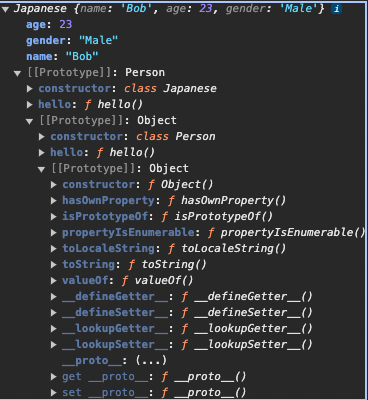

# Study JavaScript

<!--toc:start-->

- [Study JavaScript](#study-javascript)
  - [Overview](#overview)
  - [1. JavaScriptの歴史](#1-javascriptの歴史)
    - [なぜ二つの環境があるのか？](#なぜ二つの環境があるのか)
  - [2. ブラウザの構成](#2-ブラウザの構成)
  - [3. JavaScript基礎](#3-javascript基礎) - [グローバルオブジェクト](#グローバルオブジェクト) - [コンテキスト](#コンテキスト) - [コールスタック](#コールスタック) - [ホイスティング](#ホイスティング) - [コード例](#コード例) - [スコープ](#スコープ) - [レキシカルスコープ(Lexical Scope)](#レキシカルスコープlexical-scope) - [コード例](#コード例) - [クロージャ](#クロージャ) - [即時関数](#即時関数) - [コード例](#コード例) - [変数について](#変数について) - [プリミティブ型とオブジェクト](#プリミティブ型とオブジェクト) - [コピー, 再代入メモリ挙動](#コピー-再代入メモリ挙動) - [コード例](#コード例) - [コード例](#コード例) - [参照とconst](#参照とconst) - [コード例](#コード例) - [同期型コールバック　　](#同期型コールバック) - [コード例](#コード例) - [this](#this) - [コード例](#コード例) - [コード例](#コード例) - [bindによる固定](#bindによる固定) - [コード例](#コード例) - [call, applyによるthisの値の変更](#call-applyによるthisの値の変更) - [コード例](#コード例) - [コード例](#コード例) - [アロー関数](#アロー関数) - [コード例](#コード例) - [コード例](#コード例) - [コード例](#コード例) - [プロトタイプ(prototype)](#プロトタイプprototype) - [コード例](#コード例) - [Class](#class) - [継承](#継承) - [Chain Method](#chain-method) - [プロパティディスクリプタ](#プロパティディスクリプタ) - [データディスクリプタ](#データディスクリプタ) - [アクセサディスクリプタ](#アクセサディスクリプタ) - [MapとSet](#mapとset) - [iterator と generator](#iterator-と-generator) - [コード例](#コード例) - [コード例](#コード例) - [スレッドによる非同期処理](#スレッドによる非同期処理) - [非同期処理](#非同期処理) - [コード例](#コード例) - [タスクキュー（Task Queue）](#タスクキューtask-queue) - [コード例1](#コード例1) - [実行順](#実行順) - [出力順](#出力順) - [コード例2](#コード例2) - [実行順](#実行順) - [出力順](#出力順) - [注意：](#注意) - [Promise](#promise) - [コード例](#コード例) - [resolve, reject](#resolve-reject) - [コード例](#コード例) - [Promise のインスタンスの状態](#promise-のインスタンスの状態) - [コード例](#コード例) - [コード例](#コード例) - [コード例](#コード例) - [Macro and Micro Task](#macro-and-micro-task) - [コード例](#コード例) - [async](#async) - [コード例](#コード例) - [await](#await) - [コード例](#コード例) - [fetch](#fetch) - [コード例](#コード例) - [コンソール出力](#コンソール出力) - [Modueler](#modueler) - [\*.html](#html) - [export](#export) - [import](#import) - [html](#html) - [Strict Mode](#strict-mode) - [コード例](#コード例) - [Dynamic Import (比較的に新しい機能なので，ブラウザによっては対応していない．)](#dynamic-import-比較的に新しい機能なのでブラウザによっては対応していない) - [コード例](#コード例) - [他のオブジェクト](#他のオブジェクト) - [Proxy](#proxy) - [コード例](#コード例) - [Reflect](#reflect) - [コード例](#コード例)
  <!--toc:end-->

## Overview

- このリポジトリは大枠は[[JS]ガチで学びたい人のためのJavaScriptメカニズム(udemy)](https://www.udemy.com/course/javascript-essence/)の学習記録である．

- このコースを受けていく中で，非同期処理の説明には不足を感じた.  
  そのため，[JavaScript [非同期処理]](https://qiita.com/sho_U/items/f07a4f3e7760a9729f10#resolve-reject)を参考にして，疑問点を解消した．

## 1. JavaScriptの歴史

ECMAScriptは，JavaScriptのコアになる仕様である.これは，混在するブラウザ間の互換性を保つために，ECMA Internationalによって標準化されたものである.  
実行環境には，ブラウザ環境とNode.js環境がある.

- ブラウザ環境
  主に，ユーザーの操作に応じて動的に画面を更新するために使用される(**フロントエンド**).  
   ユーザがボタンをクリックしたり，フォームを入力したりする際の動的な応答を担う．  
   ECMAScriptとWeb APIを合わせたものを指す.このWeb APIには，画面の更新を操作するDOM APIや，HTTP通信を行うためのXMLHttpRequest APIなどが含まれる.

- Node.js環境
  JavaScriptをブラウザの外で，サーバーサイドやその他の環境で実行するために開発された．  
   Webサーバーを構築し，データベースとのやりとり，APIの提供，**バックエンド**ロジックの処理を行う．
  ECMAScriptとCommonJSのモジュールを管理する仕組みからなる．

### なぜ二つの環境があるのか？

Node.jsの登場により，JavaScripの機能をサーバーサイドに拡張することが可能になった．フロントエンドとバックエンドの両方でJavaScriptを使用することで，一貫した言語での開発が可能になる．
また，ローカル環境での開発が可能になったことで，開発効率が向上した．

環境によって使用できる機能が異なるため，ブラウザ環境で使用できる機能とNode.js環境で使用できる機能を区別する必要がある．

## 2. ブラウザの構成

ブラウザは，- User Interface - Browser Engine - Rendering Engine - Networking - JavaScript Engine - UI Backend - Data Strage
と様々な機能を持つ．

JavaScript Engineは，ChromeではV8というものが使用されている．
JavaScript Engineによって実行結果が異なることがある．

## 3. JavaScript基礎

### グローバルオブジェクト

JSエンジンによって生成されるコード内のどこからでもアクセスできるオブジェクト．
すなわち，JavaScript実行前にはグローバルオブジェクトとthisが準備される．

### コンテキスト

実行コンテキストとは，**コードを実行する際の文脈，状況**を指す.
それは，コードがどのような状況で実行されているかということ.

### コールスタック

コンテキストがスタック構造で管理される．複数階層の関数を呼び出した際に，**スクリプト内の位置を追跡し続ける**ことを言う．  
 一番上のスタックは，現在実行中の関数のコンテキストを表す．  
 そして，このスタックは通常実行された順に消滅する．すなわち，一番最後にスタックされたコンテキストが一番最初に消滅する(Last In, First Out)．  
 ?? スタックの積み方で分岐したりするのか？

### ホイスティング

コンテキスト内で宣言した変数や関数の定義をコード実行前にメモリーに配置すること．
すなわち以下のコードでも実行することができる．

#### コード例

```js
a();

function a() {
  console.log("a is called");
}
```

変数がホイスティングされるかどうかは，宣言方法によって異なる．現在，非推奨であるvarで宣言した変数は，ホイスティングされる．  
 一方，letやconstで宣言した変数は，ホイスティングされない．

### スコープ

スコープには，グローバルスコープとスクリプトスコープがある．
このスクリプトスコープはグローバルスコープに内包される．

#### レキシカルスコープ(Lexical Scope)

以下の二つの文脈で使われる．

1. 実行中のコードからみた外部スコープのこと．
2. どのようにしてそのスコープを決定するかの仕様を指す．

関数のスコープは，関数が定義された場所によって決まる．
コードを記述した時点で，決定されるため「静的スコープ」と呼ばれる．
関数は，自身のスコープより外側のスコープにはアクセスすることができる．

##### コード例

```js
// スクリプトスコープ
let a = 2;
function fn1() {
  // ローカルスコープ(fn1)
  let b = 1;

  function fn2() {
    // ローカルスコープ(fn2)
    let c = 3;
    // クロージャー，スコープチェーン
    console.log(b);
  }
  fn2();
}
```

上の例では，
グローバルスコープ(global)はa,
ローカルスコープ(fn1)はb, fn2,
ローカルスコープ(fn2)はcを持つ．
ここで，fn2はglobal, fn1, fn2のスコープにアクセスできる．
fn1では，global, fn1のスコープにアクセスできる．

すなわちアクセス可能性は，global ⊂　fn1 ⊂ fn2 となる．

### クロージャ

外のスコープにある変数を参照する関数のこと． これにより，内部変数を作成したり，動的な関数を作成することができる．

#### 即時関数

以下のような書き方．

##### コード例

```js
let c = (function (d) {
  console.log("values is " + d);
  return 0;
})(10);
```

### 変数について

再宣言，再代入可能，スコープ，初期化できるかは以下の表にまとめる．

| タイプ | 再宣言 | 再代入 | スコープ | 初期化(ホイスティング) |
| ------ | ------ | ------ | -------- | ---------------------- |
| let    | x      | o      | ブロック | x                      |
| const  | x      | x      | ブロック | x                      |
| var    | o      | o      | 関数     | undefined              |

### プリミティブ型とオブジェクト

#### コピー, 再代入メモリ挙動

以下は，プリミティブ型の挙動

##### コード例

```js
// 以下は，c言語と同じ挙動イメージ．
let a = "hello";
let b = a;

// ここで，bの値はbが参照していた'hello'はメモリ空間から削除されずに，スコープ等を抜けるまで残る
// つまり，新たに'Bye'のメモリを確保している．
b = "Bye";
```

以下は，オブジェクトの挙動

##### コード例

```js
let a = {
  prop: "hello",
};
let b = a;

// そもそもaは，{...}の参照らしい．だから，bに参照をコピーすることになるから，bを変更するとaも変更される．
b.prop = "Bye";
```

~~静的言語やった後に，動的言語やったらバカになるわ.なんやねん.
当時は難しかったんやろうな．．~~

オブジェクトの完全なコピーはどうするの？
油断大敵．変なバグを組み込みそう．後の章で具体的な解決策が提示されるのを期待．
-> 調べてみたらやはり地獄だった．しかも，対応状況はブラウザによって異なる．

> [JSにおけるdeepcopy](https://zenn.dev/akkie1030/articles/js-structured-clone)

プリミティブ，オブジェクトともに引数に渡す際も同様な処理がなされる．
留意する必要があるのは，関数もオブジェクトであるということ．

### 参照とconst

#### コード例

```js
const a = {
  prop: "hello",
};
// 以下はできない．
// a = {};

// しかし，以下はできる．
a.prop = "Bye";
```

### 同期型コールバック　　

コールバック関数とは, 引数として他の関数に渡され, 外側の関数の中で呼び出されて,何らかのルーチンやアクションを完了させる関数.

#### コード例

```js
function greeting(name) {
  alert(`Hello, ${name}`);
}

function processUserInput(callback) {
  const name = prompt("Please enter your name.");
  callback(name);
}

processUserInput(greeting);
```

### this

thisは，関数が呼び出された際に，その関数がどのように呼び出されたかによって値が変わる．  
以下の場合，thisはpersonオブジェクトを指す．

#### コード例

```js
const person = {
  name: "Tom",
  hello: function () {
    console.log("Hello " + this.name);
  },
};
person.hello(); // Hello Tom
```

以下の場合，thisはglobalオブジェクトを指す．

#### コード例

```js
window.name = "John";
const person = {
  name: "Tom",
  hello: function () {
    console.log("Hello " + this.name);
  },
};
const ref = person.hello;
ref(); // Hello John
```

つまり，オブジェクトのメソッドとして呼び出された場合は，そのオブジェクトを指す．
一方，関数として呼び出された場合は，globalオブジェクトを指す．

### bindによる固定

上のような状況を回避するにはどうしたら良いのだろうか？

#### コード例

```js
window.name = "John";

const person = {
  name: "Tom",
  hello: function () {
    console.log("Hello " + this.name);
  },
};

// 上を回避するには，bindを使う
const ref = person.hello.bind(person); // Hello Tom
ref();
```

### call, applyによるthisの値の変更

call, applyは，関数を呼び出す際にthisの値を変更することができる．
また，実行も行われる．

#### コード例

```js
function a() {
  console.log("hello " + this.name);
}

const tim = { name: "Tim" };
const b = a.bind(tim);
b(); // hello Tim

a.call(tim); // hello Tim
a.apply(tim); // hello Tim
```

また，apply, callは引数を渡すこともできる．
そして，applyは配列を，callはカンマ区切りの引数を渡す．
thisが必要ない場合は，nullを渡す．

#### コード例

```js
// *.call(thisの値，引数1，引数2，...)
a.call(tim, 1, 2, 3); // hello Tim
// *.apply(thisの値，[引数1，引数2，...])
a.apply(tim, [1, 2, 3]); // hello Tim
```

### アロー関数

アロー関数によって，記述量を減らすことができる．

#### コード例

```javascript
function a(name) {
  return "hello " + name;
}

const b = function (name) {
  return "hello " + name;
};
// 省略して
const c = (name) => {
  return "hello " + name;
};

// さらに省略して
// 引数が1つの場合は()も省略できる
// returnが1行の場合は{}とreturnも省略できる
const d = (name) => "hello " + name;
```

しかしながら，以下のように機能が縛られる．

|           | 無名関数 | アロー関数 |
| --------- | -------- | ---------- |
| this      | o        | x          |
| argments  | o        | x          |
| new       | o        | x          |
| prototype | o        | x          |

アロー関数はthisを持たないため，thisを参照するときは，外側のスコープのthisを参照することになる．

#### コード例

```javascript
window.name = "John";

const person = {
  // これはアロー関数
  // 無名関数はthisを持たない，そのためスコープチェーンで上の階層にthisを探しに行く
  hello_arrow: () => {
    console.log("Hello " + this.name);
    a();
  },
};
```

また以下のように, アロー関数を使うとthisがglobalオブジェクトを参照する．

#### コード例

```javascript
window.name = "John";

// レキシカルスコープは，関数が定義された場所によって決まる
// thisを持たないので，スコープチェーンで上の階層にthisを探しに行く
// すなわちここでの定義はグローバルスコープがレキシカルスコープになる．
const a = () => console.log("Bye " + this.name);
```

### プロトタイプ(prototype)

プロトタイプとは，オブジェクトの元となるオブジェクトのことを指す．
プロトタイプを使うことで，オブジェクトの複製ができる他，**proto**を参照のコピーを使って，オブジェクトの継承を実現することができる．

通常であれば，オブジェクト内の関数などが他のメモリ領域にコピーされるところが，参照のコピーを使うことで，メモリの節約ができる．

#### コード例

```js
function Person(name, age) {
  this.name = name;
  this.age = age;
}

Person.prototype.hello = function () {
  console.log("Hello " + this.name);
};

const bob = new Person("Bob", 18);

bob.hello();

console.log(bob.__proto__ === Person.prototype); // -> true
```

ここで，bob.**proto** === Person.prototype が成り立っており，
**proto**がfunction() { .. }のオブジェクトへの参照を保持していることになる．
prototypeを使うと，メモリの節約になる

また，返り値も動的であるため,オブジェクトの返り値にオブジェクトを指定するしないで，機能が大きく異なることがある．（~~Fucking 仕様では？~~）  
 詳しくは， [オブジェクトを返り値に持つ際の, オブジェクト生成挙動の変化](../060_Function2/030_new/main.js) を参照.

### Class

書き方が違うだけで，オブジェクトと同じ．ES6から導入された．
オブジェクトとクラスは，Prototye Chainでつながっている．

#### 継承

下記のようなコードでは，



また，Superを使うことで，親クラスのコンストラクタを呼び出すことができる．

```javascript
class Person {
  constructor(name, age) {
    this.name = name;
    this.age = age;
  }

  hello() {
    console.log("class: hello " + this.name);
  }
}

// 継承の書き方
class Japanese extends Person {
  constructor(name, age, gender) {
    super(name, age);
    this.gender = gender;
  }

  hello() {
    console.log("Japanese: hello " + this.name);
  }
  hello() {
    console.log("Japanese: bye " + this.name);
  }
}

const bob = new Japanese("Bob", 23, "Male");
console.log(bob);
```

### Chain Method

メソッドチェーンとは，メソッドを連続して呼び出すこと．

以下のように，メソッドの最後にthisを返すことで，メソッドチェーンを実現できる．

```javascript
class Person {
  constructor(name, age) {
    this.name = name;
    this.age = age;
  }

  hello() {
    console.log("hello " + this.name);
    return this; // return を追加
  }

  bye() {
    console.log("bye " + this.name);
    return this;
  }
}

const bob = new Person("Bob", 23);
bob.hello().bye();
```

### プロパティディスクリプタ

discriptorとは，オブジェクトのプロパティの挙動を定義するオブジェクト．

#### データディスクリプタ

プロパティの値，書き込み可否，列挙可否，再定義可否を定義する．

#### アクセサディスクリプタ

プロパティのgetter, setter, 列挙可否，再定義可否を定義する．

| 属性         | 無名関数 | アロー関数 |
| ------------ | -------- | ---------- |
| value        | Any      | undefined  |
| writable     | Boolean  | false      |
| enumerable   | Boolean  | false      |
| configurable | Boolean  | false      |
| get          | Function | undefined  |
| set          | Function | undefined  |

各プロパティに, getter, setterを定義することができる．初期値はundefinedなので，指定してやる必要がある．

```javascript
let human = {
  set name(value) {
    this._name = value;
  },
  get name() {
    return this._name;
  },
  set age(value) {
    this._age = value;
  },
  get age() {
    return this._age;
  },
};

// 使う側（値のセット）
human.name = "Giorno Giovanna";
human.age = 15;

// 使う側（値のゲット）
console.log(human.name); // Giorno Giovanna
console.log(human.age); // 15
```

- for in  
   列挙可能(enumerable)なプロパティに対して，順不動に処理を実行する．  
   Symbolで定義したプロパティは，列挙されない．
- for of  
   String, Array, Map, Set, argumentsなどのiterableなオブジェクトに対して，順不動に処理を実行する．

### MapとSet

Mapは，キーと値のペアを保持するオブジェクト．そのキーには制限がなく，関数などもキーにできる．

- Object vs Map

  |         | 　Object | Map      |
  | ------- | -------- | -------- |
  | キー    | 　文字列 | 制約なし |
  | for..in | ⚪︎      | ×        |
  | for..of | ×        | ⚪︎      |

- Array vs Set

  |         | 　Array | Set |
  | ------- | ------- | --- |
  | 重複値  | ⚪︎     | ×   |
  | for..in | ⚪︎     | ×   |
  | for..of | ⚪︎     | ⚪︎ |

### iterator と generator

{done: false, value: 1} というオブジェクトを返すnext()メソッドを持つオブジェクトをイテレータと呼ぶ．
ジェネレータは，イテレータを生成する関数．

イテレータは以下のように定義できる．

#### コード例

```js
function genIterator(max) {
  let i = 0;

  return {
    next: function () {
      if (i < max) {
        return { done: false, value: i++ };
      } else {
        return { done: true };
      }
    },
  };
}

// ここでイテレータを生成．つまり，初期化が行われる．
const it = genIterator(10);
// ここでは，let i = 0; は実行されないので，i++
let a = it.next();
while (!a.done) {
  console.log(a.value);
  a = it.next();
}
```

さらにジェネレータは少ない記述量でイテレータを定義できる．

#### コード例

```js
function* genIterator(max = 10) {
  for (i = 0; i < max; i++) {
    yield i++;
  }
}

const it = genIterator(10);
let a = it.next();
while (!a.done) {
  console.log(a.value);
  a = it.next();
}
```

### スレッドによる非同期処理

ブラウザはスレッドを使って，複数の処理を同時に実行している．  
 スレッドには以下の三種類が行われている．

1. Main Thread  
   JavaScriptの実行，レンダリング（画面の描画）などを行う．  
   処理は，JavaScript -> レンダリングの順番で実行される．
2. Service Worker  
   ネットワーク通信などを行う．  
   通信が完了したら，Main Threadに通知する．

3. Web Worker  
   あとで説明する．

#### 非同期処理

一時的にメインスレッドから処理が切り離される．

##### コード例

```js
// index.html にボタンを追加する必要がある．
function sleep(ms) {
  const startTime = new Date();
  // ms またせるには，このように処理を書かずに実装できる．
  while (new Date() - startTime < ms);
  console.log("sleep done");
}

const btn = document.querySelector("button");
btn.addEventListener("click", function () {
  console.log("button click");
});

// setTimeout は非同期処理
// よって，この処理はMainThreadから切り離される．そのため，クリックなどのイベントは受け付ける．
setTimeout(function () {
  // 一方，この処理はMainThreadで実行されるため，クリックなどのイベントは受け付けない．
  sleep(3000);
}, 2000);
```

#### タスクキュー（Task Queue）

キューは，**FIFO**(First In, First Out: 先入れ先出し)のデータ構造．

Call Stack と Task Queue は，**Event Loop**によって管理されている．  
 **Call Stackを実行し終わった後， Task Queueに積まれた処理をCall Stackに戻して実行する．**

当然，非同期処理によって性能向上などが期待できるが，その処理の順番はプログラマーが保証してやる必要がある．

実行の手順を確認するには，[JavaScript Visualizer 9000](https://www.jsv9000.app/?code=ZnVuY3Rpb24gYSgpIHsKICBjb25zb2xlLmxvZygiYSIpCn0KZnVuY3Rpb24gYigpIHsKICBjb25zb2xlLmxvZygiYiIpCn0KZnVuY3Rpb24gYygpIHsKICBjb25zb2xlLmxvZygiYyIpCn0KCmEoKTsKYigpOwpjKCk7)を利用するとよさそう．

##### コード例1

```js
function a() {
  console.log("a");
}
function consoleB() {
  console.log("B");
}
function b() {
  setTimeout(consoleB, 0);
}
function c() {
  console.log("c");
}

function GC() {
  a();
  b();
  c();
}

GC();
```

###### 実行順

1. GCが実行され, Call Stackに積まれる．
2. Call Stackにaが積まれ，実行される．aは，廃棄される．
3. Call Stackにbが積まれ，実行される．bは，Task QueueにconsoleBを積む．bは，廃棄される．
4. Call Stackにcが積まれ，実行される．cは，廃棄される．
5. Call Stackが空になる．
6. Task Queueに積まれたconsoleBがCall Stackに積まれ，実行される．consoleBは，TaskQueueから廃棄される．

###### 出力順

1. aが出力される．
2. cが出力される．
3. Bが出力される．

> 参考: [Visualizer: タスクキュー](https://www.jsv9000.app/?code=ZnVuY3Rpb24gYSgpIHsgY29uc29sZS5sb2coImEiKSB9CmZ1bmN0aW9uIGNvbnNvbGVCKCkgeyBjb25zb2xlLmxvZygiQiIpIH0KZnVuY3Rpb24gYigpIHsgc2V0VGltZW91dChjb25zb2xlQiwgMCkgfQpmdW5jdGlvbiBjKCkgeyBjb25zb2xlLmxvZygiYyIpIH0KCmZ1bmN0aW9uIEdDKCl7CiAgYSgpOwogIGIoKTsKICBjKCk7Cn0KCkdDKCk7)

##### コード例2

```js
function consoleCIF() {
  console.log("callback in first");
}

function consoleCIS() {
  console.log("callback in second");
}

function first() {
  console.log("first");
  setTimeout(consoleCIF, 300); //非同期でのカウント時間を300ミリ秒に変更。
}

function second() {
  console.log("second");
  setTimeout(consoleCIS, 0);
}

function GC() {
  first();
  second();
}

GC();
```

###### 実行順

1. GCが実行され, Call Stackに積まれる．
2. Call Stackにfirstが積まれ，実行される．firstは，**3秒後に**Task QueueにConsoleCIFが詰まれる．その後，firstが廃棄される．
3. Call StackにSecondが積まれ，実行される．Secondは，**すぐに**Task QueueにconsoleCISを積む．その後，Secondは廃棄される．
4. Task Queueに**先に**積まれたconsoleCIFがCall Stackに積まれ，実行され, その後Call Stackから廃棄される．
5. その後，consoleCISはCall Stackに積まれ，TaskQueueから廃棄される．

###### 出力順

1. firstが出力される．
2. secondが出力される．
3. callback in secondが出力される．
4. callback in firstが出力される．


##### 注意：

JV9000で[タスクキュー]へは，[consoleCIS]が後に送られているように表現されるが，
実際は[consoleCIS]が先に送られている．

> 参考: [Visualizer: タスクキュー](https://www.jsv9000.app/?code=ZnVuY3Rpb24gY29uc29sZUNJRigpIHsKICBjb25zb2xlLmxvZygiY2FsbGJhY2sgaW4gZmlyc3QiKTsKfQoKZnVuY3Rpb24gY29uc29sZUNJUygpIHsKICBjb25zb2xlLmxvZygiY2FsbGJhY2sgaW4gc2Vjb25kIik7Cn0KCmZ1bmN0aW9uIGZpcnN0KCkgewogIGNvbnNvbGUubG9nKCJmaXJzdCIpOwogIHNldFRpbWVvdXQoY29uc29sZUNJRiwgMzAwKSAKfQoKZnVuY3Rpb24gc2Vjb25kKCkgewogIGNvbnNvbGUubG9nKCJzZWNvbmQiKTsKICBzZXRUaW1lb3V0KGNvbnNvbGVDSVMsIDApCn0KCmZ1bmN0aW9uIEdDKCkgewogIGZpcnN0KCk7CiAgc2Vjb25kKCk7Cn0KCkdDKCk7Cg%3D%3D)

### Promise

非同期処理をより簡単に，可読性が上がるように実装するための仕組み．  
 Promiseを用いた非同期処理の関数は，コールバック関数で連鎖させるのではなく，Promiseクラスのインスタンスで非同期を連鎖させる．

Promseクラスのコンストラクタに渡される最初の処理を**Excutor**と呼ぶ．  
 そのExcutor自体は，コールスタックに積まれて即時実行される．

以下の例は，a -> b -> c で実行されることに注意．

#### コード例

```js
console.log("a");

new Promise(() => {
  console.log("b");
});

console.log("c");
```

Promiseのインスタンスのコンストラクタに渡されるExcutorは，resolveとrejectを引数に持つ．

### resolve, reject

resolveは，正常処理．
rejectは，例外処理のための関数．

#### コード例

```js
const calcAdd = (v1, v2) => v1 + v2;
const logV = () => {
  console.log("正常:50以上です。");
};
const logI = (r) => {
  console.log(`異常:49以下です。結果:${r}`);
}; //rejectに渡された引数rが渡ってくる。

new Promise((resolve, reject) => {
  const r = calcAdd(20, 20);
  if (r >= 50) {
    resolve();
  } else {
    reject(r); //計算結果をコールバックに渡す。
  }
})
  .then(logV)
  .catch(logI);
// 以下でも同様の表現が可能．
// resolve, rejectが実行されると，
// それぞれthenの第一引数,第二引数の関数が実行される．
// }).then(logV, logI)

//=> 異常:49以下です。結果:40
```

### Promise のインスタンスの状態

Promise は，以下の三つの状態を持つ．

1. pending: 未解決
2. fulfilled: 解決
3. rejected: 拒否

promiseインスタンスは作成された初期は, pending状態である．
resolveされた場合，Fullfilled状態になる．
rejectされた場合，Rejected状態になる．

以下の例は，注意が必要.

#### コード例

```js
const p = new Promise((resolve) => {
  queueMicrotask(() => {
    resolve();
    console.log(p); //② resolveされるとfullfilledに変わる。
  });
});

console.log(p); //① まだresolveされていないので、pending

// ① Promise {<pending>}
// ② Promise {<fulfilled>: undefined}
```

重要なポイントは，resolve, rejectが実行されるのは，Promiseインスタンスがpendingの状態のときのみである．

そのため，**一度でもfullfilledもしくは，rejectedになった時は, resolve, reject**は実行されない．
また，rejectが実行された後に返されれるPromiseインスタンスは，resolvedの状態になることに注意．

#### コード例

```js
const p = new Promise((resolve, reject) => {
  resolve(); //thenメソッドの第1引数のコールバックを実行。状態を"fulfilled"に変更。
  reject(); //状態が"fulfilled"のため、thenメソッドの第2引数のコールバックは実行されない。
}).then(
  () => {
    console.log("正常");
  },
  () => {
    console.log("異常");
  },
);

//=> 正常
```

以下のような条件は注意が必要.
new Promiseのインスタンスはfullfilledになるが，そのインスタンスがthenメソッドを実行する．
thenメソッドが返すPromiseインスタンスは，pendingの状態になる．

#### コード例

```js
const p = new Promise((resolve, reject) => {
  resolve();
}).then(() => {
  console.log(p);
});
// -> pending
```

### Macro and Micro Task

Macro Taskとは，setTimeout, setInterval, setImmediate, I/O, UI renderingなどの非同期処理．  
 Micro Taskとは，Promise, process.nextTickなどの非同期処理．

そして，以下のスクリプトは，以下の順番で実行される．  
 2 -> 4 -> 3 -> 1

#### コード例

```js
// Macro Task
setTimeout(function () {
  console.log("1: setTimeout");
});

new Promise(function promise(resolve) {
  console.log("2: promise");
  resolve();
  // Micro Task
}).then(function job1() {
  console.log("3: job1");
});

console.log("4: global end");
```

また，二つのタスクの違いは，
Micro Taskは，順番がまわってきたら，すぐに実行される．  
Macro Taskは，順番がまわってきたら，一つずつ実行される．

すなわち，Micro Taskが必ず優先されて実行される．

### async

asyncは，非同期関数を定義する関数宣言であり，関数の頭につけることでPromiseオブジェクトを返す関数にすることができる．

#### コード例

```js
const asyncFunc = async () => {
  return 1;
};

console.log(asyncFunct());
```

async functionが値をreturnした場合，Promiseは戻り値をresolveする．  
 その値はPromiseValueとして扱われれる．


### await

awaitは，Promiseオブジェクが値を返すまで待機する演算子．  
 awaitは必ず，async function内で使える．

以下では，awaitをつけないとNaNが出力される．

#### コード例

```js
const asyncFunc = async () => {
  let x, y;
  // Promiseがresolveするまで待機
  x = await new Promise((resolve) => {
    setTimeout(() => {
      resolve(1);
    }, 1000);
  });
  // Promiseがresolveするまで待機
  y = await new Promise((resolve) => {
    setTimeout(() => {
      resolve(1);
    }, 1000);
  });

  console.log(x + y);
}; // -> 2
```

### fetch

fetch APIは，リクエストやレスポンスといったプロトコルを操作する要素にアクセスするためのインターフェース．  
 非同期にネットワーク越しでリソースを取得することができる．  
 そのため，fetch APIは，Promiseを返す．

#### コード例

```js:fetch.js
window.fetch('./users.json').then(function (response) {
    conosle.log("response: ");
    console.log(response);
    return response.json();
}).then(function (json) {
    conosle.log("json: ");
    console.log(json);
    conosle.log("output: ");
    for (const user of json) {
        console.log("I am " + user.name + ", " + user.age + " years old.");
    }
});
```

#### コンソール出力

```console
response:
Response {type: 'basic', url: 'http://127.0.0.1:5501/080_Async/110_fetch/users.json', redirected: false, status: 200, ok: true, …}

json:
(3) [{…}, {…}, {…}]
0 : {name: 'Bob', age: 23}
1 : {name: 'Tim', age: 30}
2 : {name: 'Sum', age: 25}
length : 3
[[Prototype]] : Array(0)

output:
I am Bob, 23 years old.
I am Tim, 30 years old.
I am Sum, 25 years old.
```

### Modueler

Browserでは，ES Modlesというモジュールシステムが使われている．
Nodejsでは，CommonJSというモジュールシステムが使われている．

|            | 　ESM    | CJS      |
| ---------- | -------- | -------- |
| キーワード | 　文字列 | 制約なし |
| 動作環境   | Browser  | Node.js  |
| 拡張子     | .mjs     | .cjs     |

#### \*.html

#### export

#### import

- importした変数は，通常のコピーと同じ挙動を示すので，プリミティブ型の変数は，値のコピーが渡される．
- スクリプトスコープがモジュールスコープになる．
- モジュールは，非同期で読み込まれる．

#### html

```html
<script src="./main.js" defer></script>
// <= 非同期で読み込む
<h1>Module Lecture</h1>
// <= 上にdeferがあるため，先に読み込まれる
<script type="module" src="./moduleB.js"></script>
// <= モジュールは初期で, 非同期で読み込む
```

### Strict Mode

モジュールは，自動的にStrict Modeになる．一部の書き方が制限される．

1. 意図しないバグの混入の防止.
2. 予約後の確保．
3. コードのセキュア化.

windowオブジェクトにアクセスできない．

#### コード例

```js
"use strict";
a = 0;

console.log(a); // => error
```

class は，暗黙的にstrict modeになる．

### Dynamic Import (比較的に新しい機能なので，ブラウザによっては対応していない．)

#### コード例

```js
import("./moduleB.js").then(function (module) {
  console.log(modules);
  modules.publicFn();
});
```

### 他のオブジェクト

#### Proxy

プロパティの操作に独自の処理を追加することができる．
各操作をトラップすることができる．

##### コード例

```js
const targetObj = { a: 0 };
const handler = {
  set: function (target, prop, value, receiver) {
    console.log(`[set]: ${prop}`);
    target[prop] = value;
  },
  get: function (target, prop, receiver) {
    console.log(`[get]: ${prop}`);
    return target[prop];
  },
  deleteProperty: function (target, prop) {
    console.log(`[delete]: ${prop}`);
    delete target[prop];
  },
};

const pxy = new Proxy(targetObj, handler);
pxy.a = 1; // [set]: a
pxy.a; // [get]: a
delete pxy.a; // [delete]: a
```

#### Reflect

JSエンジンの内部の汎用的な関数を呼び出すためのメソッドが格納されているオブジェクト．  
 Reflectを使うことで，関数形式で呼び出すことができる．

##### コード例

```js
const bob = {
  name: "Bob",
  _hello: function () {
    console.log(`Hello ${this.name}`);
  },
};

const tom = {
  name: "Tom",
  _hello: function () {
    console.log(`Hello ${this.name}`);
  },
  get hello() {
    console.log(this);
    return this._hello();
  },
};

tom.hello;
Reflect.get(tom, "hello");
//　第三引数は，bindに近い動き
Reflect.get(tom, "hello", bob);
```

Proxy と Reflect を組み合わせることで，より柔軟なプログラミングが可能になる．
