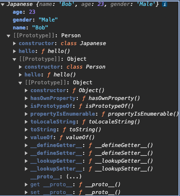

# about JavaScript
## 1. JavaScriptの歴史
ECMAScriptは，JavaScriptのコアになる仕様である.これは，混在するブラウザ間の互換性を保つために，ECMA Internationalによって標準化されたものである.  
実行環境には，ブラウザ環境とNode.js環境がある.

- ブラウザ環境
    主に，ユーザーの操作に応じて動的に画面を更新するために使用される(**フロントエンド**).  
    ユーザがボタンをクリックしたり，フォームを入力したりする際の動的な応答を担う．  
    ECMAScriptとWeb APIを合わせたものを指す.このWeb APIには，画面の更新を操作するDOM APIや，HTTP通信を行うためのXMLHttpRequest APIなどが含まれる.

- Node.js環境
    JavaScriptをブラウザの外で，サーバーサイドやその他の環境で実行するために開発された．  
    Webサーバーを構築し，データベースとのやりとり，APIの提供，**バックエンド**ロジックの処理を行う．
    ECMAScriptとCommonJSのモジュールを管理する仕組みからなる．  
    
### なぜ二つの環境があるのか？  
    Node.jsの登場により，JavaScripの機能をサーバーサイドに拡張することが可能になった．フロントエンドとバックエンドの両方でJavaScriptを使用することで，一貫した言語での開発が可能になる．
    また，ローカル環境での開発が可能になったことで，開発効率が向上した．  

環境によって使用できる機能が異なるため，ブラウザ環境で使用できる機能とNode.js環境で使用できる機能を区別する必要がある．

## 2. ブラウザの構成
ブラウザは，
    - User Interface
    - Browser Engine
    - Rendering Engine
    - Networking
    - JavaScript Engine
    - UI Backend
    - Data Strage
と様々な機能を持つ．

JavaScript Engineは，ChromeではV8というものが使用されている．
JavaScript Engineによって実行結果が異なることがある．

## 3. JavaScript基礎
- ### グローバルオブジェクト  
    JSエンジンによって生成されるコード内のどこからでもアクセスできるオブジェクト．
    すなわち，JavaScript実行前にはグローバルオブジェクトとthisが準備される．

- ### コンテキスト  
    実行コンテキストとは，**コードを実行する際の文脈，状況**を指す.
    それは，コードがどのような状況で実行されているかということ.

- ### コールスタック  
    コンテキストがスタック構造で管理される．複数階層の関数を呼び出した際に，**スクリプト内の位置を追跡し続ける**ことを言う．  
    一番上のスタックは，現在実行中の関数のコンテキストを表す．  
    そして，このスタックは通常実行された順に消滅する．すなわち，一番最後にスタックされたコンテキストが一番最初に消滅する(Last In, First Out)．  
    ?? スタックの積み方で分岐したりするのか？

- ### ホイスティング  
    コンテキスト内で宣言した変数や関数の定義をコード実行前にメモリーに配置すること．
    すなわち以下のコードでも実行することができる．

    ```js
    a();

    function a() {
        console.log('a is called');
    }
    ```
    
    変数がホイスティングされるかどうかは，宣言方法によって異なる．現在，非推奨であるvarで宣言した変数は，ホイスティングされる．  
    一方，letやconstで宣言した変数は，ホイスティングされない．　

- ### スコープ  
    スコープには，グローバルスコープとスクリプトスコープがある．
    このスクリプトスコープはグローバルスコープに内包される．

    - レキシカルスコープ(Lexical Scope)
        1. 実行中のコードからみた外部スコープのこと．
        2. どのようにしてそのスコープを決定するかの仕様を指す．

        関数のスコープは，関数が定義された場所によって決まる．
        コードを記述した時点で，決定されるため「静的スコープ」と呼ばれる．
        関数は，自身のスコープより外側のスコープにはアクセスすることができる．　　

        ```js
        // グローバルスコープ
        let a = 2;
        function fn1() {
            // ローカルスコープ(fn1)
            let b = 1;
            // ローカルスコープ(fn2)
            function fn2() {
                let c = 3;
                // クロージャー，スコープチェーン
                console.log(b);
            }
            fn2();
        }
        ```
    
        上の例では，  
        グローバルスコープ(global)はa,  
        ローカルスコープ(fn1)はb, fn2,   
        ローカルスコープ(fn2)はcを持つ．  
        ここで，fn2はglobal, fn1, fn2のスコープにアクセスできる．
        fn1では，global, fn1のスコープにアクセスできる．
        
        すなわちアクセス可能性は，global ⊂　fn1 ⊂ fn2 となる．
        
    - クロージャ  
        外のスコープにある変数を参照する関数のこと． これにより，内部変数を作成したり，動的な関数を作成することができる．  
        
    - 即時関数
        以下のような書き方．

        ```js
        let c = (function (d) {
            console.log("values is " + d);
            return 0;
        })(10)
        ```
    
- ### 変数について  
    再宣言，再代入可能，スコープ，初期化できるかは以下の表にまとめる．  

    | タイプ | 再宣言 | 再代入 | スコープ | 初期化(ホイスティング) | 
    | ---- | ---- | ---- | ---- | ---- |
    | let | x | o | ブロック | x |
    | const | x | x | ブロック | x |
    | var | o | o | 関数 | undefined |

- ### プリミティブ型とオブジェクト  
    - コピー, 再代入メモリ挙動  

        以下は，プリミティブ型の挙動
        ```js
        // 以下は，c言語と同じ挙動イメージ．
        let a = 'hello';
        let b = a;

        // ここで，bの値はbが参照していた'hello'はメモリ空間から削除されずに，スコープ等を抜けるまで残る
        // つまり，新たに'Bye'のメモリを確保している．
        b = 'Bye';
        ```
    
        以下は，オブジェクトの挙動
        ```js
        let a = {
            prop: 'hello'
        }
        let b = a;

        // そもそもaは，{...}の参照らしい．だから，bに参照をコピーすることになるから，bを変更するとaも変更される．
        b.prop = 'Bye';
        ```

        ~~静的言語やった後に，動的言語やったらバカになるわ.なんやねん.
        当時は難しかったんやろうな．．~~
        
        オブジェクトの完全なコピーはどうするの？  
        油断大敵．変なバグを組み込みそう．後の章で具体的な解決策が提示されるのを期待．  
        -> 調べてみたらやはり地獄だった．しかも，対応状況はブラウザによって異なる．  
        > [JSにおけるdeepcopy](https://zenn.dev/akkie1030/articles/js-structured-clone)
        
        プリミティブ，オブジェクトともに引数に渡す際も同様な処理がなされる．  
        留意する必要があるのは，関数もオブジェクトであるということ．
    
    - 参照とconst
        ```js
        const a = {
            prop: 'hello'
        }
        // 以下はできない．
        // a = {};
        
        // しかし，以下はできる．
        a.prop = 'Bye';
        ```

- ### this
    - thisの値  
        thisは，関数が呼び出された際に，その関数がどのように呼び出されたかによって値が変わる．  
        以下の場合，thisはpersonオブジェクトを指す．

        ```js
        const person = {
            name: 'Tom',
            hello: function() {
                console.log('Hello ' + this.name);
            }
        }
        person.hello(); // Hello Tom
        ```

        以下の場合，thisはglobalオブジェクトを指す．
        ```js
        window.name = 'John';
        const person = {
            name: 'Tom',
            hello: function() {
                console.log('Hello ' + this.name);
            }
        }
        const ref = person.hello; 
        ref(); // Hello John
        ```

        つまり，オブジェクトのメソッドとして呼び出された場合は，そのオブジェクトを指す．  
        一方，関数として呼び出された場合は，globalオブジェクトを指す．  

    - bindによる固定  
        上のような状況を回避するにはどうしたら良いのだろうか？  

        ```js
        window.name = 'John';

        const person = {
            name: 'Tom',
            hello: function() {
                console.log('Hello ' + this.name);
            }
        }

        // 上を回避するには，bindを使う
        const ref = person.hello.bind(person); // Hello Tom
        ref();
        ```

    - call, applyによるthisの値の変更  
        call, applyは，関数を呼び出す際にthisの値を変更することができる．
        また，実行も行われる．

        ```js
        function a() {
            console.log('hello ' + this.name); 
        }
        
        const tim = { name: 'Tim' };
        const b = a.bind(tim);
        b(); // hello Tim
        
        a.call(tim); // hello Tim
        a.apply(tim); // hello Tim
        ```
    
        また，apply, callは引数を渡すこともできる．  
        そして，applyは配列を，callはカンマ区切りの引数を渡す．  
        thisが必要ない場合は，nullを渡す．  

        ```js
        // *.call(thisの値，引数1，引数2，...)
        a.call(tim, 1, 2, 3); // hello Tim
        // *.apply(thisの値，[引数1，引数2，...])
        a.apply(tim, [1, 2, 3]); // hello Tim
        ```
    
    - アロー関数
        アロー関数によって，記述量を減らすことができる．
        ```js
        function a(name) {
            return 'hello ' + name;
        }

        const b = function(name) {
            return 'hello ' + name;
        }
        // 省略して
        const c = (name) => {
            return 'hello ' + name;
        }

        // さらに省略して
        // 引数が1つの場合は()も省略できる
        // returnが1行の場合は{}とreturnも省略できる
        const d = name => 'hello ' + name;
        ```
        しかしながら，以下のように機能が縛られる．

        |   | 無名関数 | アロー関数 |
        | ---- | ---- | ---- |
        | this | o | x |
        | argments | o | x |
        | new | o | x |
        | prototype | o | x |

        アロー関数はthisを持たないため，thisを参照するときは，外側のスコープのthisを参照することになる．

        ```js
        window.name = 'John';

        const person = {
            // これはアロー関数
            // 無名関数はthisを持たない，そのためスコープチェーンで上の階層にthisを探しに行く
            hello_arrow: () => {
                console.log('Hello ' + this.name);
                a();
            }
        }
        ```
        
        また以下のように, アロー関数を使うとthisがglobalオブジェクトを参照する．

        ```js
        window.name = 'John';

        // レキシカルスコープは，関数が定義された場所によって決まる
        // thisを持たないので，スコープチェーンで上の階層にthisを探しに行く
        // すなわちここでの定義はグローバルスコープがレキシカルスコープになる．
        const a = () => console.log('Bye ' + this.name);
        ```


- ### プロトタイプ(prototype)
    プロトタイプとは，オブジェクトの元となるオブジェクトのことを指す．
    プロトタイプを使うことで，オブジェクトの複製ができる他，__proto__を参照のコピーを使って，オブジェクトの継承を実現することができる．

    通常であれば，オブジェクト内の関数などが他のメモリ領域にコピーされるところが，参照のコピーを使うことで，メモリの節約ができる．

    ```js
    function Person(name, age) {
        this.name = name;
        this.age = age;
    }

    Person.prototype.hello = function() {
        console.log('Hello ' + this.name);
    }

    const bob = new Person('Bob', 18);

    bob.hello();

    console.log(bob.__proto__ === Person.prototype) // -> true

    ```

    ここで，bob.__proto__ === Person.prototype が成り立っており，
    __proto__がfunction() { .. }のオブジェクトへの参照を保持していることになる．
    prototypeを使うと，メモリの節約になる

    また，返り値も動的であるため,オブジェクトの返り値にオブジェクトを指定するしないで，機能が大きく異なることがある．（~~Fucking 仕様では？~~）  
    詳しくは， [オブジェクトを返り値に持つ際の, オブジェクト生成挙動の変化](../060_Function2/030_new/main.js) を参照.


- ### Class  
    書き方が違うだけで，オブジェクトと同じ．ES6から導入された．
    オブジェクトとクラスは，Prototye Chainでつながっている．

- ### 継承  
    下記のようなコードでは，  

      

    また，Superを使うことで，親クラスのコンストラクタを呼び出すことができる．
    ```JS
    class Person {
        constructor (name, age) {
            this.name = name;
            this.age = age;
        }

        hello() {
            console.log('class: hello ' + this.name);
        }
    }
    
    // 継承の書き方
    class Japanese extends Person {
        constructor (name, age, gender) {
            super(name, age);
            this.gender = gender;
        }

        hello() {
            console.log('Japanese: hello ' + this.name);
        }
        hello() {
            console.log('Japanese: bye ' + this.name);
        }
    }

    const bob = new Japanese('Bob', 23, 'Male');
    console.log(bob);
    ```

- ### Chain Method
    メソッドチェーンとは，メソッドを連続して呼び出すこと．

    以下のように，メソッドの最後にthisを返すことで，メソッドチェーンを実現できる．

    ```JS
    class Person {
        constructor (name, age) {
            this.name = name;
            this.age = age;
        }

        hello() {
            console.log('hello ' + this.name);
            return this; // return を追加
        }
        
        bye() {
            console.log('bye ' + this.name);
            return this;
        }

    }

    const bob = new Person('Bob', 23);
    bob.hello().bye();
    ```

- ### プロパティディスクリプタ  
    discriptorとは，オブジェクトのプロパティの挙動を定義するオブジェクト．  

    1. データディスクリプタ    
        プロパティの値，書き込み可否，列挙可否，再定義可否を定義する．
    2. アクセサディスクリプタ  
        プロパティのgetter, setter, 列挙可否，再定義可否を定義する．

        | 属性  | 無名関数 | アロー関数 |
        | ---- | ---- | ---- |
        | value | Any | undefined |
        | writable | Boolean | false |
        | enumerable | Boolean | false |
        | configurable | Boolean | false |
        | get | Function | undefined |
        | set | Function | undefined |

    各プロパティに, getter, setterを定義することができる．初期値はundefinedなので，指定してやる必要がある．

    ```JS
    let human = {
        set name(value){
            this._name = value;
        },
        get name(){
            return this._name;
        },
        set age(value){
            this._age = value;
        },
        get age(){
            return this._age;
        }
    }

    // 使う側（値のセット）
    human.name = "Giorno Giovanna";
    human.age = 15;

    // 使う側（値のゲット）
    console.log(human.name);  // Giorno Giovanna
    console.log(human.age);   // 15
    ```

    - for in  
        列挙可能(enumerable)なプロパティに対して，順不動に処理を実行する．  
        Symbolで定義したプロパティは，列挙されない．
    
    - for of  
        String, Array, Map, Set, argumentsなどのiterableなオブジェクトに対して，順不動に処理を実行する．
        
- ### MapとSet  
    Mapは，キーと値のペアを保持するオブジェクト．そのキーには制限がなく，関数などもキーにできる．  

    - Object vs Map  

        |   |　Object | Map |
        | ---- | ---- | ---- |
        | キー  |　文字列 | 制約なし |
        | for..in | ⚪︎ | × |
        | for..of | ×  | ⚪︎ |

    - Array vs Set  

        |   |　Array | Set |
        | ---- | ---- | ---- |
        | 重複値   | ⚪︎ | × |
        | for..in | ⚪︎ | × |
        | for..of | ⚪︎ | ⚪︎ |
        
- ### iterator と generator  
    {done: false, value: 1} というオブジェクトを返すnext()メソッドを持つオブジェクトをイテレータと呼ぶ．
    ジェネレータは，イテレータを生成する関数．

    イテレータは以下のように定義できる．
    ```js
    function genIterator(max) {
        let i = 0;

        return {
            next: function() {
                if (i < max) {
                    return { done: false, value: i++ };
                } else {
                    return { done: true };
                }
            }
        };
    }

    // ここでイテレータを生成．つまり，初期化が行われる．
    const it = genIterator(10);
    // ここでは，let i = 0; は実行されないので，i++
    let a = it.next();
    while (!a.done) {
        console.log(a.value);
        a = it.next();
    }
    ```

    さらにジェネレータは少ない記述量でイテレータを定義できる．
    ```js
    function* genIterator(max = 10) {
        for (i=0; i < max; i++) {
            yield i++;
        }
    }

    const it = genIterator(10);
    let a = it.next();
    while (!a.done) {
        console.log(a.value);
        a = it.next();
    }
    ```

- ### スレッドによる非同期処理  
    ブラウザはスレッドを使って，複数の処理を同時に実行している．  
    スレッドには以下の三種類が行われている．  

    1. Main Thread  
        JavaScriptの実行，レンダリング（画面の描画）などを行う．  
        処理は，JavaScript -> レンダリングの順番で実行される．  
        
    2. Service Worker  
        ネットワーク通信などを行う．  
        通信が完了したら，Main Threadに通知する．

    3. Web Worker  
        あとで説明する．


    - 非同期処理  
        一時的にメインスレッドから処理が切り離される．
        ```js
        // index.html にボタンを追加する必要がある．
        function sleep(ms) {
            const startTime = new Date();
            // ms またせるには，このように処理を書かずに実装できる．
            while (new Date() - startTime < ms);
            console.log('sleep done');
        }

        const btn = document.querySelector('button');
        btn.addEventListener('click', function() {
            console.log('button click');
        });

        // setTimeout は非同期処理
        // よって，この処理はMainThreadから切り離される．そのため，クリックなどのイベントは受け付ける． 
        setTimeout(function() {
            // 一方，この処理はMainThreadで実行されるため，クリックなどのイベントは受け付けない．
            sleep(3000);
        }, 2000);
        ```
    
    - タスクキュー（Task Queue）  
        キューは，**FIFO**(First In, First Out: 先入れ先出し)のデータ構造．  

        Call Stack と Task Queue は，**Event Loop**によって管理されている．  
        **Call Stackを実行し終わった後， Task Queueに積まれた処理をCall Stackに戻して実行する．**

        当然，非同期処理によって性能向上などが期待できるが，その処理の順番はプログラマーが保証してやる必要がある．  

        実行の手順を確認するには，[JavaScript Visualizer 9000](https://www.jsv9000.app/?code=ZnVuY3Rpb24gYSgpIHsKICBjb25zb2xlLmxvZygiYSIpCn0KZnVuY3Rpb24gYigpIHsKICBjb25zb2xlLmxvZygiYiIpCn0KZnVuY3Rpb24gYygpIHsKICBjb25zb2xlLmxvZygiYyIpCn0KCmEoKTsKYigpOwpjKCk7)を利用するとよさそう．  
        
        - Examle 1
            ```js
            function a() { console.log("a") }
            function consoleB() { console.log("B") }
            function b() { setTimeout(consoleB, 0) }
            function c() { console.log("c") }

            function GC(){
              a();
              b();
              c();
            }

            GC(); 
            ```
            
            #### 実行順
                1. GCが実行され, Call Stackに積まれる．
                2. Call Stackにaが積まれ，実行される．aは，廃棄される．
                3. Call Stackにbが積まれ，実行される．bは，Task QueueにconsoleBを積む．bは，廃棄される．
                4. Call Stackにcが積まれ，実行される．cは，廃棄される．
                5. Call Stackが空になる．
                6. Task Queueに積まれたconsoleBがCall Stackに積まれ，実行される．consoleBは，TaskQueueから廃棄される．

            #### 出力順
                1. aが出力される．
                2. cが出力される．
                3. Bが出力される．
            
            > 参考: [Visualizer: タスクキュー](https://www.jsv9000.app/?code=ZnVuY3Rpb24gYSgpIHsgY29uc29sZS5sb2coImEiKSB9CmZ1bmN0aW9uIGNvbnNvbGVCKCkgeyBjb25zb2xlLmxvZygiQiIpIH0KZnVuY3Rpb24gYigpIHsgc2V0VGltZW91dChjb25zb2xlQiwgMCkgfQpmdW5jdGlvbiBjKCkgeyBjb25zb2xlLmxvZygiYyIpIH0KCmZ1bmN0aW9uIEdDKCl7CiAgYSgpOwogIGIoKTsKICBjKCk7Cn0KCkdDKCk7)  
        
        - Example 2
            ```js
            function consoleCIF() {
                console.log("callback in first");
            }

            function consoleCIS() {
                console.log("callback in second");
            }

            function first() {
              console.log("first");
              setTimeout(consoleCIF, 300) //非同期でのカウント時間を300ミリ秒に変更。
            }
            
            function second() {
              console.log("second");
              setTimeout(consoleCIS, 0)
            }
            
            function GC() {
              first();
              second();
            }
            
            GC();
            ```
            
            #### 実行順
                1. GCが実行され, Call Stackに積まれる．
                2. Call Stackにfirstが積まれ，実行される．firstは，**3秒後に**Task QueueにConsoleCIFが詰まれる．その後，firstが廃棄される．
                3. Call StackにSecondが積まれ，実行される．Secondは，**すぐに**Task QueueにconsoleCISを積む．その後，Secondは廃棄される．
                4. Task Queueに**先に**積まれたconsoleCIFがCall Stackに積まれ，実行され, その後Call Stackから廃棄される．
                5. その後，consoleCISはCall Stackに積まれ，TaskQueueから廃棄される．

            #### 出力順
                1. firstが出力される．
                2. secondが出力される．
                3. callback in secondが出力される．
                3. callback in firstが出力される．
            
            

            #### 注意： 
               JV9000で[タスクキュー]へは，[consoleCIS]が後に送られているように表現されるが，
               実際は[consoleCIS]が先に送られている．
            
            > 参考: [Visualizer: タスクキュー](https://www.jsv9000.app/?code=ZnVuY3Rpb24gY29uc29sZUNJRigpIHsKICBjb25zb2xlLmxvZygiY2FsbGJhY2sgaW4gZmlyc3QiKTsKfQoKZnVuY3Rpb24gY29uc29sZUNJUygpIHsKICBjb25zb2xlLmxvZygiY2FsbGJhY2sgaW4gc2Vjb25kIik7Cn0KCmZ1bmN0aW9uIGZpcnN0KCkgewogIGNvbnNvbGUubG9nKCJmaXJzdCIpOwogIHNldFRpbWVvdXQoY29uc29sZUNJRiwgMzAwKSAKfQoKZnVuY3Rpb24gc2Vjb25kKCkgewogIGNvbnNvbGUubG9nKCJzZWNvbmQiKTsKICBzZXRUaW1lb3V0KGNvbnNvbGVDSVMsIDApCn0KCmZ1bmN0aW9uIEdDKCkgewogIGZpcnN0KCk7CiAgc2Vjb25kKCk7Cn0KCkdDKCk7Cg%3D%3D)  
        
    - Promise  
        非同期処理をより簡単に，可読性が上がるように実装するための仕組み．  

    - Macro and Micro Task
        Macro Taskとは，setTimeout, setInterval, setImmediate, I/O, UI renderingなどの非同期処理．  
        Micro Taskとは，Promise, process.nextTickなどの非同期処理．  
        
        そして，以下のスクリプトは，以下の順番で実行される．  
        2 -> 4 -> 3 -> 1

        ```js
        // Macro Task 
        setTimeout(function() {
            console.log('1: setTimeout');
        });

        new Promise(function promise(resolve) {
            console.log('2: promise'); 
            resolve();
        // Micro Task
        }).then(function job1() {
            console.log('3: job1');
        });

        console.log('4: global end');
        ```
        
        また，二つのタスクの違いは，
        Micro Taskは，順番がまわってきたら，すぐに実行される．  
        Macro Taskは，順番がまわってきたら，一つずつ実行される．  
        
        すなわち，Micro Taskが必ず優先されて実行される．  
        

