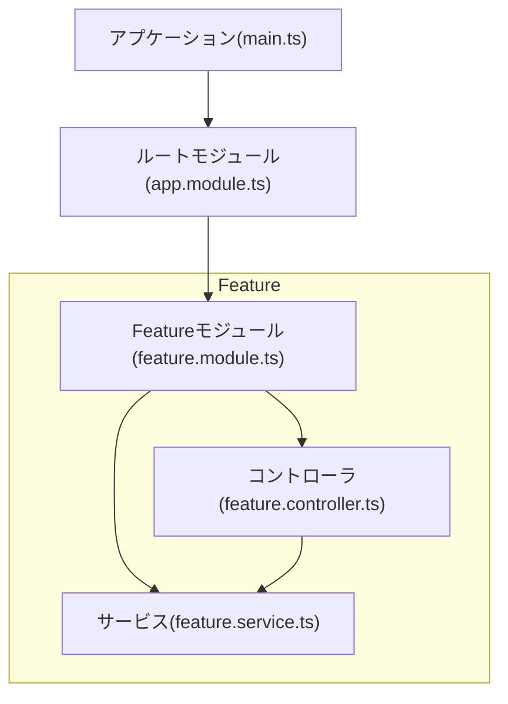

# Nestjs
## 基本アーキテクチャ



ルートモジュールは1つ以上必要．  
Featureモジュールは0以上必要．  


1. Controller  
    クライアントからのリクエストを受け付け，クライアントにレスポンスを返す．  
    また，ネットワーク上でデータを転送する際，その経路を導き出すことルーティングと呼ぶ．

    例えば，POST http://localhost:3000/AuthController/signup

    - 定義方法  
        ```typescript
        import { Controller } from "@nestjs/common";
        
        // クラス（ハンドラー）にHTTPメソッドデコレータをつける．
        @Controller('users')
        export class UsersController {
            // メソッドにHTTPメソッドデコレータをつける．
            @Post()
            create() {
                // Create user
            } 
        }
        ```
        ?? Postデコレータは予約語?

2. Service
    ビジネスロジック(具体的な業務で扱う様々な実体を表現し，それらの関係や処理の方法，業務の流れを実装した部分)を実装する．  
    Controllerから呼び出すことで，ユースケースを実現する．  

    例えば，データベースへのアクセスや外部APIとの通信など．
    
    - Dependency Injection (DI)  
        サービスをコントローラの外部から注入する．  
        
        ```mermaid
        classDiagram
            direction LR
            UsersService ..|> UsersController : DI

            class UsersController {
                -usersService: UsersService
            }
            class UsersService {
            }
        ```

        これにより，本番用とテスト用でインスタンスの切り替えが容易になる.  
        ログの出力先の切り替えなどにも利用できる．  
        
        依存するクラスが複数になると，DIの管理が大変になる．  
        そのため，Nestjsでは，DIコンテナを利用する．

        Serviceの定義, `$ nest g service users`  
        ```typescript
        import { Injectable } from "@nestjs/common";
        
        @Injectable()
        exort class UsersService {
            // ...
        }
        ```

        ModuleのprovidersにServiceを登録する．上のCLIコマンドで自動で登録される．    
        ```typescript  
        @Module({
            controllers: [UsersController], // 依存するコントローラ(?? ファイル名？)
            providers: [UsersService], // 依存するサービス
        })
        exprot class UsersModule {}
        ```

        ControllerからServiceを利用する.  
        ```typescript  
        @Controller('users')
        export class UserController {
            constructor(private readonlyreadonly usersService: UsersService) {}
            
            @Get(':username')
            find(@Param('username') username: string) {
                this.usersService.find(username);
            }
        }
        ```
        
        面白いのは，Nestjsはサービスが, DIを用いた設計であるという前提で作られている点．  
    
## バリデーションと例外処理
1. DTO(Data Transfer Object)  
    データの受け渡しを行うためのオブジェクト．  
    Nestjs特有の機能ではなく，ソフトウェア開発において広く使われる．  
    
    - メンテナンス性の向上  
        データの内容や型などが変更になった場合でも，修正箇所をDTOに閉じ込めることができる．  
    
    - 安全性の向上  
        やり取りするデータをDTOの型に制限することができる．  
        よって，誤ったデータが扱われるリスクがへる．  

    - Nestjsのバリデーション機能
        型チェックだけではなく，複雑なバリデーションが可能になる．  

2. バリデーション
    リクエストオブジェクトの形式チェック   
    例えば，  
    - ユーザー名が1文字以上20字以内であること  
    - emailはメールアドレスの形式であること  
    - パスワードは英数字で8文字以上であること  

    Pipeを利用することで，バリデーションを行うことができる．  
    - ハンドラーがリクエストを受け取る前にリクエストに対して処理を行う．  
    - データの変換とバリデーションが可能．  
    - 処理を行った後のデータをハンドラーに渡す．  
    - Pipeの処理中に例外を返すことも可能．  

    以下は，ハンドラへの適用例．  
    ```typescript
    @Post()
    @UsePipes(ParseIntPipe)
    create(@Body('id') id: number) {
        //
    }
    ```

    以下は, パラメータごとへの適用例．  
    ```typescript
    @Post()
    create(
        @Body('id', ParseIntPipe) id: number,
        @Body('isActive', ParseBoolPipe) isActive: boolean,
    ) {
        //
    }
    ```
    
    以下は, グローバルへの適用例．  
    ```typescript
    async function bootstrap() {
        const app = await NestFactory.create(AppModule);
        app.useGlobalPipes(new ValidationPipe());
        await app.listen(3000);
    }
    ```

    上記のParseIntPipeは，文字列を数値に変換する組み込みのPipe．  
    
    例えば，ParseUUIDPipeを用いることで，UUIDの形式チェックが可能．  
    error -> http://localhost:3000/items/test1  

    以下はエラーのレスポンス．
    ```json
    {
        "message": "Validation failed (uuid is expected)",
        "error": "Bad Request",
        "statusCode": 400
    }
    ```

    ok -> http://localhost:3000/items/123e4567-e89b-12d3-a456-426614174000  


## 備考
- HTTPメソッド
    HTTPメソッドは，クライアントが行いたい処理をサーバに伝えるためのもの．  
    よく使われるHTTPメソッドは以下の通り．  

    1. GET: データの取得
    2. POST: 新しいデータをサーバに送信.
    3. PUT: 既存のデータを更新．   
    4. DELETE: 既存のデータを削除．
    5. PATCH: 既存のデータを部分的に更新．
    6. HEAD: データの本体を取得せずに，HTTPヘッダのみを取得．
    7. OPTIONS: 使用可能なHTTPメソッドを取得．

- クラス図
    1. 継承 `..|>`  
        継承は，一つのクラスが別のクラスの属性や振る舞いを受け継ぐことを示す．  
        以下のように実践で表す．  
        ```mermaid
        classDiagram
            class A
            class B
            direction RL
            A ..> B 
        ```

    2. 依存 `..>`  
        依存は，あるクラスが他のクラスに一時的に依存していることを示す．  
        以下のように実践で表す．  
        ```mermaid
        classDiagram
            class A
            class B
            direction RL
            A ..> B 
        ```

    3. 関連 `-->`  
        関連は二つのクラス間に論理的な接続があることを示す．  
        一方のクラスのオブジェクトが他方のクラスのオブジェクトにアクセスできることを意味する．  
        インスタンスを持ってなくてもアクセスできれば，関連は成り立つ．

        以下のように実践で表す．  
        ```mermaid
        classDiagram
            class A
            class B
            direction RL
            A --> B 
        ```

    4. 集約 `o-->`  
        集約は，関連の特別な形で，「全体」と「部分」の関係を示す．  
        例えば，あるクラスが他のクラスを含むが，それぞれ独立して存在できるという関係である．  
        「車」クラスが「タイヤ」クラスを持つが，タイヤがなくても車は存在できるといった関係性．  

        以下のように実践で表す．  
        ```mermaid
        classDiagram
            class A
            class B
            direction RL
            A o--> B 
        ```

    5. 実現 `..|>`  
        実現は，クラスがインターフェースを実装すること表す．  
        以下のように実践で表す．
        ```mermaid
        classDiagram
            class A
            class B
            direction RL
            A ..|> B
       ```
       
- CLUD  
    CLUDは，create, read, update, deleteの頭文字をとったもの．  
    CLUDを実装することで，データベースを操作や管理を自在に行うことができるようになる.  
    また，データベースに限らず文脈内で使われるみたい．  
    
    