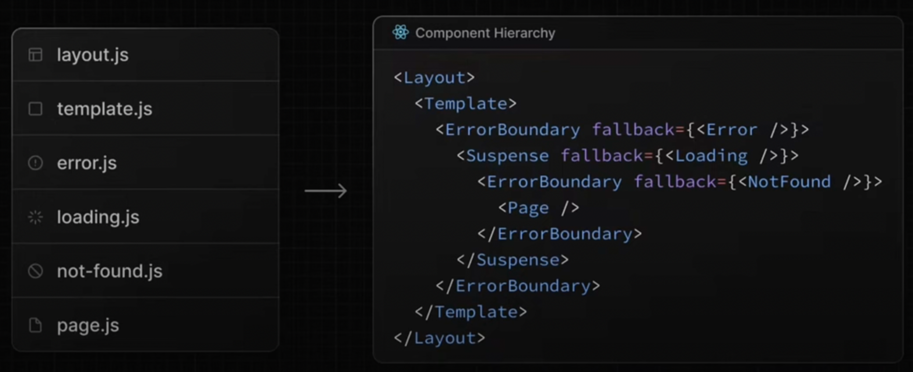
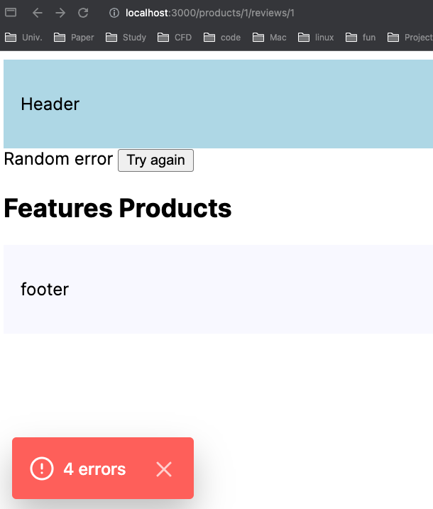
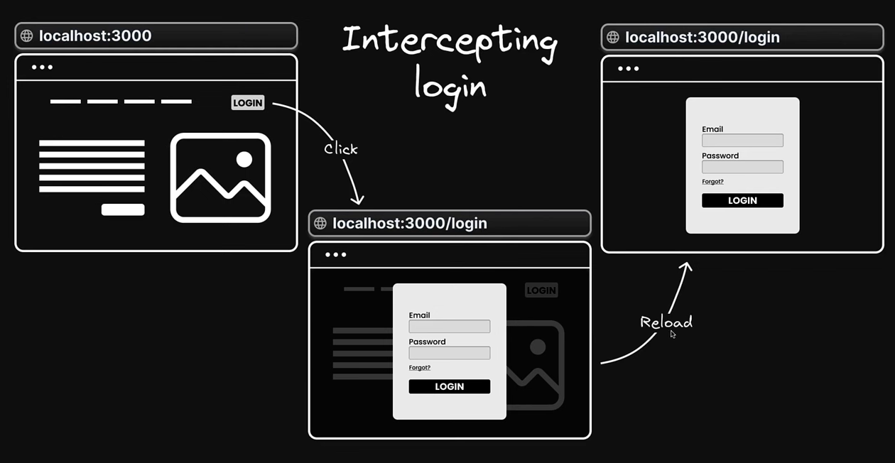
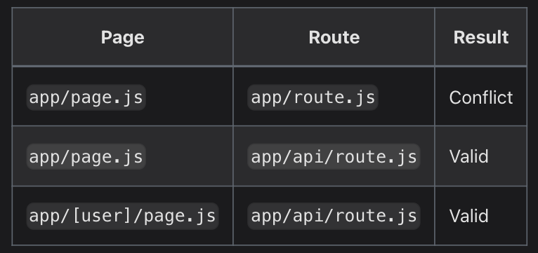
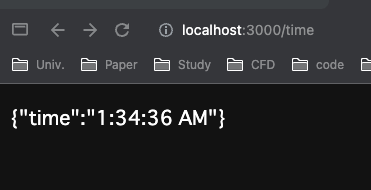
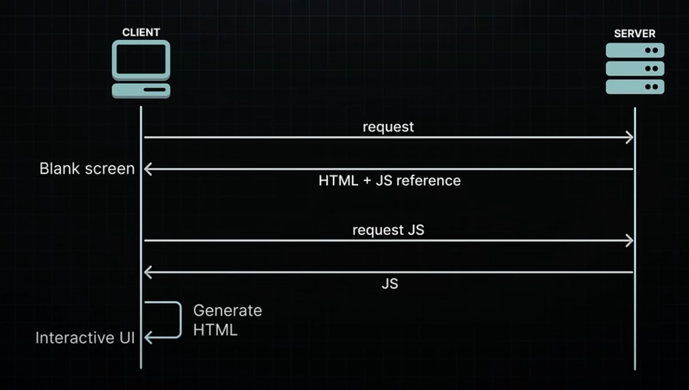

# OVERVIEW

Next.js 14を学習備忘録．

> [Next.js 14](https://www.youtube.com/watch?v=ZjAqacIC_3c&list=PLC3y8-rFHvwjOKd6gdf4QtV1uYNiQnruI&index=1)

<!--toc:start-->

- [OVERVIEW](#overview)
- [React](#react)
  - [Reactとは？](#reactとは)
  - [Reactの構成](#reactの構成)
- [Next.js](#nextjs)
  - [Next.jsを学ぶ利点](#nextjsを学ぶ利点)
  - [Special Files](#special-files)
  - [Component Hierarchy](#component-hierarchy)
  - [Routing](#routing)
  - [Metadata](#metadata)
  - [Link Navigation](#link-navigation)
  - [Error Handling](#error-handling)
  - [Parallel Routing](#parallel-routing)
    - [Slots](#slots)
  - [Interceptional Routing](#interceptional-routing)
  - [Route Handlers](#route-handlers) - [関数名のルール](#関数名のルール) - [Cache機能](#cache機能)
  <!--toc:end-->

# React

## Reactとは？

## Reactの構成

以下は，HTML．

```html
<body>
  <noscript>You need to enable JavaScript to run this app.</noscript>
  <div id="root"></div>
</body>
```

以下は，App.js.

```js
const root = ReactDOM.createRoot(document.getElementById("root"));
root.render(
  <React.StrictMode>
    <App />
  </React.StrictMode>,
);
```

このように，rootタグの間にアプリケーションが差し込まれるイメージ．

# Next.js

## Next.jsを学ぶ利点

1. Routingが簡単
2. API routes
3. Rendering
4. Data fetching
5. Styling
6. Optimization
7. Dev and prod build sysytem

## Special Files

いくつか特定の機能を持ったファイルが存在する．

1. `page.tsx`
2. `layout.tsx`
3. `templete.tsx`
   layout.tsxとの違いは，際レンダリングされるかどうか．
4. `not-found.tsx`
5. `loading.tsx`
6. `error.tsx`

## Component Hierarchy

それぞれ，コンポーネントのヒエラルキーは，



## Routing

Next.jsは，ページという概念に基づいて，ファイルシステムに沿ったルーターを持っている．  
`about`ディレクトリにファイルが追加された時，ルートとして自動で使用可能になる．  
`about`ディレクトリ内のファイルは次の一般的になパターンで定義される．

```sh
.
├── app
│   ├── _lib
│   ├── (auth)
│   │   ├── (with-auth)
│   │   │   ├── layout.tsx
│   │   │   ├── login
│   │   │   │   └── page.tsx
│   │   │   └── register
│   │   │       └── page.tsx
│   │   └── forgot-password
│   │       └── page.tsx
│   ├── about
│   │   └── page.tsx
│   ├── docs
│   │   └── [[...slug]]
│   │       └── page.tsx
│   ├── products
│   │   ├── [productId]
│   │   │   └── reviews
│   │   │       ├── [reviewId]
│   │   │       │   ├── not-found.tsx
│   │   │       │   └── page.tsx
│   │   │       ├── layout.tsx
│   │   │       └── page.tsx
│   │   └── page.tsx
│   ├── layout.tsx
│   ├── page.tsx
└── components

20 directories, 19 files
```

上のようなディレクトリ構造では，`http://localhost:3000/about`でアクセス可能．

- Route Groups
  `app`フォルダ以下にあるフォルダは，通常ルーティングされるが，フォルダをルートグループとすることで，  
  そのフォルダがルートのURLパスに含まれないようにすることができる．

  上のフォルダ構成では，フォルダ名に`(auth)`を使うことで，  
  URLパスが`http://localhost:3000/auth/login`ではなく，`http://localhost:3000/login`となる．

  これにより，URLパス構造に影響を与えるkとなく，ルートセグメントとプロジェクトファイルを論理的なグループに分けることができる．  
  kk

- Private Folder
  フォルダ名に`_`をつけることで，ルーティングされないプライベートフォルダを作成することができる．

- Dynamic Routes
  以下は，動的ルートの例．
  `app/blog/[slug]/page.tsx` -> `http://localhost:3000/blog/a`

  ```ts
  export default function Page({ params }: { params: { slug: string } }) {
    return <div>My Post: {params.slug}</div>;
  }
  ```

  また，[...slug]を用いることで，複数のパスを受け取ることができる．  
  `app/shop/a`, `app/shop/a/b`など．

## Metadata

以下は，`app/products/[productId]/page.tsx`の例．

```ts
export const generateMetadata = ({ params }: Props): Metadata => {
  return {
    title: `Product ${params.productId}`,
  };
};
```

動的に，`<head>`内の`<title>`を変更することができる．

また，非同期関数を用いることで，fetchの結果からメタデータをつけることができる．

```ts
export const generateMetadata = async ({
  params,
}: Props): Promise<Metadata> => {
  const title = await new Promise((resolve) => {
    setTimeout(() => {
      resolve(`iphone ${params.productId}`);
    }, 100);
  });
  return {
    title: `Product ${title}`,
  };
};
```

??なぜ，appルートではMetadataの情報をlayout.tsxに書くのに，他のルーティングでは，page.tsxに書くのか??

`default`, `template`, `absolute`のフィールドを使用することができる．

````ts
import { Metadata } from "next";

export const metadata: Metadata = {
  title: {
    template: "%s | Acme Dashboard",
    default: "Acme Dashboard",
  },
  description: "The official Next.js Learn Dashboard built with App Router.",
  metadataBase: new URL("https://next-learn-dashboard.vercel.sh"),
};
//```

`templete`により，`%s`に以下の`metadata.title`が代入される．

```ts
export const metadata: Metadata = {
  title: "Invoices",
};
````

`absolute`を使うことで，書き換えることができる．

```ts
export const metadata: Metadata = {
  title: {
    absolute: "Dashboard",
  },
};
```

## Link Navigation

`<Link>`は，Reactのコンポーネントである．Next.jsでルート間をナビゲートする主要な方法．

```ts
import Link from 'next/link'

export default function Page() {
  return <Link href="/dashboard">Dashboard</Link>
}
```

動的なルートを使うこともできる．

```ts
"use client";

import Link from "next/link";
import { usePathname } from "next/navigation";

const navLinks = [
  { name: "Register", href: "/register" },
  { name: "Login", href: "/login" },
  { name: "Forgot Password", href: "/forgot-password" },
];

export default function AuthLayout({
  children,
}: {
  children: React.ReactNode;
}) {
  // フックを利用して，現在のパス名を取得する．
  const pathname = usePathname();

  return (
    <div>
      {navLinks.map((link) => {
        const isActive = pathname.startsWith(link.href);

        return (
          <Link
            href={link.href}
            key={link.name}
            // もし，リンクがアクティブなら，`font-bold`を適用する．
            className={isActive ? "font-bold mr-4" : "text-blue-500 mr-4"}
          >
            {link.name}
          </Link>
        );
      })}
      {children}
    </div>
  );
}
```

`use client`は，特定のコンポーネントやページがクライアントサイドでのみレンダリングされることを意図している場合に宣言される．

Routerを使って，クリックイベントを実装することもできる．

```ts
const router = useRouter();
const handleClick = () => {
  console.log("Order Product");
  router.push("/");
};
```

## Error Handling

`error.tsx`を用いて，エラーが発生した時に表示させることができる．

- 入れ子構造になっている場合も，適用される．
- ファイルルーティング階層を利用して，特定のセグメントに合わせたエラーUIを作成する．
- アプリケーションの残りの機能を維持しながら，影響を受けるセグメントにエラーを隔離する．
- ページ全体をリロードすることなく，エラーからの回復を試みる機能を追加する．
- ページ全体をリロードすることなくエラーからの回復を試みる機能を追加する．
- ルートセグメント内に，error.jsファイルを追加し，Reactコンポーネントをエクスポートすることで，エラーUIを作成する．

以下のようなファイルを作成する(error.tsx)．

```ts
"use client";

export default function ErrorBoundary({
  error,
  reset,
}: {
  error: Error;
  reset: () => void;
}) {
  return (
    <div>
      {error.message} <button onClick={reset}>Try again</button>
    </div>
  );
}
```



## Parallel Routing

パラレルルーティングは，同じレイアウト内に複数のページを同時に表示することができる．

### Slots

パラレルルーティングを使用するには，スロットを用いる．  
`@folder`のような`@`をフォルダ名に使用する．

```ts
export default function Layout({
  children,
  team,
  analytics,
}: {
  children: React.ReactNode
  analytics: React.ReactNode
  team: React.ReactNode
}) {
  return (
    <>
      {children}
      {team}
      {analytics}
    </>
  )
}
```

例え，レイアウト内の一部のスロットがロード中であったり，エラーが発生してレンダリングできない場合でも，他のスロットはレンダリングされる ．

## Interceptional Routing

ルートをインターセプト(傍聴的な)することができる．  
現在のレイアウト上でアプリケーションの別の部分からルートをロードすることができる．  
ユーザが別のコンテキストに切り替えることなく，ルートの内容を表示したい時に役立つ．

以下のようなログインが当てはまる．



インターセプトルートをする際は，以下のルールに従ってフォルダ名を設定する．

- `(.)temp` 同じ階層．
- `(..)temp` 一つ上の階層
- `(..)(..)temp` 二つ上の階層
- `(...)temp` ルートディレクトリをさす．

## Route Handlers

ルートハンドラを使用することで，WebリクエストAPIとレスポンスAPIを使用して, 指定したルートのカスタムリクエストハンドラを作成する．
Route Handlers では，条件を満たす場合はレスポンスをキャッシュして，処理を高速化する．

??バックエンド側の機能をNextで作るため??

- `/app`フォルダ内に配置．
- ファイル名は`route.ts`.
- `page.tsx`と同じ階層においていない．



例えば，クライアント側から`fetch("/api/admin")`と呼び出す場合，`route.ts`ファイルは，`/app/api/admin/route.ts`に配置されている必要がある．  
また，`page.tsx`と`route.tsx`が同じ階層にある場合，`route.tsx`が優先される．

### 関数名のルール

例えば，`/app/api/test`にGETリクエストを送ると，JSON形式で`{"msg": "hello, world"}`を返す処理があるとする場合，  
以下のように関数名を`GET`と命名する必要がある．

```ts
import { NextRequest, NextResponse } from "next/server";

export function GET(req: NextRequest) {
  const res = NextResponse.json({ msg: "hello,world!" });
  return res;
}
```

同様に，POST，DELETE，PUTなどのメソッドを使用する．

### キャッシング

`Response`オブジェクトで，`GET`メソッドを使用する場合は，Routeハンドラはデフォルトでキャッシュされる．  
キャッシングとはなんなのか？以下の例を見てみる．

```ts
export default function GET() {
  return Response.json({
    time: new Date().toLocaleTimeString(),
  });
}
```

以下の例では，`time`がキャッシュされる．  
リロードしても，`time`が更新されない．


?? データがキャッシュされるの -> GETの結果を維持的に保存して，再利用する．??

キャッシュ無効にするには，以下の方法がある．

- `GET`メソッドで`Request`オブジェクトを使用する．
- その他のHTTPメソッドを使用する．
- `cookies`や`headers`などの`Dynamic Function`を使用する．
- セグメント設定オプションで手動で動的モードを指定する．

`export const dynamic = "force-dynamic"`を文頭に置くことで，キャッシュを防げる．

### 静的データの再検証

静的データの再検証フェッチは，`next.revalidate`オプションを使ってできる．

```ts
export async function GET() {
  const res = await fetch("https://data.mongodb-api.com/...", {
    next: { revalidate: 60 }, // Revalidate every 60 seconds
  });
  const data = await res.json();

  return Response.json(data);
}
```

### ヘッダーの読み取り

`next/headers`を使って，ヘッダーを読み込むことができる．  
httpリクエストは，必ずヘッダーを持っている．

ヘッダーは，コンテンツタイプ，コンテンツ長さ，認証情報，クッキーなどの情報を含む．

```ts
import { headers } from "next/headers";

export async function GET(request: Request) {
  const headersList = headers();
  const referer = headersList.get("referer");

  return new Response("Hello, Next.js!", {
    status: 200,
    headers: { referer: referer },
  });
}
```

### Middleware

ミドルウェア(Middleware)は，クライアントとサーバーの間で働く．  
リクエストとレスポンスを適切に処理する．  
リクエストがサーバーに到達する前に何か特別な処理をしたり，レスポンスをクライアントに送る前に処理を行う．

- URLリダイレクトを行う．
- URLリライトを行う．
- リクエストとレスポンスを変更する．
- ヘッダーの強化する．
- 送受信リクエストの追跡をする．

ファイル名には，`middleware.js`と`middleware.ts`が使うことができる．


> [Metadata](https://qiita.com/masakinihirota/items/30a5e06e3288031b9788)

## Rendering

### CSR(Client-side Rendering)

`CSR`は，`Client Side Rendering`の略で，日本語で訳すと`クライアント側でのレンダリング`．

CSRでは，クライアントのリクエストに対して，空のHTMLとJSを返し，クライアント側でJSを実行してレンダリング，およびデータ取得を行う．  
このJSには，コンテンツを動的に生成するコードが含まれている．

具体的には，

- JavaScriptのダウンロード：ページにアクセスすると，サーバーからHTMLとJavaScriptがダウンロードされる ．
- JavaScriptの実行：非同期処理などを用いて，ページのコンテンツを生成する．
- コンテンツのレンダリング：JavaScriptによって生成されたコンテンツは，実行された後にブラウザのDOMに追加される．



Reactのみを使って，SPA(Single Page Application)をつくる場合に`useEffect`の中でデータを`fetch` して結果を`useState`に渡して，表示するというやり方．

CSRには以下の2つの問題点がある．

- クライアントのリクエストに対して空のHTMLを返すため，SEO(Search Engine Optimization)とOGP(Open Graph Protocol)に対応できない．
- クライアント側で，JSを実行するため，初期表示が遅い．

### SSR(Server-side Rendering)

SSRは，`Server Side Rendering`の略で，日本語で訳すと`サーバー側でのレンダリング`．

SSRでは，クライアントのリクエストに対して，サーバ側でデータを取得して，HTMLを生成しそれを返す．  
サーバー側でHTMLを生成するため，SEOとOGPに対応している．


1. ブラウザがURLページのリクエストを送信．
2. サーバ側はAPI連携でデータを取得．
3. サーバがデータを取得し，希望なデータを含むレンダリングHTMLを生成．
4. ブラウザーに非インタラクティブなHTMLを返す．
5. ブラウザに非インタラクティブなHTMLが送信される(JavaScriptは送られない)．
6. ブラウザがHTMLにおいてるJavaScriptファイルをロードする．
7. ブラウザがフレームワークを実行ページからインタラクティブになる．

### SSG(Static Site Generation)

SSGは，`Static Site Generation`の略で，日本語で訳すと`静的サイト生成`．  
SSGはビルド時にサーバー側でデータを取得して，HTMLを生成して，リクエストに対してそれを返す．  
事前にHTMLを生成するため，CDNにキャッシュさせることでができ，SSRよりパフォーマンスに優れる．


### ISR(Incremental Static Regeneration)
