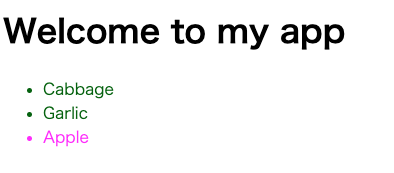

# OVERVIEW

<!--toc:start-->

- [OVERVIEW](#overview)
- [React](#react)
  - [基本構成](#基本構成)
    - [コンポーネントの作成とネスト](#コンポーネントの作成とネスト)
    - [JSXでマークアップを記述](#jsxでマークアップを記述)
    - [スタイルの追加](#スタイルの追加)
    - [データの表示](#データの表示)
    - [条件付きレンダー](#条件付きレンダー)
    - [リストのレンダー](#リストのレンダー)
    - [イベントに応答する](#イベントに応答する)
    - [画面の更新](#画面の更新)
    - [コンポーネント間のデータの共有](#コンポーネント間のデータの共有)
  - [チュートリアル](#チュートリアル)
  - [Reactの流儀](#reactの流儀)
  - [React hooks](#react-hooks) - [useState](#usestate) - [useEffect](#useeffect) - [useContext](#usecontext) - [useRef](#useref) - [Ref属性](#ref属性) - [TypeScriptでの挙動](#typescriptでの挙動)
  <!--toc:end-->

# React

## 基本構成

### コンポーネントの作成とネスト

Reactアプリはコンポーネントで構成されている．コンポーネントとは，独自のロジックと外見を持つUIの部品である．  
コンポーネントは，ボタンのような小さなものである場合も，ページ全体を表す大きなものである場合もある．

```js
function MyButton() {
  return <button>I'm a button.</button>;
}
```

MyButtonを宣言したら，別のコンポーネントにネストすることができる．

```js
export default function MyApp() {
  return (
    <div>
      <h1>Hello, world!</h1>
      <MyButton />
    </div>
  );
}
```

結果は，[コンポーネントの作成とネスト](./react-quickStart/01-component_nest)に載せている．


### JSXでマークアップを記述

上でみたマークアップ構文は，JSXと呼ばれるもである．使用は任意であるが，その便利さ故にほとんどのReactプロジェクトではJSXが使用されている．  
JSXは，HTMLより構文が幻覚である．`<br />`のようにタグは閉じる必要がある．  
また，コンポーネントは複数のJSXタグをreturnすることはできない．`<div></div>`や空の`<>...</>`ラッパのような共通の親要素で囲む必要がある．

```js
function AboutPage() {
  return (
    <>
      <h1>About</h1>
      <p>
        Hello there.
        <br />
        How do you do?
      </p>
    </>
  );
}
```

JSXに変換する必要がある場合，オンラインコンバータを使うことが可能．

### スタイルの追加

Reactでは，CSSクラスを`className`で指定する．HTMLのclass属性と同じ方法で動作する．

```html

```

そして，別のCSSファイルに対応するCSSルールを記述する．

```css
.avatar {
  border-radius: 50%;
}
```

### データの表示

JSXを使うことで，JavaScript内にマークアップを入れることができる．波括弧を使うことで，逆にJSXの中からJavaScriptに「戻る」ことができ，コード内の変数を埋め込んで，ユーザに表示することができる．

```js
const user = {
  name: "Hedy Lamarr",
  imageUrl: "https://i.imgur.com/yXOvdOSs.jpg",
  imageSize: 90,
};

export default function Profile() {
  return (
    <>
      <h1>{user.name}</h1>
      
    </>
  );
}
```

`style={{}}`は特別な構文ではない．**`style={ }`というJSXの波括弧内にある通常の`{}`オブジェクト**である．
スタイルがJavaScript変数に依存する場合は，`style`属性を使用することができる．

結果は，[CSSによるマークアップ](./react-quickStart/02-CSS)に載せている．

### 条件付きレンダー

Reactには，条件分岐を書くための特別な構文は存在しない．  
代わりに通常のJavaScriptコードを書くときに使うのと同じ手法を使う．

```js
let content;
if (isLoggedIn) {
  content = <AdminPanel />;
} else {
  content = <LogginForm />;
}
return <div>{content}</div>;
```

3項演算子を使うことで，コンパクトにすることも可能．

```js
<div>{isLoggedIn ? <AdminPanel /> : <LoginForm />}</div>
```

else側の分岐が不必要な場合，短い論理`&&`構文を使うことができる．

```js
<div>{isLoggedIn && <AdminPanel />}</div>
```

### リストのレンダー

コンポーネントのリストをレンダーする場合は，forループや配列のmap()関数といったJavaScriptの機能を使って行う．

```js
const products = {
  {title: 'Cabbage', id: 1},
  {title: 'Garlic', id: 2},
  {title: 'Apple', id: 3},
}
```

コンポーネント内で，map()関数を使って商品の配列を`<li>`要素の配列に変換する．

```js
const listItems = products.map(product => <li key={product.id}>{product.title}</li>);

return ()
  <ul>
    {listItems}
  </ul>
);
```

`<li>`に`key`属性があることに注意する．
リスト内の各項目には，兄弟の中でそれを一意に識別するための文字列または数値を渡す必要がある．  
通常，keyはデータから決まるはずで，データベース上のIDなどが該当する．  
Reactは，あとでアイテムを挿入，削除，並べ替えることがあった際に，何が怒ったかをkeyを使って把握する．



結果は，[CSSによるマークアップ](./react-quickStart/03-list)に載せている．

### イベントに応答する

コンポーネントの中で，イベントハンドラ関数を宣言することで，イベントに応答することができる．

```js
function MyButton() {
  function handleClick() {
    alert("You clicked me!");
  }

  return (
    // hanldeClick()ではなく，handleClickを渡す
    <button onClick={handleClick}>Click me</button>
  );
}
```

`onclick={handleClick}`の末尾に括弧がないことに注意する．  
そこで，イベントハンドラ関数を呼び出すわけではない．

### 画面の更新

しばしば，コンポーネントに情報を「記憶」させて表示させたい場合がある．  
例えば，ボタンがクリックされた回数を覚えて置きたい場合などが当てはまる．  
これを行うには，コンポーネントにstateを追加する．

まず，Reactから`useState`をimportする．  
そして，コンポーネント内にstate変数を宣言することができる．

```js
function MyButton() {}
  const [count, setCount] = useState(0);
  // ...
}
```

`useState`から2つのものが得られる．現在のstate(count)と，それを更新するための関数(setCount)である．  
名前は任意であるが，慣習的に`[something, setSomthing]`のように記述する．

ボタンが初めて表示されるときに，countは0である．

```js
import { useState } from "react";

export default function MyApp() {
  return (
    <div>
      <h1>Counters that update separately</h1>
      <MyButton />
      <MyButton />
    </div>
  );
}

function MyButton() {
  const [count, setCount] = useState(0);

  function handleClick() {
    setCount(count + 1);
  }

  return <button onClick={handleClick}>Clicked {count} times</button>;
}
```

以下に示すデモから，二つのボタンがそれぞれの状態を持っているのがわかる．  
結果は，[Stateの管理(それぞれ独立した状態管理)](./react-quickStart/04-state)に載せている．

### コンポーネント間のデータの共有

前述の例では，それぞれの`MyButton`が独立した`count`を持っており，ボタンがクリックされるたびにクリックされたボタンの`count`だけが更新された．


また，コンポーネント間データを共有し，一緒に更新したいということもある．  
両方の`Mybutton`コンポーネントが同じ`count`を表示し，一緒に更新されるようにするには，状態を個々のボタンから「上に」移動して，それら全てを含む最も近いコンポーネントに入れる．


こうすることによって，どちらのボタンをクリックしても，MyAppのcountが更新され，連動して`MyButton`の両方のカウントが更新される．  
以下は，コードで表現する方法である．

```js
import { useState } from "react";

export default function MyApp() {
  const [count, setCount] = useState(0);

  function handleClick() {
    setCount(count + 1);
  }

  return (
    <div>
      <h1>Counters that update together</h1>
      <MyButton count={count} onClick={handleClick} />
      <MyButton count={count} onClick={handleClick} />
    </div>
  );
}

function MyButton({ count, onClick }) {
  return <button onClick={onClick}>Clicked {count} times</button>;
}
```

結果は，[Stateの管理(共有された状態管理)](./react-quickStart/05-state2)に載せている．

## チュートリアル

このチュートリアルは，小さな三目並べゲーム(tic-tac-toe)を作成する．

結果は，[Tic Tac Toe](./react-quickStart/06-tic-tac-toe/)に載せている．

## Reactの流儀


## React hooks

### useState

stateを使うと，ユーザの入力などの上をコンポネントに『記憶』させることができる．

1. 状態変数(State Variable): これは現在の状態の値を保持する．
2. 状態更新関数(State Updater Function): 状態を更新するための関数．

```js
import { useState } from "react";

export const Example = () => {
  //   1. 状態変数countを宣言し、初期値0を設定
  const [count, setCount] = useState(0);

  return (
    <div>
      <p>Count: {count}</p>
      {/* 2. ボタンクリック時に状態を更新 */}
      <button onClick={() => setCount(count + 1)}>Increment</button>
    </div>
  );
};
```

### useEffect

Reactアプリケーションは，ユーザインターフェースの構築や更新に関する主要なタスクを処理するために，コンポーネントを使用する．  
しかしながら，アプリケーションにはコンポーネントの描画以外にデータの読み込みや外部イベントなどの副作用を必要とすることがある．  
このような副作用を管理するために，Reactは`useEffect`を提供している．

1. useEffect関数内で副作用の処理を定義する． これはAPI呼び出し，イベントリスナーの設定などの処理を含むことがある．
2. オプションとして，return ステートメントを使用してクリーンアップ関数を提供可能．コンポーネントがアンマウントされる前や再レンダリング時に実行される．このクリーンアップ関数は，リソースの解放やイベントリスナーの削除など，副作用をクリーンアップするために使用される．
3. フックの第二引数として，`dependecies`(依存関係)の配列を指定できる．この配列に含まれる値が変更された場合，副作用の処理が再実行される．依存関係が空配列の場合，副作用は初回のレンダリング時にのみ実行される．第二引数に何も指定されていない場合，レンダリング毎に実行される．

?? 初回に実行されるのは，最後のreturn? ??

例1

```js
import { useState, useEffect } from "react";

export const DataFetching = () => {
  const [data, setData] = useState([]);

  useEffect(() => {
    fetch("https://api.example.com/data")
      .then((response) => response.json())
      .then((data) => setData(data));
  }, []); // 依存関係が空なので初回のレンダリング時のみ実行

  return (
    <div>
      <ul>
        {data.map((item) => (
          <li key={item.id}>{item.name}</li>
        ))}
      </ul>
    </div>
  );
};
```

例2,

```js
import { useState, useEffect } from "react";

export const DataFetching = () => {
  const [data, setData] = useState([]);

  useEffect(() => {
    fetch("https://api.example.com/data")
      .then((response) => response.json())
      .then((data) => setData(data));
  }, []); // 依存関係が空なので初回のレンダリング時のみ実行

  return (
    <div>
      <ul>
        {data.map((item) => (
          <li key={item.id}>{item.name}</li>
        ))}
      </ul>
    </div>
  );
};
```

?? 例2はある種初期化みたいな感じか？ ??

例3，よくあるミス

以下は無限レンダリングが生じる．  
`useEffect`内で第二引数に変更を加えた場合に生じる．

1. 初回レンダリング時に useEffect が呼び出され、count の値を変更する
2. レンダリング前後で count の値が変わっているので useEffect が呼び出される
3. useEffect が呼び出され count の値を変更する
4. 再レンダリングする

上の2, 3が繰り返される．

```js
useEffect(() => {
  console.log("countを更新", count);
  setCount((prev) => prev + 1);
}, [count]);
```

> [参考文献](https://qiita.com/diskszk/items/333511fb97d24f52a439)

### useContext

グローバルにデータを管理することができる仕組み．  
通常親コンポーネントにデータを渡す際は，`props`を介してデータを渡すことが多い．  
しかし，親から子，そのまた子となると複数のコンポーネントを介してデータを渡す場合にバケツリレーのようなやり方だったら，設定が複雑になる．

### useRef

関数コンポーネントでは，Classコンポーネント時のref属性の代わりに，`useRef`を使って要素への参照を行う．  
また，`useRef`は`useState`のように，コンポーネントないでの値を保持することができる．

`Ref`オブジェクトは，アンマウントされるまで存在し続けること，自由に書き換えることができるのが特徴である．

多用は厳禁で，`useRef`を使うべき場面は限られている．

?? Ref属性を持つオブジェクトがRefオブジェクト？ -> 違う下で説明してる ??

比較のために，一般的なオブジェクトの挙動を確認する．

```js
import React, { useState } from "react";

const list = [];

const App = () => {
  const [count, setCount] = useState(0);
  const onClick = () => {
    setCount((c) => c + 1);
  };

  const obj = {}; // objは、`Ref`ではない一般的なオブジェクト
  list.push(obj);
  if (list.length >= 2) {
    console.log(list[list.length - 2] === list[list.length - 1]); // X
  }

  return (
    <div>
      <button type="button" onClick={onClick}>
        count up
      </button>
      {count}
    </div>
  );
};

export default App;
```

再レンダリング毎に，新しいobjが生成され，listに追加される．  
そのため，consoleには`false`が表示される．

次に，useRefを使って，Refオブジェクトを生成する．

```ts
import React, { useState, useRef } from "react";

const list = [];

const App = () => {
  const [count, setCount] = useState(0);
  const onClick = () => {
    setCount((c) => c + 1);
  };

  const obj = useRef;
  list.push(obj);
  if (list.length >= 2) {
    console.log(list[list.length - 2] === list[list.length - 1]); // X
  }

  return (
    <div>
      <button type="button" onClick={onClick}>
        count up
      </button>
      {count}
    </div>
  );
};

export default App;
```

これは，常に`true`が表示される．  
つまりマウント時に`useRef`で生成した`Ref`オブジェクトをそのまま使い続けている．

以下は，`useRef`と`useState`を同時に利用する例である．

```js
import React, { useState, useRef, useEffect } from "react";

const App = () => {
  const [count, setCount] = useState(0);
  const onClick = () => {
    setCount((c) => c + 1);
  };

  return (
    <div>
      <Child count={count} />
      <button type="button" onClick={onClick}>
        count up
      </button>
    </div>
  );
};

const Child = ({ count }) => {
  const ref = useRef("--");

  useEffect(() => {
    ref.current = count;
  });

  return (
    <div>
      Before: {ref.current}
      <br />
      Now: {count}
    </div>
  );
};

export default App;
```

これは，Before: 0, Now: 1といったように違う値を表示する．  
重要なのは， **`useRef`がレンダリングの結果がDOMに反映された後に実行される** という点である．
つまり，実際に画面に表示される前の値が`ref.current`の値である．

これは公式の例．

```js
const App = () => {
  const inputEl = useRef(null);
  const handleClick = () => {
    inputEl.current.focus();
    console.log("inputEl.current:", inputEl.current);
    //inputEl.current: <input type="text">
  };
  return (
    <>
      <input ref={inputEl} type="text" />
      <button onClick={handleClick}>入力エリアをフォーカスする</button>
    </>
  );
};
```


#### Ref属性

HTML要素やクラスコンポーネントには`ref`という特別な属性を設定することができる．  
この属性には，`Ref`オブジェクトか関数を渡すことができる．

HTML要素の`ref`属性に`Ref`オブジェクトを渡すと，`Ref.current`にそのHTML要素が格納させる．

```js
import React, { useRef, useEffect, useState } from "react";

const App = () => {
  const [state, setState] = useState(false);
  const ref = useRef();

  useEffect(() => {
    // state が true のときは span 要素
    // state が false のときは null
    // 但し初回レンダー時のみ undefined
    console.log(ref.current);
  });

  const onClick = () => {
    setState((s) => !s);
  };

  return (
    <div>
      <button type="button" onClick={onClick}>
        click
      </button>
      {state && <span ref={ref}>text1</span>}
    </div>
  );
};

export default App;
```

格納されるタイミングは, 当該要素がマウントされた後. それまではcurrentにはRefオブジェクトの初期値が入っている.

ref属性に関数を渡すことができる．

```js
import React, { useState } from "react";

const App = () => {
  const [state, setState] = useState(false);

  const onClick = () => {
    setState((s) => !s);
  };

  const callbackRef = (arg) => {
    console.log(arg); // <span>text1</span> と null が交互に表示される
  };

  return (
    <div>
      <button type="button" onClick={onClick}>
        click
      </button>
      {state && <span ref={callbackRef}>text1</span>}
    </div>
  );
};

export default App;
```

既に述べたように，`Ref`オブジェクトの内容が更新されても，それが通知されることがない．  
そのため，`ref`属性を設定している要素の状態が変わったタイミングで，何かを発火させるといったことができない．  
そのようなことを行いたい時はk，`ref`属性に関数を渡す．この関数，およびこれを利用した手法を`コールバックRef`と呼ぶ．

この関数は，それを渡した要素のマウント時，更新時，アンマウント時に実行される．  
上の例は，ボタンを押下する度に，`span`要素のマウントとアンマウントが交互に行われる．

#### TypeScriptでの挙動

TypeScript環境でのReactの`useRef`は初期値と型引数の与え方によって，返り値の方が`RefObject`と`MutableObject`のどちらかになる．

```ts
interface RefObject<T> {
  readonly current: T | null;
}
interface MutableRefObject<T> {
  current: T;
}
```

`MutableObject`になるのは以下の通り．

```ts
// 推論されて、 `MutableRefObject<null>` になる。 `null` だけが入る
// 推論されて、 `MutableRefObject<null>` になる。 `null` だけが入る
useRef(null);
// 推論されて、 `MutableRefObject<undefined>` になる。 `undefined` だけが入る
useRef(undefined);
// 推論されて、 `MutableRefObject<number>` になる。 `number` が入る
useRef(0);
// `MutableRefObject<number | null>` になる。 `number` と `null` が入る
useRef<number | null>(null);
// `MutableRefObject<React.CSSProperties>` になる
useRef<React.CSSProperties>({});
// `MutableRefObject<HTMLElement | null>` になる
useRef<HTMLElement | null>(null);
```
