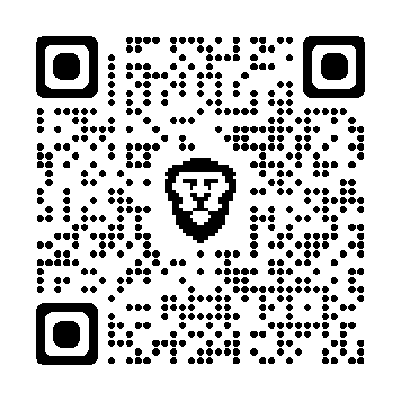
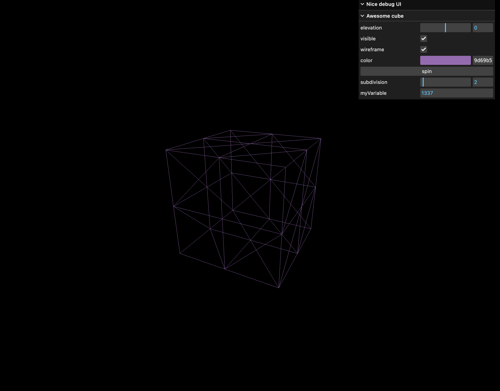
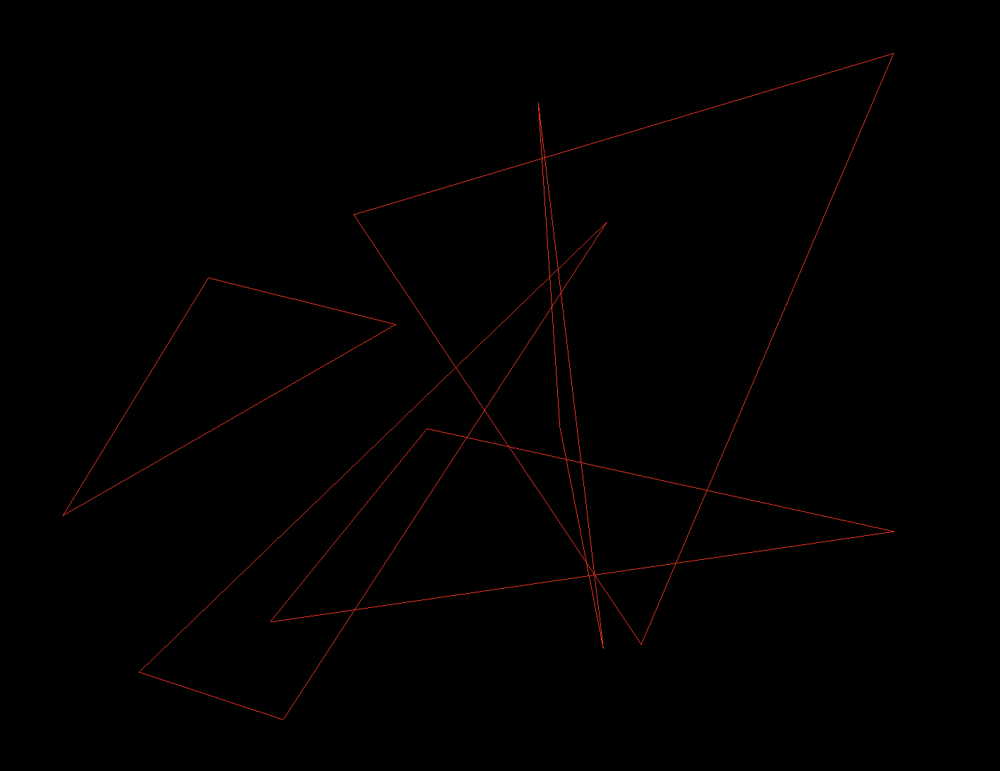
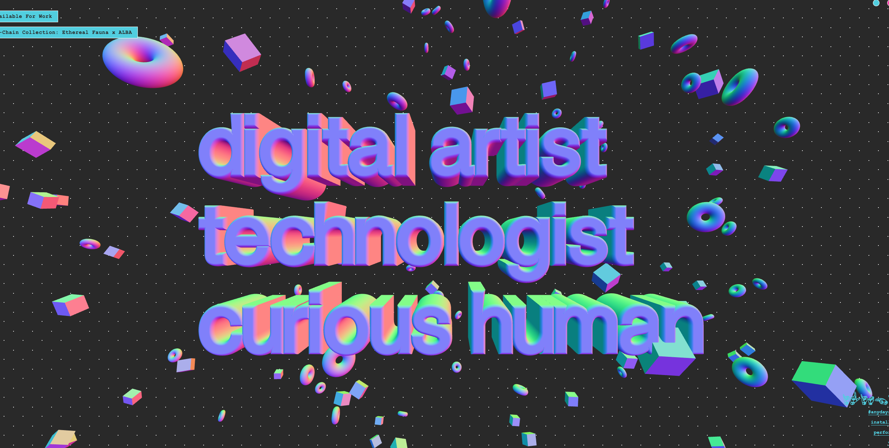

# ThreeJS 入門

## OVERVIEW

<!--toc:start-->

- [ThreeJS 入門](#threejs-入門)
  - [OVERVIEW](#overview)
  - [1. 基礎知識](#1-基礎知識)
    - [1.1 オブジェクト](#11-オブジェクト)
      - [オブジェクトの回転](#オブジェクトの回転)
        - [オイラー角による回転](#オイラー角による回転)
          - [ジンバルロック](#ジンバルロック)
          - [固定角](#固定角)
        - [クォータニオンによる回転](#クォータニオンによる回転)
          - [クォータニオンとは](#クォータニオンとは)
          - [任意軸回転](#任意軸回転)
          - [クォータニオンによる回転操作](#クォータニオンによる回転操作)
          - [複素数の拡張としてのクォータニオン](#複素数の拡張としてのクォータニオン)
          - [クォータニオンの利点](#クォータニオンの利点)
    - [1.2 Animation](#12-animation)
    - [1.3 カメラ](#13-カメラ)
      - [PerspectiveCamera クラス](#perspectivecamera-クラス)
      - [OrthographicCamera クラス](#orthographiccamera-クラス)
      - [CameraControl](#cameracontrol)
    - [1.4 フルスクリーン表示](#14-フルスクリーン表示)
    - [1.5 Debug UI](#15-debug-ui)
    - [1.6 Geometry](#16-geometry)
    - [1.7 Texture](#17-texture)
      - [PBR(Physically Based Rendering)](#pbrphysically-based-rendering)
      - [UV unwrapping](#uv-unwrapping)
        - [面(Face)の定義](#面faceの定義)
        - [テクスチャの収集](#テクスチャの収集)
        - [テクスチャ描画の最適化](#テクスチャ描画の最適化)
          - [Mipmapping](#mipmapping)
        - [画像データの選択](#画像データの選択)
    - [1.8 3D Text](#18-3d-text)
    - [1.8 レンダラー](#18-レンダラー)
    - [1.9 シーン](#19-シーン)
    - [1.10 マテリアル](#110-マテリアル)
    - [1.11 光源](#111-光源)
      - [AmbientLight クラス](#ambientlight-クラス)
      - [DirectionalLight クラス](#directionallight-クラス)
      - [HemisphereLight クラス](#hemispherelight-クラス)
      - [PointLight クラス](#pointlight-クラス)
      - [SpotLight クラス](#spotlight-クラス)
      - [RectAreaLight クラス](#rectarealight-クラス)
    - [1.12 Shadow](#112-shadow)
    - [1.12 Material](#112-material)
      - [MeshBasicMaterial クラス](#meshbasicmaterial-クラス)
      - [MeshNormalMaterial クラス](#meshnormalmaterial-クラス)
      - [MeshMatcapMaterial クラス](#meshmatcapmaterial-クラス)
      - [MeshLambertMaterial クラス](#meshlambertmaterial-クラス)
      - [MeshPhongMaterial クラス](#meshphongmaterial-クラス)
      - [MeshToonMaterial クラス](#meshtoonmaterial-クラス)
      - [MeshStandardMaterial クラス](#meshstandardmaterial-クラス)
    - [1.13 Raycast](#113-raycast)
  - [2. React Three Fiber](#2-react-three-fiber)
  <!--toc:end-->

## 1. 基礎知識

### 1.1 オブジェクト

以下のコマンド．オブジェクトを生成する，

```js
/**
 * Objects
 */
const geometry = new THREE.BoxGeometry(1, 1, 1);
const material = new THREE.MeshBasicMaterial({ color: 0xff0000 });
const mesh = new THREE.Mesh(geometry, material);
scene.add(mesh);
```

以下に，オブジェクトの位置，スケール，回転に関するコマンドを示す．

```js
// objects自体の位置を変更するには，以下のコマンドが有効
mesh.position.set(0.7, -0.6, 1);

// 引数は表示する軸の長さ
const axexHelper = new THREE.AxesHelper(2);
scene.add(axexHelper);

// 中心からの距離を取得
console.log("中心からの距離:" + mesh.position.length());
console.log(
  "指定した位置からの距離:" +
    mesh.position.distanceTo(new THREE.Vector3(0, 1, 0)),
);
// Scale
mesh.scale.set(2, 0.5, 0.5);

// rotation
mesh.rotation.reorder("YXZ");
mesh.rotation.set(Math.PI * 0.25, Math.PI * 0.25, 0);
```

#### オブジェクトの回転

回転を数学的に表現する上で, オイラー角,回転行列とクォータニオンがある．

> [参考:回転行列、クォータニオン(四元数)、オイラー角の相互変換](https://qiita.com/aa_debdeb/items/3d02e28fb9ebfa357eaf)

##### オイラー角による回転

オイラー角は，3つの角度の組で表される．  
一方の座標系を(x, y, z)で表し，他方を(X, Y，Z)で表す．

以下の図の例では，

1. (x, y, z)をz軸周りに角度をα回転させ，(x\', y\', z\')とする．
2. (x\', y\', z\')をx\'軸周りに角度をβ回転させ，(x\'\', y\'\', z\'\')とする．
3. (x\'\', y\'\', z\'\')をz\'\'軸周りに角度をγ回転させ，(X, Y, Z)とする．


上記の定義では，z軸-x\'軸-z\'\'軸の順で回転する．この順番をオイラー角の回転順序といい，  
この場合z-x-z系のオイラー角と呼ばれる．(左に書いてある方が内側)  
この回転順序には，i-j-kタイプとi-j-iタイプがある．そのため，3! + 3C1 = 12通りのオイラー角が存在する．

逆を言い返せば，(x, y, z)から(X, Y, Z)へ変換するには，どんな変換であれ，3回の手続きで変換可能であり，その回転方法は12通りあるということだ．

回転行列の積で表すと，

$$
{\begin{align}
\boldsymbol{R} _{xyz} (\alpha, \beta, \gamma)
& = \boldsymbol{R} _x (\alpha) \boldsymbol{R} _y (\beta) \boldsymbol{R} _z (\gamma)  \\
& = \begin{pmatrix}
1 & 0 & 0 \\
0 & \cos \alpha& -\sin \alpha\\
0 & \sin \alpha& \cos \alpha
\end{pmatrix}
\begin{pmatrix}
\cos \beta& 0 & \sin \beta\\
0 & 1 & 0 \\
-\sin \beta& 0 & \cos \beta
\end{pmatrix}
\begin{pmatrix}
1 & 0 & 0 \\
0 & \cos \gamma& -\sin \gamma\\
0 & \sin \gamma& \cos \gamma
\end{pmatrix}
\end{align}
}
$$

アニメーションは以下の通り．  


###### ジンバルロック

三つの軸のうち，二つの軸が一致してしまうと，本来ある自由度３が，自由度が２になってしまう現象．  
代数的な説明で${\frac{\partial R}{\partial \theta}, \frac{\partial R}{\partial \phi}, \frac{\partial R}{\partial \psi}}$が線形従属になる時を，ジンバルロックという．  
オイラー角X-Y-Z系で，Y軸周りの回転が90度の時にジンバルロックが発生する．


> [参考:ジンバルロックDEMO](https://arihide.github.io/demos/gimbal/)  
> [参考:ジンバルロック解説](https://qiita.com/Arihi/items/4b306feb3d9e6cd93204)



###### 固定角

**オイラー角X-Y-Z系の場合**

1. 初期の座標系を(x-y-z)とする．
2. (x, y, z)をx軸周りに角度をα回転させ，(x\', y\', z\')とする．
3. (x\', y\', z\')をy\'軸周りに角度をβ回転させ，(x\'\', y\'\', z\'\')とする．
4. (x\'\', y\'\', z\'\')をz\'\'軸周りに角度をγ回転させ，(X, Y, Z)とする．

**固定角X-Y-Z系の場合**

1. 初期の座標系を(x-y-z)とする．
2. (x, y, z)をx軸周りに角度をα回転させ，(x\', y\', z\')とする．
3. (x\', y\', z\')をy軸周りに角度をβ回転させ，(x\'\', y\'\', z\'\')とする．
4. (x\'\', y\'\', z\'\')をz軸周りに角度をγ回転させ，(X, Y, Z)とする．

固定角は回転行列で表現すると，以下のようになる．

$$
{\begin{align}
\boldsymbol{R} _{xyz} (\alpha, \beta, \gamma)
& = \boldsymbol{R} _z (\gamma) \boldsymbol{R} _y (\beta) \boldsymbol{R} _x (\alpha)  \nonumber \\
& =
\begin{pmatrix}
\cos \gamma& -\sin \gamma& 0  \\
\sin \gamma& \cos \gamma& 0  \\
0 & 0 & 1
\end{pmatrix}
\begin{pmatrix}
\cos \beta& 0 & \sin \beta\\
0 & 1 & 0 \\
-\sin \beta& 0 & \cos \beta
\end{pmatrix}
\begin{pmatrix}
1 & 0 & 0 \\
0 & \cos \alpha& -\sin \alpha\\
0 & \sin \alpha& \cos \alpha
\end{pmatrix}
\end{align}
}
$$

##### クォータニオンによる回転

```js
// rotationは，オイラー角を用いた回転を行う．
// gimbal lockが起きるので注意．
mesh.rotation.reorder("YXZ");
// そこで，reorderを用いることで，現在のオイラー角(姿勢)からクォータニオンを作成し，それを用いて回転させることができる.
// q(0, r)q^-1という形で回転させることができ，また結合法則が成り立つため，複数の回転でも扱いやすい．
mesh.rotation.y = Math.PI * 0.25;
mesh.rotation.x = Math.PI * 0.25;
```

###### クォータニオンとは

クォータ二オンは,任意軸回転させる．

ここで，留意しておくべき点は，回転と姿勢の定義である．  


方向すなわち回転軸は，三次元ベクトルの大きさを１とすると2次元で表される．  
姿勢は，方向+1次元の3次元で表される．

三次元空間にて，

方向ベクトル$(\lambda_x, \lambda_y, \lambda_z)$を回転軸として, 角度$\theta$回転させるという「回転クォータニオン」は，  
四次元ベクトル$(\cos\frac{\theta}{2}, \lambda_x \sin\frac{\theta}{2}, \lambda_y \sin\frac{\theta}{2}, \lambda_z \sin\frac{\theta}{2})$

なぜ，$\frac{\theta}{2}$ を用いるのかは，後述する．

###### 任意軸回転


回転軸となる正規化ベクトルを$\vec{n}$として，角度$\theta$回転を行うことする．  
回転の対象になる位置ベクトル$\vec{r}$を回転後の位置ベクトルを$\vec{r'}$とする．

$$
{\begin{align}
\vec{r_{\|}} = (\vec{n}\cdot\vec{r})\vec{n} \nonumber \\
\vec{r_{\perp}} = \vec{r} - \vec{r_{\|}} \nonumber
\end{align}}
$$

ここで，回転軸$\vec{n}$ と垂直成分$\vec{r_{\perp}}$に直行している回転面にあるベクトル$\vec{v}$を導入する．

$$
\vec{r_{\perp}^{'}} = \cos{\theta}\vec{r_{\perp}} + \sin{\theta}\vec{v}
$$

あとは，垂直成分ベクトル$\vec{r_{\|}}$との合成により，

$$
{\begin{align}
\vec{r_{\perp}^{'}} &= \vec{r_{\|}} + \vec{r_{\perp}} \nonumber \nonumber \\
&= \vec{r_{\|}} + (\cos\theta)\vec{r_\perp} + (\sin\theta)\vec{v} \nonumber \\
&= (\cos\theta)\vec{r} + (1-\cos\theta)(\vec{n}\cdot\vec{r})\vec{n} + (\sin\theta)(\vec{n}\times\vec{r})
\end{align}}
$$

###### クォータニオンによる回転操作

以下は，クォータニオンによる外積の式である．

$$
{\begin{align}
q \otimes p = (
&q_w p_x - q_z p_y + q_y p_z + q_x p_w, \nonumber \\
&q_z p_x + q_w p_y - q_x p_z + q_y p_w, \nonumber \\
&-q_y p_x + q_x p_y + q_w p_z + q_z p_w, \nonumber \\
&-q_x p_x - q_y p_y - q_z p_z + q_w p_w)
\end{align}
}
$$

行列式を使うと，

$$
{q \otimes p =
\begin{pmatrix}
q_w & -q_z & q_y & q_x \\
q_z & q_w & -q_x & q_y \\
-q_y & q_x & q_w & q_z \\
-q_x & -q_y & -q_z & q_w
\end{pmatrix}
\begin{pmatrix}
p_x \\
p_y \\
p_z \\
p_w
\end{pmatrix}
}
$$

クォータ二オンによる回転操作は，非常にシンプルである．  
三次元ベクトル$\vec{v}$に回転$q$を実施すると，$q\otimes (0, \vec{v}) \otimes \overline{q}(=q^{-1})$ ここで，$\overline{q}$は$q$の逆回転である．  
姿勢クォータニオン$p$に回転$q$を実施すると，$q\otimes p$.
クォータニオンのw成分を0にして掛け算したものは，ベクトルの外積に対応している．

そのため，$p=(0, \vec{v})$として，以下を計算すると

$$
{\begin{align}
p^{'} &= \nonumber \\
&= q \otimes p \otimes q^{-1} \nonumber \\
&= (w, \vec{v}) (0, \vec{r}) (w, -\vec{v}) \nonumber \\
&= (0, \cos{2\phi\vec{r}}) + (1-\cos{2\phi})(\vec{n}\cdot\vec{r})\vec{n} + \sin2\phi(\vec{n}\times\vec{r})) \\
\end{align}}
$$

となり，先ほどの任意軸回転の式と近い形になる．

ここで，回転角が$2\phi$であることを考慮して，

$$
q = (\cos{\frac{\phi}{2}}, \sin{\frac{\phi}{2}}\vec{n})
$$

###### 複素数の拡張としてのクォータニオン

クォータニオンは複素数の拡張と言える．  
| | 対応ベクトル | 実現する回転 | 回転行列 |
|-------------- | -------------- | -------------- | -------------- |
| 複素数 $x + yi$ | 二次元ベクトル | 二次元回転 | 2x2 |
| 四元数 $w + xi + yj+ zk$ | 四次元ベクトル | 三次元回転 | 3x3 |

複素数と同様な性質を持つ．  
$i^2 = j^2 = k^2 = ijk = -1$のルールが定まれば，以下のような表が作れる．  
| | i | j | k |
|---------------- | --------------- | --------------- | --------------- |
| i | -1 | k | -j |
| j | -k | -1 | i |
| k | j | -i | -1 |

また，複素数と同様な定義を持つ．

- ノルム
  $$
  |q| = \sqrt{{q_w}^2 + {q_x}^2 + {q_y}^2 + {q_z}^2}
  $$
- 共役四元数
  $$
  |\overline{q}| = q_w - q_x\bf{i} - q_y\bf{j} - q_z\bf{k}
  $$
- 逆数
  $$
  q^{-1} = \frac{\overline{q}}{|q|^2}
  $$

逆数を持つため，体である．

###### クォータニオンの利点

- メモリ的に効率的
- 計算時間が短い
- 回転行列の性質を引き継いでるので，回転の結合法則も成り立つ．
- ジンバルロックが発生しない.
- 計算時に数値誤差が生じにくいらしい．
- 回転お連続的変化で補間計算が容易．
- 結合法則が成り立ち，複数の回転の操作でも扱いやすい．

### 1.2 Animation

Animationを行うためには，以下のようなコードをかく．  
時間による描画を正しく行いたい場合は，以下のように書く．

```js
const clock = new THREE.Clock();

// Animation
const tick = () => {
  const elapsedTime = clock.getElapsedTime();
  // Update
  camera.position.y = Math.sin(elapsedTime);
  camera.position.x = Math.cos(elapsedTime);
  camera.lookAt(mesh.position);

  // Render
  renderer.render(scene, camera);

  window.requestAnimationFrame(tick);
};

tick();
```

他には，gsapとうライブラリを使うことで，アニメーションを行うことができる．

```js
gsap.to(mesh.position, { duration: 1, delay: 1, x: 2 });
gsap.to(mesh.position, { duration: 1, delay: 2, x: 0 });
```

### 1.3 カメラ

#### PerspectiveCamera クラス

```js
// Camera
const camera = new THREE.PerspectiveCamera(
  45,
  sizes.width / sizes.height,
  1,
  1000,
);
```

それぞれ，引数は，視野角，アスペクト比，near, farである.  
near は，カメラからの最小描画距離，farは，カメラからの最大描画距離である．  
この設定によっては，オブジェクトがちらついたりするので，注意が必要である．

#### OrthographicCamera クラス

```js
// Camera
const aspectRatio = sizes.width / sizes.height;
const camera = new THREE.OrthographicCamera(
  -1 * aspectRatio,
  1 * aspectRatio,
  1,
  -1,
  0.1,
  100,
);
```

OrthographicCamera(orthographic projection: 正投影)は，透視投影とは異なり，平行投影を行う．  
そのため，オブジェクトが等しい大きさで描画される．  
2D描画などに適する．

#### CameraControl

以下は，カメラコントロールを自作する例．

```js
const tick = () => {
  const elapsedTime = clock.getElapsedTime();

  // Update objects
  mesh.rotation.y = elapsedTime;

  Update camera
  camera.position.x = 3.0 * Math.sin(cursor.x * Math.PI * 2);
  camera.position.z = 3.0 * Math.cos(cursor.x * Math.PI * 2);
  camera.position.y = cursor.y * 5;
  camera.lookAt(mesh.position);

  // Render
  renderer.render(scene, camera);

  // Call tick again on the next frame
  window.requestAnimationFrame(tick);
};

tick();
```

通常，カメラコントロールは以下のようなライブラリを使うことが多い．

```js
const controls = new OrbitControls(camera, canvas);
```

### 1.4 フルスクリーン表示

```js
window.addEventListener("resize", () => {
  // Update sizes
  sizes.width = window.innerWidth;
  sizes.height = window.innerHeight;

  // Update camera
  camera.aspect = sizes.width / sizes.height;
  camera.updateProjectionMatrix();

  // Update renderer
  renderer.setSize(sizes.width, sizes.height);
  // pixel ratio が変更された時にも，対応．
  renderer.setPixelRatio(window.devicePixelRatio);
});

window.addEventListener("dblclick", () => {
  const fullscreenElement =
    document.fullscreenElement || document.fullscreenElement;
  if (!fullscreenElement) {
    if (canvas.requestFullscreen) {
      canvas.requestFullscreen();
    } else if (canvas.webkitRequestFullscreen) {
      canvas.requestFullscreen();
    }
  } else {
    if (document.exitFullscreen) {
      document.exitFullscreen();
    } else if (document.webkitExitFullscreen) {
      document.exitFullscreen();
    }
  }
});
```

### 1.5 Debug UI

以下のように，デバッグUIを簡単に作成することができる．
色関連の設定がよくわかってないところがあるが，色コードは関数によって異なる?? それに注意するべき．

```js
/**
 * Debug
 */
const gui = new GUI({
  width: 300,
  title: "Nice debug UI",
  closeFolders: true,
});
// gui.close()

window.addEventListener("keydown", (event) => {
  if (event.key == "h") {
    gui.show(gui._hidden);
  }
});

const debugObject = {};

/**

...

 */

/**
 * Object
 */
debugObject.color = "#9d69b5";

const geometry = new THREE.BoxGeometry(1, 1, 1, 2, 2, 2);
const material = new THREE.MeshBasicMaterial({
  color: debugObject.color,
  wireframe: true,
});
const mesh = new THREE.Mesh(geometry, material);
scene.add(mesh);

const cubeTweaks = gui.addFolder("Awesome cube");
// cubeTweaks.close();

cubeTweaks.add(mesh.position, "y").min(-3).max(3).step(0.01).name("elevation");
cubeTweaks.add(mesh, "visible");
cubeTweaks.add(mesh.material, "wireframe");

// onChange で欲しい色コードを取得できる．
// また，色コードは，関数によって異なることがあるので，使用には注意．
cubeTweaks.addColor(debugObject, "color").onChange(() => {
  material.color.set(debugObject.color);
});

debugObject.spin = () => {
  gsap.to(mesh.rotation, { duration: 1, y: mesh.rotation.y + Math.PI * 2 });
};
cubeTweaks.add(debugObject, "spin");

cubeTweaks.add(geometry, "widthSegments");

debugObject.subdivision = 2;
cubeTweaks
  .add(debugObject, "subdivision")
  .min(1)
  .max(20)
  .step(1)
  .onFinishChange(() => {
    mesh.geometry.dispose(); // これがないと，メモリリークが発生する．
    mesh.geometry = new THREE.BoxGeometry(
      1,
      1,
      1,
      debugObject.subdivision,
      debugObject.subdivision,
      debugObject.subdivision,
    );
  });

const myObject = {
  myVariable: 1337,
};
cubeTweaks.add(myObject, "myVariable");
```



### 1.6 Geometry

以下は，ジオメトリの作成例である．

```js
const geometry = new THREE.BufferGeometry();

const count = 5;
const positionsArray = new Float32Array(count * 3 * 3);

for (let i = 0; i < count * 3 * 3; i++) {
  positionsArray[i] = (Math.random() - 0.5) * 4;
}

const postionsAttribute = new THREE.BufferAttribute(positionsArray, 3);
geometry.setAttribute("position", postionsAttribute);

const material = new THREE.MeshBasicMaterial({
  color: 0xff0000,
  wireframe: true,
});
```



三角形の集合を描画することができた．

### 1.7 Texture

#### PBR(Physically Based Rendering)

PBRマテリアルとは，Physically Based Renderingの略で，物理ベースレンダリングを実現するためのマテリアルを指す．  
光の挙動を実際の物理法則に従って，シミュレーションする．

以下は，テクスチャ配信サイト

> oliigon.com  
> 3dtextures.me  
> arroway-textures.ch  
> https://polyhaven.com/textures


#### UV unwrapping

3Dモデルの表面を2D平面に展開するプロセスのことをUV unwrappingと呼ぶ．  
複雑な形状の場合，3Dソフトウェアを使用するのが一般的．

以下は，UV unwrappingのイメージ．


##### 面(Face)の定義

テクスチャの定義を理解するには，まず面の定義方法を知る必要がある．  
3Dレンダリングにおける，六面体の各面は２つの三角形の組み合わせによって表現されている．

Three.jsでは，頂点の座標はGeometryオブジェクトのfacesという配列で定義される．  
faces配列は，1個の三角形毎に半時計周りに定義すると紙面上向きが正面であると見なされる(右ねじの法則)．  


上図は，一例であり開始する頂点はどれでも構わなない．

##### テクスチャの収集

3Dでは，テクスチャの配置を定義することをUVマッピングと呼ぶ．  
つまり，一つの面に対して複数のテクスチャを貼り付ける場合，UVマッピングが必要．  
UVとはテクスチャを2次元とした場合に，U，V軸で定義することに由来する．(さらに，高さを定義したUVWマッピングも存在する)


下図でいうと，右方向がU軸正の向き，上方向がV正の向き. また，原点は左下となる．


?? 疑問なのは，立方体のテクスチャを設定した際に，

##### テクスチャ描画の最適化

###### Mipmapping

Mipmappingとは，1x1のテクスチャになるまで，テクスチャの半分の小さいバージョンを何度も生成する技術．  
filterとは，Mipmappingする際に複数のピクセルを平均化などの処理をかけることをいう．

Threejsには，二つのフィルタリング操作を標準搭載している．

- Minification filter
  Minification fileter(最小化フィルタ)は，テクスチャのピクセルがレンダリングのピクセルより小さい時に機能する．  
  通常は，`THREE.LinearMipmapLinearFilter`が適用されている．

- Magnification filter
  Magnification filter(最大化フィルタ)は，テクスチャのピクセルがレンダリングのピクセルよりも大きい場合に機能する．つまりテクスチャが覆う面に対して小さすぎる場合.

  例えば，以下の例では，
  

  デフォルトは，`THREE.LinearFilter`が適用されているが，`THREE.NearestFilter`を適用することで，上記の問題を解決できる．  
  

##### 画像データの選択

画像データはなるべく軽くしてやる必要がある．  
pngファイルは，圧縮が比較的弱め，高画質だがファイル自体は重め．  
jpegファイルは，圧縮が強め，低画質，低容量．

> [TinyPNG: 画像圧縮サイト](https://tinypng.com/)

### 1.8 3D Text

以下のような，3Dのテキストオブジェクトを生成することができる．


3Dテキストオブジェクトの中心が定義されてないため，中心を定義してやる必要がある．

```js
fontLoader.load("/fonts/helvetiker_regular.typeface.json", (font) => {
  const textGeometry = new TextGeometry("DONUTS!!", {
    font: font,
    size: 0.5,
    height: 0.2,
    curvedSegments: 6, // mesh resolution
    bevelEnabled: true,
    bevelThickness: 0.03,
    bevelSize: 0.02,
    bevelOffset: 0,
    bevelSegments: 4, // bevel (角) resolution
  });

  // bevel の分だけオフセットする
  // textGeometry.computeBoundingBox();
  // textGeometry.translate(
  //   -(textGeometry.boundingBox.max.x - 0.02) * 0.5,
  //   -(textGeometry.boundingBox.max.y - 0.02) * 0.5,
  //   -(textGeometry.boundingBox.max.z - 0.02) * 0.5,
  // );

  // 上と同じ
  textGeometry.center();
}
```

### 1.8 レンダラー

レンダリングとは，3D空間に存在するオブジェクトを2D画像に変換することであり，その処理を行うのがレンダラーである．


### 1.9 シーン

シーンとは，3D空間に存在するオブジェクトを配置するための箱のようなものである．

### 1.10 マテリアル

マテリアルとは，オブジェクトの見た目を決めるためのものである．
質感や色などを指定することができる．

### 1.11 光源

以下に，複数の光源の使用例を示す.

#### AmbientLight クラス

環境光を表すクラス．３D空間全体を均一に照らす．一律に明るくしたい時に重宝される．
このライトのクラスのみでは，陰影や影がつかないので他のライトと併用して使う．

```js
// 環境光源を作成
// new THREE.AmbientLight(色, 光の強さ)
const light = new THREE.AmbientLight(0xffffff, 1.0);
scene.add(light);
```


#### DirectionalLight クラス

特定の方向に放射される光．光源は無限に離れているものとして，そこから発生する光線は全て平行になる．わかりやすく言うと，太陽光のような光源である．

```js
// 平行光源を作成
// new THREE.DirectionalLight(色, 光の強さ)
const light = new THREE.DirectionalLight(0xffffff, 1);
scene.add(light);
```


#### HemisphereLight クラス

AmbientLightクラスに似ているが，上からの光の色と下からの光の色に分けることができる．
屋外での光の見え方に近くなる．

```js
// 半球光源を作成
// new THREE.HemisphereLight(空の色, 地の色, 光の強さ)
const light = new THREE.HemisphereLight(0x888888, 0x0000ff, 1.0);
scene.add(light);
```


#### PointLight クラス

単一点からあらゆる方向に放射される光源．電球のような光源である．

```js
// 点光源を作成
// new THREE.PointLight(色, 光の強さ, 距離, 光の減衰率)
const light = new THREE.PointLight(0xffffff, 2, 50, 1.0);
scene.add(light);
```


#### SpotLight クラス

特定の方向に放射される光源．電球のような光源である．

```js
// スポットライトを作成
// new THREE.SpotLight(色, 光の強さ, 距離, 光の減衰率, 角度, パワー)
const light = new THREE.SpotLight(0xffffff, 2, 50, 1.0, 0, 0);
scene.add(light);
```


#### RectAreaLight クラス

```js
// 長方形光源を作成
const spotLight = new THREE.SpotLight(
  0x78ff00, // color
  4.5, // intensity
  10, // distance
  Math.PI * 0.1, // angle
  0.25, // penumber (光の輪郭)
  1, // decay(光の減衰)
);
scene.add(light);
```

光は負荷が重め

- 軽め
  AmbientLight, HemisphereLight
- 中程度
  DirectionalLight, PointLight
- 高め
  SpotLight, RectAreaLight

そこで，負荷を軽くするために，**Baking**あらかじめテクスチャに影を描いておく手法が取られる．

### 1.12 Shadow

影の演出を行う方法は，二つある．
一つ目は，ライトを用いて影を描写する方法である．

```js
renderer.shadowMap.enabled = true;
// ライトに影を有効にする
directionalLight.castShadow = false;
// オブジェクトに影を有効にする
plane.receiveShadow = false;
```

二つは，Baked Shadowである．  
あらかじめテクスチャに影を焼き付けておく手法．  
ライトの位置が固定されている場合にのみ有効であり，GPU負荷を軽減することができる．

### 1.12 Material

#### MeshBasicMaterial クラス

マテリアルの一種．オブジェクトの見た目を指定するためのもの．  
このマテリアルを使うと，オブジェクトの見た目を一色にすることができる．

```js
// ドーナツを作成
const geometry = new THREE.TorusGeometry(300, 100, 64, 100);
// マテリアルを作成
const material = new THREE.MeshBasicMaterial({ color: 0x6699ff });
// メッシュを作成
const mesh = new THREE.Mesh(geometry, material);
// 3D空間にメッシュを追
scene.add(mesh);
```


#### MeshNormalMaterial クラス

ノーマルカラーをRGBで可視化するマテリアル．  
ライティングを必要しないとため，手動に動作確認する時に役立つ．  
色は，面に対しての法線ベクトルがカメラによってどの角度で見えるかによって定まる．  
つまり，回転する球は常に同じ色に見える．

```js
// ドーナツを作成
const geometry = new THREE.TorusGeometry(300, 100, 64, 100);
// マテリアルを作成
const material = new THREE.MeshNormalMaterial({ color: 0x6699ff });
// メッシュを作成
const mesh = new THREE.Mesh(geometry, material);
// 3D空間にメッシュを追
scene.add(mesh);
```

#### MeshMatcapMaterial クラス

カメラの法線ベクトルによって，色を決定するマテリアル．  
光源がなくても，影がつくような見た目になる．よって，他の陰影と矛盾しないようにする必要がある．

以下は，Matcapのサンプル集．

> [参考: Matcap Samples](https://github.com/matcaps)

また，Matcapは作成することができる．
具体的な手法としては，Blenderで**球に(必ず)**光を投影して，それをテクスチャとして保存する方法である．

以下が，Matcapを確認できるサイト

> [参考: Matcap Debug UI](https://kchapelier.com/matcap-studio/)

```js
// ドーナツを作成
const geometry = new THREE.TorusGeometry(300, 100, 64, 100);
// マテリアルを作成
const material = new THREE.MeshMatcapMaterial();
// メッシュを作成
const mesh = new THREE.Mesh(geometry, material);
// 3D空間にメッシュを追
scene.add(mesh);
```


#### MeshLambertMaterial クラス

光沢感ないマットな質感を表現するマテリアル．ライトを当てると，陰影がつく．

```js
// ドーナツを作成
const geometry = new THREE.TorusGeometry(300, 100, 64, 100);
// マテリアルを作成
const material = new THREE.MeshLambertMaterial({ color: 0x6699ff });
// メッシュを作成
const mesh = new THREE.Mesh(geometry, material);
// 3D空間にメッシュを追加
scene.add(mesh);
```

#### MeshPhongMaterial クラス

光沢感のある質感を表現するマテリアル．ライトを当てると，陰影がつく．

```js
// ドーナツを作成
const geometry = new THREE.TorusGeometry(300, 100, 64, 100);
// マテリアルを作成
const material = new THREE.MeshPhongMaterial({ color: 0x6699ff });
// メッシュを作成
const mesh = new THREE.Mesh(geometry, material);
// 3D空間にメッシュを追加
scene.add(mesh);
```

#### MeshToonMaterial クラス

アニメのような，トゥーンシェーディングを表現するマテリアル．ライトを当てると，陰影がつく．

仮に，独自のtextureを利用する際に解像度が低い場合，
`minFilter`と`magFilter`を設定する必要がある．

```js
// ドーナツを作成
const geometry = new THREE.TorusGeometry(300, 100, 64, 100);
// マテリアルを作成
const material = new THREE.MeshToonMaterial({ color: 0x6699ff });
// メッシュを作成
const mesh = new THREE.Mesh(geometry, material);
// 3D空間にメッシュを追加
scene.add(mesh);
```

#### MeshStandardMaterial クラス

金属のような質感を表現するマテリアル．ライトを当てると，陰影がつく．

```js
// ドーナツを作成
const geometry = new THREE.TorusGeometry(300, 100, 64, 100);
// マテリアルを作成
const material = new THREE.MeshStandardMaterial({
  color: 0x6699ff,
  roughness: 0.5,
});
// メッシュを作成
const mesh = new THREE.Mesh(geometry, material);
// 3D空間にメッシュを追加
scene.add(mesh);
```

### 1.13 Raycast

raycastとは，光線を発射してその光線が当たったオブジェクトを取得することである．
当たり判定などの処理に利用される．

## 2. React Three Fiber
