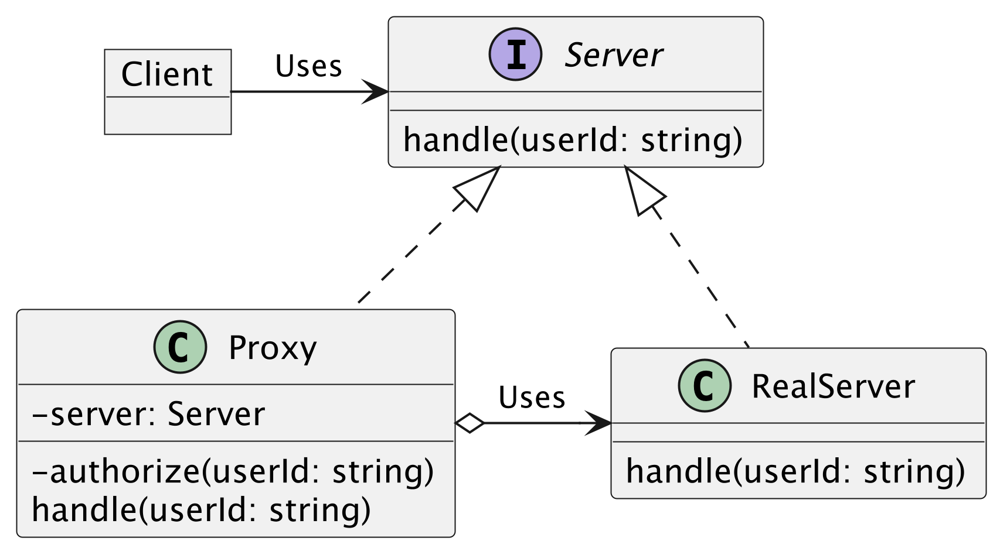

## Abstract Factory
生成に関するデザインパターンである．部品の具体的な実装を隠蔽し，抽象のAPIに注目し，そのAPIだけを使って，部品を組み立てていく．  

例えば，GUIのボタンを作成する際に，ボタンのデザインをMac, WindowsなどのOSに合わせて作成したい.  
そのときに，以下のようなクラス構成にすることができる．  

#### メリット  
- 具体的なクラスをクライアントから隠蔽する．  
- 利用する部品群の整合性を保つことができる．  

#### デメリット  
- クラス数が多く，コードが必要以上に複雑になる可能性がある．  
- オブジェクトの追加などの修正には適さない. 例えば，WindowToggleButtonを追加するとか．
    
#### Abstract FactoryとFactory Methodの違い  
- Abstract Factoryは，部品を組み合わせて新しい部品を作る．  
- Factory Methodは，部品を作る．

## Strategy  
複数のアルゴリズムを別個のクラスとして定義し，切り替えができるようにするパターン．

#### メリット  
- 実行時にオブジェクト内で使用されるアルゴリズムを切り替えることができる．  
- アルゴリズムの実装の詳細をコードから隠蔽することができる．
- アルゴリズムの追加や変更が容易になる．

#### デメリット  
- アルゴリズムが少ない場合は過剰な設計になり得る．  

## State

#### 使い時  
- 現状の状態に応じて異なる振る舞いをする場合に使用する．そして，その状態数が多い場合に使用する．  
    - Contextに現在の状態をセットすることで振る舞いが切り替わる．  
    
- 状態の内容が頻繁に変更される場合．  

- 状態に固有の処理を実行させるために，いくつかの条件分岐を有する場合．

#### メリット  
- 特定の状態における実装の詳細を別クラスに分離できる．  
- 状態に固有の処理を選択するための条件分がなくなる．  
- 状態の追加が容易．

#### デメリット
- 状態の種類が少ない場合，過剰な設計になり得る．

## Chain of Responsibility
振る舞いに関するデザインパターンである．  
クライアントからのリクエストを処理するオブジェクトを鎖のように繋げ，処理が可能なオブジェクトにリクエストを順に渡していくパターン.

#### メリット  
- リクエスト処理の順序を制御できる．  
- リクエストの送信側と受信側の結びつきを弱くすることができる．  
- 新しい処理クラスを容易に追加できる．  

#### デメリット
- 処理がたらい回しにされるので，パフォーマンスが悪くなる可能性がある．  

## Composite
構造に対するデザインパターンである．  
ツリー構造を持つオブジェクトに再帰的な処理を行えるようにするパターン.  

#### メリット  
- 複雑なツリー構造を簡単に扱うことができる．  
- 新しい枝葉を簡単に追加できる．

#### デメリット
- 枝葉が大きく異なる場合は，共有のAPIを作ることが困難．  

#### 使い時
ディレクトリツリー，組織階層，DOMツリー  

## Decorator
基本となるオブジェクトに対して，柔軟に機能を追加できるようにするパターン．  
継承を使わずに，オブジェクトに機能を追加する．  
構造に対するでザインパターンである．  

#### メリット  
- 実行時の機能追加がようにできる．  
- 複数の機能を組み合わせることができる．  

#### デメリット
- 組み合わせた昨日から特定の機能の削除は困難．  
- 振る舞いがデコレータの組み合わせの順序に依存する．  

## Proxy
代理となるオブジェクトを通じて，間接的に目的のオブジェクトにアクセスすることができるようにするパターン．  
目的のオブジェクトへのアクセスを制御し，目的のオブジェクトへリクエストが届く前後に別の処理を行うことができる．  
構造に関するデザインパターンである．  
例）プロキシサーバ  

#### メリット  
- オブジェクトへのアクセスが間接的になる．
- 目的のオブジェクトがまだ存在しない場合でも開発を進められる．    

#### デメリット
- 過剰な設計に気をつける．  

## Bridge
機能を提供するクラスと，実装を提供するクラスを独立させるためのパターン．  
目的(何を行うのか)と手段(どうやって行うのか)を分離する．  
構造に関するデザインパターンである．  

#### メリット  
- 機能の拡張と実装の修正が容易．
- プログラムの実行時に実装を切り替えられる．
- 機能や実装のバリエーションが豊富な場合，最終的に作成すべきクラス数を抑えることができる．  

#### デメリット
- 過剰な設計に気をつける．  

## flyweight  
ボクシングの「フライ級」を意味する．  
インスタンス化されたオブジェクトを効率よく共有することで，生成されるオブジェクトやリソースの消費を抑えるパターン．  
構造に関するデザインパターン．  

#### メリット  
- 生成されるオブジェクトのパターンの数を抑える．  
- リソースの消費を抑える．  

#### デメリット
- コードの複雑化，読むのが難しくなる．  
- 共有されているオブジェクトの変更により想定外のバグを生む．  

#### 使い道
同一のオブジェクトを大量に使用する必要がある．  
インスタンスの生成によるリソースの消費を抑えたい場合．  

## Observer  
観察対象のオブジェクトの状態変化が発生した際に，複数の観察者に対して通知を行うパターン.  
観察よりも通知に重点が置かれており，Publish(発行)-Subscribe(購読)パターンと呼ばれることもある．  
振る舞いに関するデザインパターン.

以下は，商品の追加通知．  

上の図では，通知リストなるものをItemSubjectは保持することになる．  

#### メリット  
- 実行時に観測者の変更が可能．  
- 観測者と観測対象のつながりを弱めることができる．  
- 新たな観測対象の追加と削除が容易にできる．  

#### デメリット
- 通知の順番に依存しない実装にする必要がある．
通知A，B，Cの順番によらないようにする．

#### 使い道
ニュース，SNS．新しい更新があるとリロードを促している．その裏には監視が行われている．  
 
## Mediator  
関連し合うオブジェクト間のやり取りを仲介者となるオブジェクトに集約し，
オブジェクトが直接やり取りすることを制限するパターン．  
振る舞いに関するデザインパターン．  
- やり取りを制限することで，オブジェクト同士の結びつきを弱める．  

カプセル化(外部からの直接の操作を禁止し，内部メンバにアクセスするためのAPIを容易する．)を利用したパターン.  

　　

カプセル化によって，通信間のやり取りや関係性が隠蔽されている．  

#### メリット  
- オブジェクト同士のやり取りを集約し，理解しやすさと保守性を高めることができる．  
- Colleageオブジェクトの結びつきを弱める．  

#### デメリット
- Sinletonみたいに，Mediatorが大きくなりすぎる可能性がある．  

#### 使い道
 
## Memento  
オブジェクトの現在の状態を保存しておき，状態が変化した場合でもその時の状態に戻すことができるようにするパターン．  
Undoのような機能を実装する．  
振る舞いに関するデザインパターン．  

ここで，Note PadがOriginatorに当たる．  
　　

「カプセル化の破壊」を防ぎつつ，内部状態の保存・復元ができる設計にする．  

#### メリット  
- カプセル化を破壊することなく，オブジェクトの状態のスナップショットを作成・復元できる．
- Caretakerに任せることで，Originatorクラスをシンプルに保つことができる．  

#### デメリット
- Mementoを大量に作成してしまうとメモリ使用量が増加する．  
- プログラミング言語の使用に応じて，構成が異なる．  

## Visitor
データ構造を表すクラスとそれに対する操作を行うクラスを分離するパターン．  
操作を行うクラスがデータ構造を表すクラスを訪問し，順に処理を行う．  
振る舞いに関するデザインパターン.  

ダブルディスパッチを利用．  
- 訪問者と受け入れる側がお互いのメソッドを呼び出す．  
    - 受け入れる側のメソッド：element.accept(visitor)
    - 訪問する側のメソッド：visitor.visit(element)
    
- Elementの具体的な型とVisitorの具体的な型によって実行される処理が確定する．  

例えば，  
データ構造の中に多くの要素が格納されており，その各要素に対して，何らかの処理をしたい．  
データ構造の中に書いてしまうと，データ構造の数だけデータクラスを修正してやる必要がある．  
このような問題をクリアすることができる．  

　　

#### メリット  
- データ構造と操作を分離し，共通な操作を一箇所にまとめることができる．  
- 新しい操作を容易に追加できる．

#### デメリット
- 新しいデータ構造を追加することは困難．  

## Command  
命令をメソッドではなく，独立したクラスとして表現するパターン．  
- 「命令」を送る側と，「命令」を受け取る側を分離する．  
- 「命令」クラスのインスタンスを切り替えることで様々な処理を実現することができる．  

以下は，ファイル操作をキューにまとめて実行する例．  

ポイントは，コマンドはFileのメンバー関数である．  
そして，コマンドはQueueにてまとめて実行される．  

　　

複数の命令をひとまとめに実行する場合に便利．  
また，非同期処理などとも相性がいい．

#### メリット  
- 既存のコードを修正することがなく，命令の追加・拡張ができる．  
- 命令の再利用が可能．  
- 処理のキューイングが可能．  

#### デメリット
- 過剰設計に気を付ける．  

## Interpreter
構文の解析を行なって，その結果を利用して処理を行うパターン.    
- 解析を行うための「規則」をクラスとして表現．  
- 規則のツリー構造を扱うことができる．  
例）構文木
振る舞いに関するデザインパターン  

　　

正規表現，SQL解析，プログラミング言語開発などに用いられる．  

#### メリット  
- 既存のコードを修正することなく，規則の追加・拡張が可能．  

#### デメリット
- 過剰設計に気を付ける．  