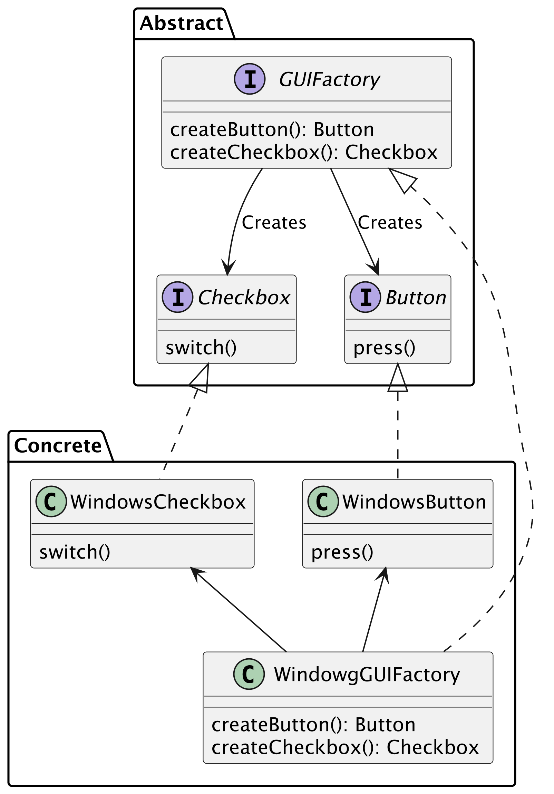
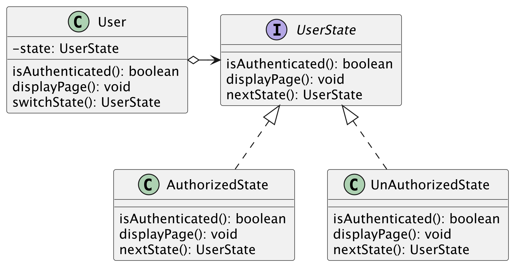
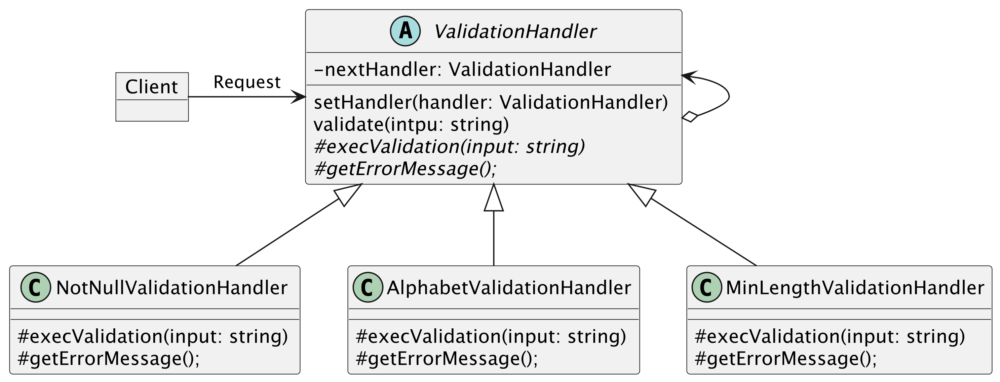

## Abstract Factory
生成に関するデザインパターンである．部品の具体的な実装を隠蔽し，抽象のAPIに注目し，そのAPIだけを使って，部品を組み立てていく．  

例えば，GUIのボタンを作成する際に，ボタンのデザインをMac, WindowsなどのOSに合わせて作成したい.  
そのときに，以下のようなクラス構成にすることができる．  

#### メリット  
- 具体的なクラスをクライアントから隠蔽する．  
- 利用する部品群の整合性を保つことができる．  

#### デメリット  
- クラス数が多く，コードが必要以上に複雑になる可能性がある．  
- オブジェクトの追加などの修正には適さない. 例えば，WindowToggleButtonを追加するとか．
    
#### Abstract FactoryとFactory Methodの違い  
- Abstract Factoryは，部品を組み合わせて新しい部品を作る．  
- Factory Methodは，部品を作る．

## Strategy  
複数のアルゴリズムを別個のクラスとして定義し，切り替えができるようにするパターン．

#### メリット  
- 実行時にオブジェクト内で使用されるアルゴリズムを切り替えることができる．  
- アルゴリズムの実装の詳細をコードから隠蔽することができる．
- アルゴリズムの追加や変更が容易になる．

#### デメリット  
- アルゴリズムが少ない場合は過剰な設計になり得る．  

## State

#### 使い時  
- 現状の状態に応じて異なる振る舞いをする場合に使用する．そして，その状態数が多い場合に使用する．  
    - Contextに現在の状態をセットすることで振る舞いが切り替わる．  
    
- 状態の内容が頻繁に変更される場合．  

- 状態に固有の処理を実行させるために，いくつかの条件分岐を有する場合．

#### メリット  
- 特定の状態における実装の詳細を別クラスに分離できる．  
- 状態に固有の処理を選択するための条件分がなくなる．  
- 状態の追加が容易．

#### デメリット
- 状態の種類が少ない場合，過剰な設計になり得る．

## Chain of Responsibility
振る舞いに関するデザインパターンである．  
クライアントからのリクエストを処理するオブジェクトを鎖のように繋げ，処理が可能なオブジェクトにリクエストを順に渡していくパターン.

#### メリット  
- リクエスト処理の順序を制御できる．  
- リクエストの送信側と受信側の結びつきを弱くすることができる．  
- 新しい処理クラスを容易に追加できる．  

#### デメリット
- 処理がたらい回しにされるので，パフォーマンスが悪くなる可能性がある．  