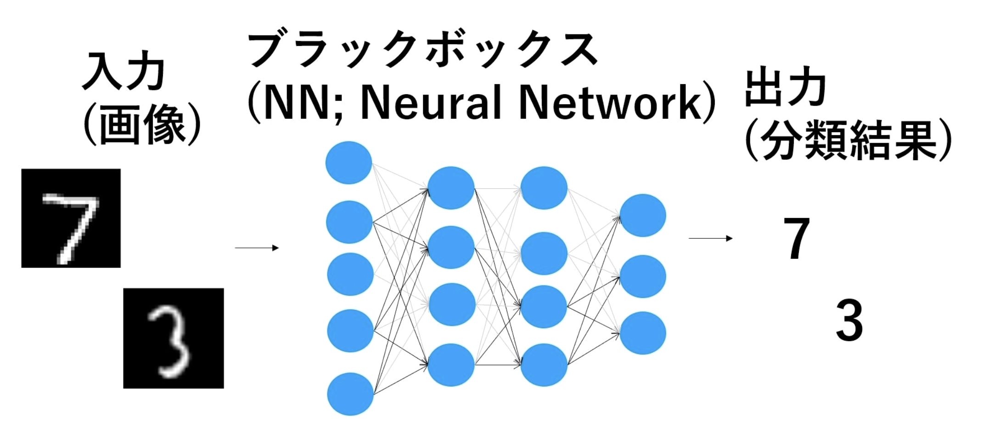
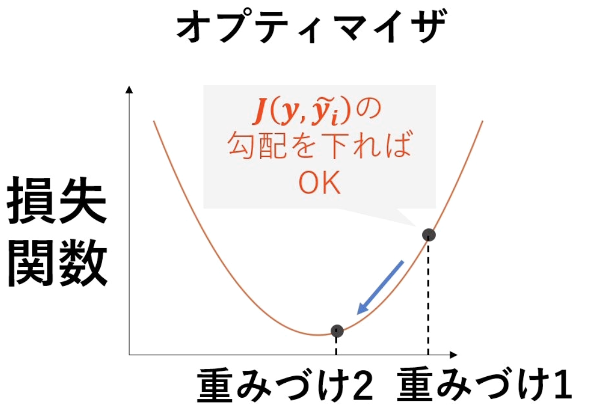
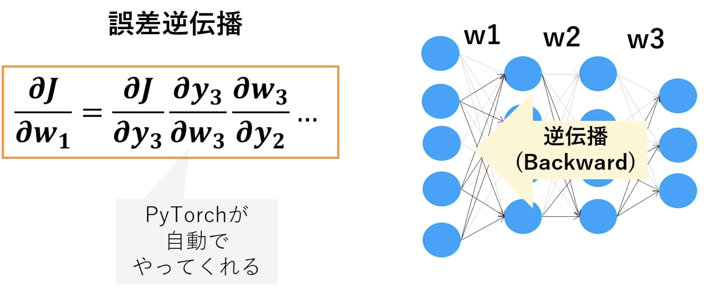
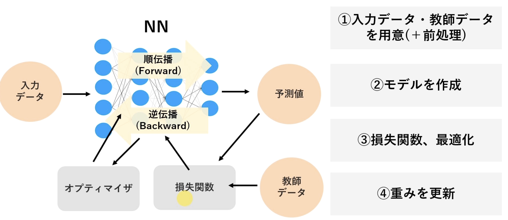
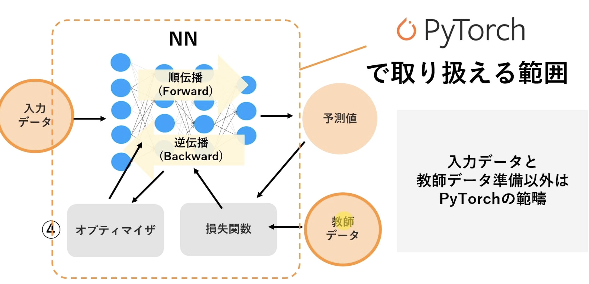

# PyTorch

<!--toc:start-->

- [PyTorch](#pytorch)
  - [PyTorch基礎](#pytorch基礎)
    - [Tensor](#tensor)
    - [PythonにおけるTensor型の取り扱い](#pythonにおけるtensor型の取り扱い)
    - [自動微分](#自動微分)
    - [機械学習の流れ](#機械学習の流れ)
  - [機械学習の基礎](#機械学習の基礎)
    - [活性化関数](#活性化関数)
    - [Poolingレイヤ](#poolingレイヤ)
    - [全結合(Affine変換)](#全結合affine変換)
  - [線形回帰](#線形回帰)
  - [CNN (Convolutional Neural Network: 畳み込みニューラルネットワーク)](#cnn-convolutional-neural-network-畳み込みニューラルネットワーク)
    - [畳み込み演算](#畳み込み演算)
    - [ゼロパティングとストライド](#ゼロパティングとストライド)
  - [深層学習](#深層学習)
  - [その他用語](#その他用語) - [回帰問題と分類問題](#回帰問題と分類問題)
  <!--toc:end-->

FaceBook AI Researchが開発した深層学習ライブラリ.  
Define by Runの特徴を持つ．インタプリタ言語のように実行時にネットワークを構築する．

## PyTorch基礎

### Tensor

**数学や物理学とのテンソルとは異なることに注意．**

- 数学とか物理: 線形的な量または線形的な幾何概念を一般化したもので, 基底を選べば, 多次元の配列として表現できるようなものである. しかし, テンソル自身は, 特定の座標系によらないで定まる対象である. 特定の座標を指定した際に, 幾何に基づく変換則に従う．(コーシー応力とか)
- PyTorch: 自由度の数がTensorの次元数に一致する．ただの多次元配列データ構造．

0次のTensorはスカラー，1次のTensorはベクトル，2次のTensorは行列．

写真を例に考えると，(色，高さ，幅)の3次のTensorで表現できる．  
実際は，(バッチサイズ，色(R, G, B)，高さ，幅)の6次のTensorで表現することが多い．

### PythonにおけるTensor型の取り扱い

[PyTorch基礎](./udemyPyTorch/PyTorchの基礎.ipynb)にまとめる．

おおよそはNumpyと同じ．特質すべき点は以下の通り．

1. -1指定による推定

```python
# 0で初期化された要素数10のベクトルを生成 [0, 0, ... , 0]
arr_t3 = torch.zeros([10]
# -1 を指定すると，推定してくれる．
arr_t3.reshape(5, -1)
```

```output
tensor([[0., 0.],
        [0., 0.],
        [0., 0.],
        [0., 0.],
        [0., 0.]])
```

2. 配列の大きさ取得

```python
arr_t4.size()
```

```output
torch.Size([5, 2])
```

numpyの`.shape`と同じ．

### 自動微分

微分を自動で計算してくれる（そのまま）.  
ある点における勾配を算出．

[自動微分](./udemyPyTorch/自動微分.ipynb)にまとめる．

```python
# requires_gradで勾配計算を有効化
x = torch.tensor([2], dtype=torch.float32, requires_grad=True)
y = 3 * x ** 3

# 誤差逆伝播
y.backward()

# 勾配を算出
x.grad
```

?? なんで，ここで誤差逆伝播するんだ ??
?? 書き方が特殊だ．誤差逆伝播, その過程で勾配も自動で算出されてる ??

### 機械学習の流れ

機械学習は, データからパターンを学習し, その学習をもとに予測や判断を行う技術.

以下は，画像から数字を予測する機械学習．


予測結果 $\tilde y_i$ と真値 $y_i$ との誤差（損失関数）を最小化するように重みづけを決定する．

$$
MSE = J(y, \tilde y_i) = \frac{1}{n} \sum (y_i - \tilde y_i)^2
$$

最適化手法でパラメータを更新するアルゴリズムには損失関数の勾配が必要である．



誤差を最小とする 極小値を求める.

$$
\frac{\partial J}{\partial w_i} = 0, \frac{\partial^2 J}{{\partial w_i}^2} > 0
$$

NNでは，誤差逆伝播法で連鎖律と勾配を使って求める．



全体の流れをまとめると，



このうち，PyTorchが計算するのは，



当然，入力データや教師データの用意はユーザが行う必要がある.
データの前処理は，いくつかPyTorchが提供している.

## 機械学習の基礎

### 活性化関数

入力信号(データ)の総和を出力信号(データ)に変換するために，使用する関数．  


中間層に用いられる関数としては以下がある．

1. Sigmoid関数  
   出力が0-1の範囲に収まる．  
   

2. ReLU  
   出力値を入力が0以下ならば0, 0を超えていたら，その値をそのまま出力する．Sigmoidは出力が大きくなっても，最大1までしか出力しないので，学習が遅いという弱点を持っている．  
   ReLUは，入力の値が大きくなるに従って出力が大きくなるので，学習が速いというメリットがある．
   ?? なぜ，学習が速いのか？??  
     
   図は分かりずらいが，最大１．

3. tanh  
   出力値を−1から1の間にする．Sigmoid関数の微分が最大0.25と小さく勾配が小さくなるため学習に時間がかかる．  
    

最終層に用いられる関数としては以下がある．

1. ソフトマックス関数(softmax)  
    ニューラルネットワークは，「分類問題」と「回帰問題」とに分類されるが，どちらに分類されるかにより，最終出力層の活性化関数が決定する．  
    一般的に，「分類問題」ではソフトマックス関数を，「回帰問題」では恒等関数を用いる．

   $$ y_k = exp(a_k)/\sum exp(a_i) $$

   

### Poolingレイヤ

脳の複雑型細胞をモデル化したもので，空間的な位置ずれを吸収し，同一形状とみなせるように機能する．  
データの次元削減を行って，計算に必要な処理コスト下げる目的がある.??そうなん, ほんとに？??  
以下は，MaxPoolingの例．  


以下は，AveragePoolingの例．  


### 全結合(Affine変換)

これまでの畳み込み演算とプーリングにより画像の特徴を得たが，特徴を抽出するだけでは，画像の識別はできない．識別には，「特徴量に基づいた分類」が必要である．この分類の役割を担っているのが，全結合相になるなる．
得られたそれぞれの特徴量を1つのノードに集約し，活性化関数を通して，出力する．  
具体的には，隣接する層の全ての出力信号を結合する．  
この時に隣接する層のどのチャネルからどの程度の信号を受け取るべきか，重み$w$ および $b$を使って計算してくことになる．  
?? softmax関数との違いは Affine結合のあとに，Softmax？??
?? $b$ は，切片的な理解でいいよな ??


### 損失関数

1. 二乗和誤差

   $$
   E \hspace{3mm} = \hspace{3mm} - \frac{1}{2} \sum (y_{k} - t_{k})^{2}
   $$

2. クロスエントロピー誤差
   自然対数eを底とするモデル出力値のlog値と正解データ値を乗算したものの総和を損失とする．

   $$
   E \hspace{3mm} = \hspace{3mm} - \sum t_{k} \log_{y} K
   $$

   すなわち，1に近いと0となり，0に近いと大きな出力になる．

### 誤差伝播関数

1. 活性化関数  
   誤差逆伝播は順伝播の微分で表せられる．  
   代表的な活性化間関数の微分は以下になる．

- Sigmoid

  $$
  \frac{\partial{L}}{\partial{y}} ・ y(1 - y)
  $$

- ReLU

  $$
  {\begin{align}
  　\frac{\partial{y}}{\partial{x}} &= 1 \hspace{10mm} ( x > 0)  \\
  　　 　&= 0 \hspace{10mm} (x ≦ 0)
  \end{align}
  }
  $$

- Softmax
  $$
  \frac{\partial{y}}{\partial{x}} =  y_{n} - t_{n} 　※tは正解ラベル
  $$

2. 畳み込み層  
   畳み込み処理は微分可能な関数ではないので，微分の算出はできないため，以下の流れになる．

## 線形回帰

単純な線形回帰を実装する．  
入力1次元，出力1次元のモデルを作成する．

```python
class LR(nn.Module):
  def __init__(self):
    super().__init__()
    self.linear = nn.Linear(in_features=1, out_features=1)
  def forward(self, x):
    output = self.linear(x)
    return output
```

## CNN (Convolutional Neural Network: 畳み込みニューラルネットワーク)

CNNは畳み込みとプーリングの二つが特徴的．  
単純な全結合層のみのMLPよりも性能が良い．  
画像系の学習ではほぼ必須．  


### 畳み込み演算

フィルターを通じて，周囲の情報を取り込むことができる．


### ゼロパティングとストライド

例えば，3x3のフィルターを用いると，画像境界で畳み込みができない. よって画像サイズが小さくなる．  
そこで，画像サイズを保つために，ゼロパディングという手法を用いる．  


また，意図的にフィルターを特定のピクセルでスキップし, 入力サイズより小さな画像を生成することがある．これを**ストライド**と呼ぶ．  


> [畳み込みネットワークCNN](https://qiita.com/DeepTama/items/379cac9a73c2aed7a082)

## 深層学習

64x64ピクセルの画像データを入力して，0-9の数字のいずれかを予測している．  
このように，入力と出力の次元が異なる場合，中間に何らかの処理を挟む必要がある．

## その他用語

### 回帰問題と分類問題

- 分類問題  
  分類問題は、与えられた入力データを事前に定義されたカテゴリのいずれかに割り当てる問題です。これは基本的にはラベリングのタスクであり、出力は離散的です。例えば、メールがスパムかどうかを判断する（スパム、非スパム）、動物の画像がどの種類に属するかを識別する（犬、猫、鳥など）などがあります。分類問題では、通常、カテゴリの数が限定されており、それぞれのクラスには明確な境界があります。

- 回帰問題  
  回帰問題は、与えられた入力に対して連続的な値または実数値を予測する問題です。これは量的な出力を求めるタスクであり、例えば家の価格予測、株価の将来の価値予測、気温の予測などがあります。回帰問題では出力に明確な範囲がなく、実数全体の任意の値をとることができます。
